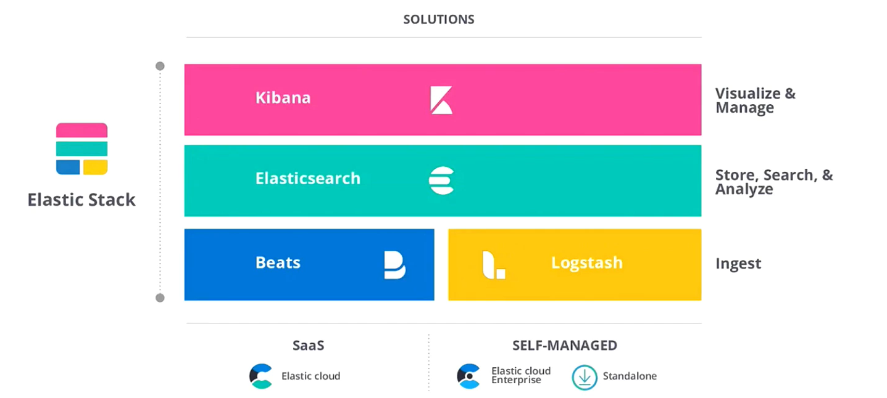
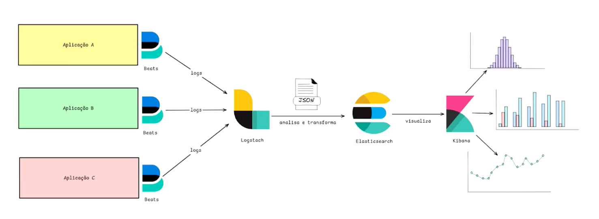
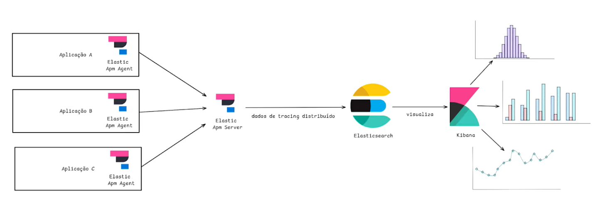
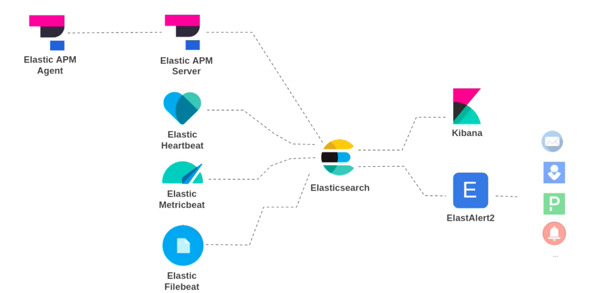
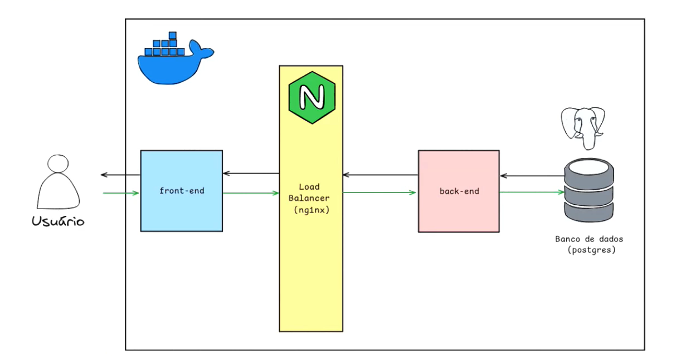

# Observabilidade e Monitoramento I
## Monitoramento
- **Monitoramento** é o processo de coletar, analisar e usar dados sobre o desempenho de um sistema, infraestrutura ou aplicação com base em **métricas predefinidas**
- O objetivo é detectar anomalias, falhas e problemas de desempenho. Ele se baseia em alertas configurados antecipadamente, sendo eficaz para monitorar eventos e condições específicas

### Características do Monitoramento
- **Proativo:** O monitoramento é configurado para observar métricas-chave, como uso de CPU, memória, tempo de resposta e disponibilidade.
- **Métricas Definidas:** Baseia-se em métricas pré-configuradas, como uso de recursos, contagem de erros ou latência.
- **Alertas:** Envia notificações automáticas quando essas métricas ultrapassam limites estabelecidos (por exemplo, CPU acima de 80%).
- **Visão Superficial:** Ele oferece uma visão clara sobre a "saúde" do sistema, mas é limitado àquilo que foi previamente configurado para monitorar. Se um problema não foi antecipado, ele pode passar despercebido.

## Observabilidade
- A **Observabilidade** é um conceito mais amplo e profundo, focado na **capacidade de entender o comportamento interno de um sistema complexo** apenas examinando suas saídas (logs, métricas, traces).  
- Enquanto o monitoramento mede coisas predefinidas, a observabilidade permite que você **descubra problemas não antecipados**, explorando dados mais detalhados.

## Observabilidade vs Monitoramento
| **Característica**  | **Monitoramento**                           | **Observabilidade**                                    |
| :------------------ | :------------------------------------------ | :----------------------------------------------------- |
| **Foco**            | Métricas e evento predefinidos              | Diagnóstico e entendimento do sistema                  |
| **Objetivo**        | Detectar anomalias e falhas conhecidas      | Explorar e diagnosticar comportamentos desconhecidos   |
| **Coleta de Dados** | Métricas simples e limites                  | Logs, métricas e tracing (dados ricos e detalhados)    |
| **Alertas**         | Baseados em limiares predefinidos           | Suporte à exploração e investigação de falhas          |
| **Visão**           | Limitada ao que foi configurado             | Ampla, cobrindo vários tipos de dados                  |
| **Abordagem**       | Proativa (monitora e alerta)                | Reativa e exploratória (permite investigação profunda) |
| **Adequado para**   | Problemas conhecidos e limiares previsíveis | Problemas complexos e emergentes                       |

### Exemplo de Monitoramento
Você configura um monitoramento para alertá-lo se o uso da CPU de um servidor ultrapassar 90%. Quando esse limite é atingido, você recebe um alerta para investigar.

### Exemplo de Observabilidade
Ao notar que o tempo de resposta de uma aplicação está aumentando, você usa ferramentas de observabilidade para investigar os logs, traces e métricas de múltiplos serviços e descobre que o problema está em uma interação lenta com o banco de dados.

## Comparação
- **Monitoramento é como um sistema de alarme:** ele é configurado para soar quando algo específico dá errado (como portas abertas ou movimento detectado). Ele avisa se algo conhecido falha, mas não pode prever o inesperado.
- **Observabilidade é como uma câmera de segurança inteligente:** ela grava todos os eventos e você pode investigar o que aconteceu mesmo que o alarme não tenha soado. Se houver um comportamento estranho que você não antecipou, você tem os dados para analisá-lo e entender melhor o que ocorreu.

## O que preciso monitorar?
Os 4 sinais de SRE (Site Reliability Engineers):
1. **Latência**
2. **Tráfego**
3. **Erros**
4. **Saturação**
- [Link do livro](https://sre.google/sre-book/table-of-contents/)
- [Engenharia de Confiabilidade do Google: Como o Google Administra Seus Sistemas de Produção](https://www.amazon.com.br/Engenharia-Confiabilidade-Google-Administra-Sistemas/dp/8575225170)

## Os 3 Pilares da Observabilidade
1. **Logs**
2. **Métricas**
3. **Traces (Rastreamento)**

## Pilar: Logs
**Logs** são **registros** textuais gerados por aplicações, sistemas operacionais, servidores ou outros componentes de software para descrever eventos, ações e estados ocorridos em determinado momento.

### Estrutura dos Logs
Os logs geralmente incluem informações como:
- **Timestamp (Data e Hora):** Quando o evento ocorreu.
- **Nível de Log:** Indica a severidade do evento, como INFO, DEBUG, ERROR, WARNING, etc.
- **Mensagem:** Uma descrição do evento, o que aconteceu ou o status do sistema.
- **Contexto:** Informações adicionais como ID de usuário, nome do serviço, ou qualquer dado que ajude a identificar a causa ou impacto do evento.

### Pontos Importantes do Pilar Logs
- **Coleta Eficiente de Logs:**
  - Centralização de Logs
  - Correlação de Logs
- **Estruturação dos Logs**
  - Logs Estruturados
  - Níveis de Severidade
- **Retenção e Rotação de Logs**
  - Política de Retenção de Logs
  - Rotação de Logs

### Níveis de Log
- **DEBUG:** Informações detalhadas usadas para depuração.
- **INFO:** Informações sobre operações normais.
- **WARNING:** Potenciais problemas que não afetam o sistema, mas podem necessitar de atenção.
- **ERROR:** Erros que impactam partes do sistema, mas não o desativam completamente.
- **CRITICAL/FATAL:** Erros críticos que podem resultar em falha total ou interrupção significativa do serviço.

## Pilar: Métricas
- **Métricas** são medições **quantificáveis** de um sistema. Elas fornecem uma visão em tempo real de como os recursos estão sendo utilizados e como as aplicações estão se comportando, facilitando a detecção de anomalias e o diagnóstico de problemas.  
- As métricas são **simples, agregadas e leves** em termos de armazenamento, sendo ideais para monitoramento contínuo.

### Categorias de Métricas
#### Métricas de Sistema (Infraestrutura):
- **CPU:** Percentual de uso de CPU de uma máquina ou serviço.
- **Memória:** Quantidade de memória sendo utilizada.
- **Rede:** Quantidade de dados sendo enviados e recebidos.
- **Disco:** Espaço em disco disponível e taxa de leitura/gravação.
- ... entre muitas outras.

#### Métricas de Aplicação:
- **Taxa de Erros:** Percentual de requisições que resultaram em erros.
- **Latência:** Tempo médio de resposta de uma requisição.
- **Taxa de Requisições:** Quantidade de requisições recebidas por segundo.
- **Uso de Banco de Dados:** Consultas por segundo, tempo de resposta de queries, conexões abertas.
- ... entre muitas outras.

#### Métricas de Negócios:
- **Número de Usuários Ativos:** Quantidade de usuários acessando a plataforma.
- **Transações Completadas:** Quantidade de compras ou ações importantes realizadas pelos usuários.
- **Conversão:** Percentual de visitantes que realizaram uma ação desejada.
- **Receita por Minuto:** Valor monetário gerado em um período específico.
- ... entre muitas outras.

### Tipos de Métricas
- **Métricas Contínuas:** Representam valores que podem variar em intervalos contínuos de tempo.  
  Exemplo: Uso de CPU ou latência de requisição.
- **Métricas de Contagem:** São incrementadas ou acumuladas ao longo do tempo.  
  Exemplo: Número de requisições processadas por um serviço.
- **Métricas Derivadas:** Calculadas a partir de outras métricas.  
  Exemplo: Taxa de erro derivada de dividir o número de erros pelo total de requisições.

### Integração de Métricas de Diferentes Categorias
- Se houver um aumento na **latência de requisição**, isso pode impactar **negativamente** a taxa de **conversão de vendas**.
- Se o uso de CPU estiver **muito alto**, isso pode afetar o tempo de resposta ao cliente e, assim, **aumentar o churn de clientes**.

### Pontos importantes do Pilar Métricas
- **Coleta de Métricas:**
  - Automatização
  - Granularidade
- **Monitoramento de Limiares (Thresholds):**
  - Alertas Baseados em Limiares
  - Alertas Dinâmicos
- **Visualização:**
  - Gráficos e Dashboards

### Benefícios de Monitorar Métricas
- **Detecção Precoce de Problemas:** Monitorar métricas permite identificar falhas ou degradações de desempenho antes que elas impactem usuários.
- **Aprimoramento Contínuo:** O monitoramento regular de métricas ajuda a identificar padrões de uso e possíveis otimizações.
- **Escalabilidade:** Métricas de infraestrutura ajudam a planejar o escalonamento de recursos à medida que o sistema cresce.

### Métricas, SLA e SLO
- **SLA (Acordo de Nível de Serviço):** É um contrato formal entre um provedor de serviço e um cliente que define o nível de serviço esperado. Geralmente, inclui penalidades ou compensações se esses níveis de serviço não forem atingidos.  
  - **Exemplo:** Um SLA que garante **99,9% de disponibilidade** de um serviço ao longo de um mês.
- **SLO (Objetivo de Nível de Serviço):** É um subconjunto de um **SLA**, focando nos objetivos que o provedor de serviço define para manter o acordo. Ele define **metas técnicas** mensuráveis, como tempo de resposta, taxa de erro, disponibilidade, etc. O **SLO** é a métrica que se monitora para verificar se o **SLA** está sendo cumprido.

### Métricas como Base para Definir SLOs
- As métricas coletadas no sistema ao longo do tempo fornecem dados históricos que ajudam a definir SLOs **realistas**.
  - **Exemplo:** Se as métricas históricas mostram que a latência média de uma aplicação é **150ms**, um SLO de **200ms de latência máxima** pode ser estabelecido com confiança.

### Exemplos de Métricas Relacionadas a SLOs e SLAs
#### Disponibilidade (Uptime)
- **SLO:** O sistema deve estar disponível 99,9% do tempo.
- **Métrica:** Monitorar o uptime e o downtime do sistema.
- **SLA:** O SLA define que, se a disponibilidade cair abaixo de **99,9%**, o provedor do serviço será penalizado (por exemplo, descontos para o cliente).

#### Latência
- **SLO:** O tempo de resposta de uma requisição não deve ultrapassar **200ms** em 95% das vezes.
- **Métrica:** Monitorar a **latência média e os percentis** (por exemplo, P95, P99) de resposta da aplicação.
- **SLA:** O SLA pode estipular que, se a latência exceder 200ms consistentemente, compensações ou melhorias devem ser implementadas.

### Benefícios de Utilizar Métricas para Monitorar SLA e SLO
- **Transparência e Confiança:** As métricas permitem monitorar o cumprimento de **SLOs** de forma objetiva, garantindo que os clientes saibam que o serviço está funcionando conforme prometido no SLA.
- **Proatividade:** Com as métricas monitoradas em tempo real, as equipes de operação podem ser proativas e corrigir problemas antes que eles violem um **SLA**.
- **Evolução Contínua:** O acompanhamento das métricas ao longo do tempo permite que os **SLOs** sejam ajustados para refletir melhorias na infraestrutura ou necessidades de negócios, e os **SLAs** sejam atualizados de forma coerente.

### Principais Características dos Alertas
#### Detecção de Incidentes
- O objetivo principal de um alerta é detectar rapidamente **incidentes ou potenciais falhas**, como picos de latência, aumento da taxa de erro ou quedas na disponibilidade de um sistema.  
- Alertas são disparados quando uma condição específica, geralmente definida por métricas ou logs, **ultrapassa um limiar ou atende a uma regra configurada**.

#### Condições e Regras de Alerta
- Um alerta é configurado com base em condições que refletem o comportamento esperado do sistema.  
  - **Exemplos:**
    - Se a **CPU** de um servidor estiver acima de 90% por mais de 5 minutos.
    - Se a **taxa de erro** de uma API for maior que 1% das requisições.

#### Tipos de Alertas
- **Alertas por Métricas:** Baseados em valores numéricos que indicam a performance ou estado do sistema. 
  - **Exemplo:** taxa de erro, uso de CPU, tempo de resposta.
- **Alertas por Logs:** Disparados quando padrões ou palavras-chave específicas aparecem nos logs do sistema, indicando possíveis erros ou exceções.
- **Alertas por Traces:** Usados para identificar lentidão em fluxos de transações distribuídas ou outros problemas relacionados a dependências em microsserviços.

#### Severidade dos Alertas
- **Informativo:** Apenas para informar que algo diferente do normal foi detectado.
- **Aviso:** Indica que o sistema pode estar se aproximando de uma falha, mas ainda está operando dentro dos limites aceitáveis.
- **Crítico:** Necessita de ação imediata, pois o sistema está fora dos padrões operacionais e pode estar impactando usuários.

#### Boas Práticas para Configuração de Alertas
- Evitar Alerta em Excesso (Alert Fatigue)
- Definir Limiares Claros
- Priorizar Alertas Críticos
- Automatização de Respostas
- Integrar Alertas com Ferramentas de Notificação

## Pilar: Rastreamento (Tracing)
- **Tracing (ou rastreamento distribuído)** é o processo de rastrear o **caminho completo** de uma requisição enquanto ela percorre os diferentes serviços e componentes de um sistema distribuído.  
- O objetivo do tracing é monitorar e entender o comportamento de aplicações distribuídas, como microsserviços, identificando **gargalos** de desempenho, **falhas** ou **pontos de lentidão** em todo o **ciclo de vida** de uma requisição.

### Pontos Importantes do Tracing
#### Transações Distribuídas
- **Transações End-to-End**: O tracing permite monitorar uma transação do início ao fim, através de múltiplos serviços. Isso inclui a captura de latência, falhas e o tempo de processamento em cada serviço ou componente.
- **SPAN e TRACE**:
  - **Span**: Cada unidade de trabalho dentro de um trace. Um trace pode ser composto de vários spans, cada um representando uma etapa ou serviço da transação.
  - **Trace**: Representa o caminho completo de uma requisição através de diferentes serviços e spans.

### Pontos Importantes do Tracing
- **Correlações com Outras Métricas**: 
  - Integração com logs e métricas
  - Identificadores correlacionados.
- **Tempo de Execução e Latência**: 
  - Análise de latência de ponta a ponta.
- **Diagnóstico de Problemas**: 
  - Identificação de falhas
  - Análise de dependências.

## Ferramentas de Observabilidade
- Datadog
- New Relic
- OpenTelemetry
- Elastic Stack ELK

## Elastic Stack ELK

### Processo de Captação e Visualização dos Logs

### Processo de Captação e Visualização do Tracing Distribuído

### Emitindo Alertas com ElastAlert2

## Aplicação de Exemplo Prático

## Observações e Referências
- [Link do livro](https://sre.google/sre-book/table-of-contents/)
- [Engenharia de Confiabilidade do Google: Como o Google Administra Seus Sistemas de Produção](https://www.amazon.com.br/Engenharia-Confiabilidade-Google-Administra-Sistemas/dp/8575225170)

# Observabilidade e Monitoramento II
- [Comandos para executar o Elastic Stack ELK e a Aplicação](./observabilidade-monitoramento/README.md)
- [Kibana](http://localhost:5601/app/home) -> Observability 
- [Aplicação](http://localhost:3000/)

## Observações e Referências

