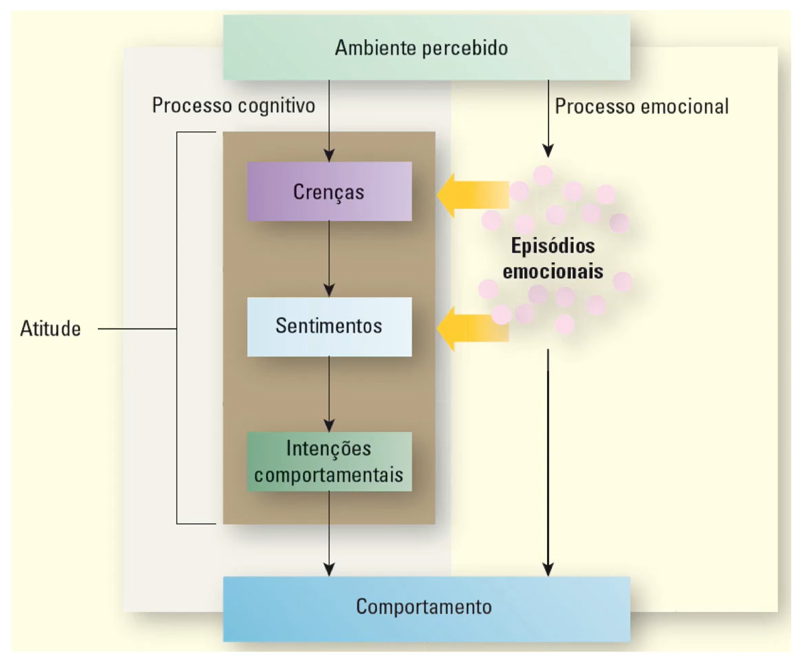
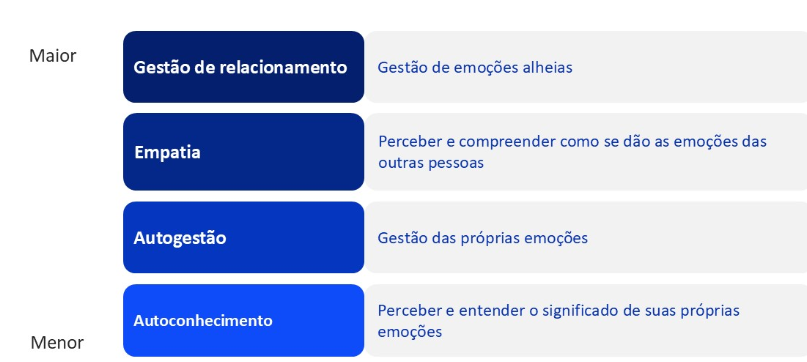
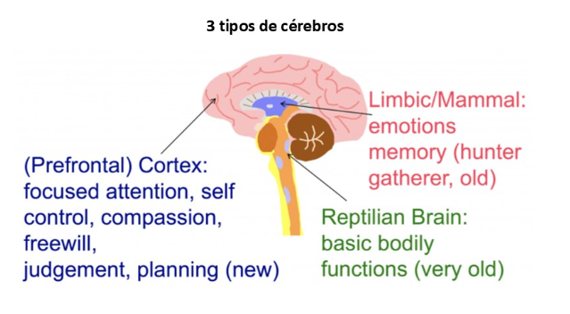
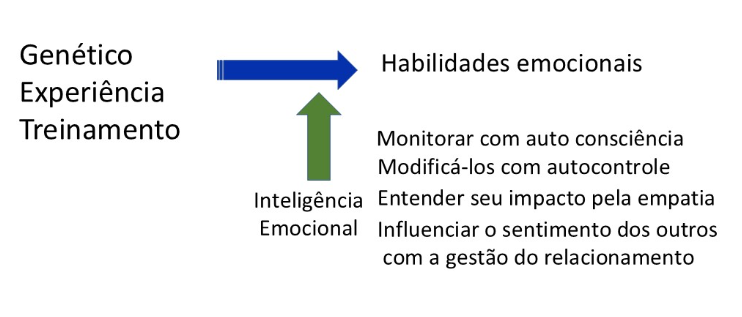
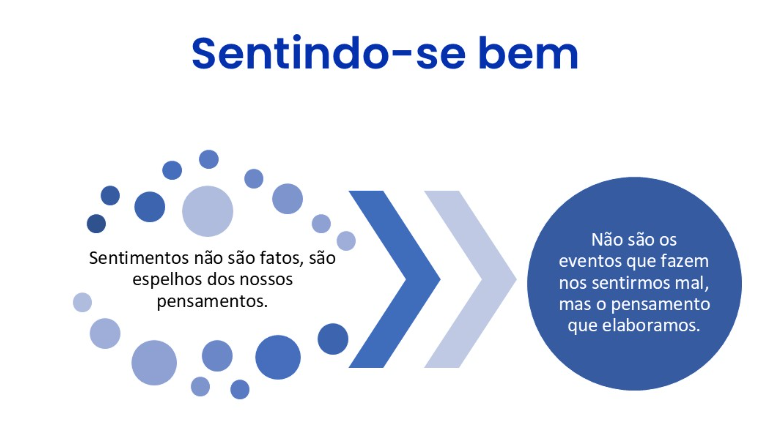

# Inteligência Emocional
## Emoções
- "A razão deve ser a senhora das paixões" (Platão)

- Episódios fisiológicos, comportamentais e psicológicos experimentados em relação a um objeto, pessoa ou evento, que criam um estado de prontidão
- A maioria das emoções ocorre sem a pessoa ter consciência
- Duas características de todas as emoções:
  - Todas têm algum grau de ativação
  - Todas têm um estado emocional central - avaliar se algo é bom/ruim

### Atitudes versus emoções
- **Atitudes:**
  - julgamentos sobre o objeto da atitude
  - geralmente baseadas no raciocínio lógico
  - comumente estáveis por vários dias ou mais
- **Emoções:**
  - experiências relacionadas ao objeto da atitude
  - baseadas nas respostas inatas e aprendidas para o ambiente
  - geralmente experienciadas por algum segundo ou menos

### Atitudes: das crenças ao comportamento

#### Emoções, atitudes e comportamentos
- Como as emoções influenciam as atitudes:
  - sentimentos são influenciados pelo acúmulo de episódios emocionais (não somente pela avaliação de crença)
  - Nós "ouvimos" nossas emoções
- Potenciais conflitos entre processos cognitivo e emocionais
- Emoções também afetam diretamente o comportamento
  - por exemplo, expressão facial

#### Definição do trabalho emocional
- Planejamento, esforço e controle necessários para expressar emoções organizacionalmente desejados durante transações interpessoais
- Trabalho emocional maior exige:
  - Exibir emoção frequente/por longo tempo
  - Exibir variedade de emoções
  - Exibir emoções internas

#### Desafios do trabalho emocional
- Dificuldade para exibir as emoções esperadas com precisão e para esconder as verdadeiras emoções
- Dissonância emocional:
  - Conflito entre emoções reais e exigidas
  - Maior estresse com atuações superficiais
  - Menor estresse com atuações profundas

## Inteligência Emocional
- QI ou QE? Liderança

### Definição
- Inteligência emocional é a
  - capacidade de perceber com precisão as próprias emoções e as dos outros
  - entender os sinais que as emoções enviam sobre os relacionamentos e
  - gerenciar as suas próprias emoções e as dos outros

### Preste atenção na sua IE
- Entre outras coisas, essa é sua habilidade para reconhecer suas próprias emoções, compreender claramente o que elas estão nos falando e perceber como suas emoções afetam as pessoas ao nosso redor
- Também envolvem nossa percepção dos outros: entender como se sentem, isso permite lidar com os relacionamentos mais efetivamente

### Modelo da inteligência emocional

### O que faz um líder
- **Autoconsciência:**
  - **Definição:** consciência de suas emoções, forças, fraquezas, impulsos, valores e objetivos - e seus impactos sobre os outros
  - **Marcas:**
    - Autoconfiança
    - Autoavaliação realista
    - Senso de humor autodepreciativo
    - Sede de críticas construtivas
  - **Exemplo:** um gerente sabe que prazos apertados trazem à tona o que há de pior nele. Então ele planeja seu tempo para fazer o trabalho com bastante antecedências
- **Autorregulação:**
  - **Definição:** regulação autocontrolada ou redirecionamento emoções e impulsos perturbadores
  - **Marcas:**
    - Confiabilidade
    - Integridade
    - Conforto com ambiguidade e mudança
  - **Exemplo:** quando uma equipe estraga uma apresentação, seu líder reiste à vontade de gritar. Em vez disso, ela considera possíveis razões para o fracasso, explica as consequências para sua equipe e explora soluções com eles
- **Motivação:**
  - **Definição:** ser levado a alcançar por causa da realização
  - **Marcas:**
    - paixão pelo próprio trabalho e por novos desafios
    - energia incansável para melhorar
    - otimismo diante do fracasso
  - **Exemplo:** um gerente de portfólio de uma empresa de investimentos vê seu fundo cair por três trimestres consecutivos. Grande defeito dos clientes. Em vez de culpar as circunstâncias externas, ela decide aprender com a experiência - e arquiteta uma reviravolta
- **Empatia:**
  - **Definição:** considerar os sentimentos dos outros, especialmente ao tomar decisões
  - **Marcas:**
    - expertise em atrair e reter talentos
    - capacidade de desenvolver outros
    - sensibilidade às diferenças interculturais
  - **Exemplo:** uma consultora americana e sua equipe apresentam um projeto para um cliente em potencial no Japão. Sua equipe interpreta o silêncio do cliente como desaprovação e se prepara para sair. O consultor lê a linguagem corporal do cliente e percebe o interesse. Ela continua a reuni~ão e sua equipe consegue o trabalho
- **Habilidades sociais:**
  - **Definição:** gerenciando relacionamentos para mover nas direções desejadas
  - **Marcas:**
    - eficácia na liderança de mudanças
    - persuasão
    - ampla rede
    - expertise na construção e liderança de equipes
  - **Exemplo:** um gerente quer que sua empresa adote uma melhor estratégia de internet. Ele encontra almas gêmeas e monta uma equipe de fato para criar um protótipo do site. Ele convence aliados em outras divisões a financiar a participação da empresa em uma convenção relevante. Sua empresa cria uma divisão de internet - e o coloca no comando.

#### Autoconsciência
- compreender suas emoções e por causa disso, não permitem que seus sentimentos os dirijam
- conhecer suas forças e fraquezas e trabalham nelas para desempenha melhor

#### Autorregulação
- Habilidade de controlar emoções e impulsos
- Não toma decisões impulsivas e levianas
- pensa antes de agir
- características da autorregulação são ponderação, conforto com mudanças, integridade e capacidade de dizer não

#### Motivação
- estão dispostos a definir resultados imediatos por sucesso a longo prazo
- são altamente produtivas, adoram desafios e são muito efetivos no que fazem
  - **Negativa:** medo
  - **Positiva:** desejo e aspirações

#### Empatia
- O segundo elemento mais importante
- É a habilidade de identificar como entender as vontades, necessidades e pontos de vistas ao seu redor
- Reconhecer os sentimentos dos outros
- São bons ouvintes
- Evitam esteriotipar e julgar muito rapidamente

- É uma habilidade de comunicação que inclui três componentes:
  - **Cognitivo:** capacidade de compreender, acuradamente, os sentimentos e perspectivas de outra pessoa
  - **Afetivo:** identificado por sentimentos de compaixão e simpatia pela outra pessoa, além de preocupação com o bem-estar desta
  - **Comportamental:** consiste em transmitir um entendimento explícito do sentimento e da perspectiva da outra pessoa, de forma que esta outra pessoa sinta-se profundamente compreendida 

##### Usando efetivamente a empatia
- Coloque de lado seu ponto de vista e tente ver as coisas pela perspectiva do outro
- Valide a perspectiva do outro
  - Entender não significa acordo
- Examine sua atitude
  - Ganhar, estar certo ou encontrar solução, construir relacionamentos e aceita outros
- Ouvir
  - com olhos, ouvidos, seu instinto, com seu coração

##### Habilidade empática - atenção
- Prestar atenção: envolve "estar com" a outra pessoa, física e psicologicamente
- Fitar diretamente a outra pessoa
- Adotar uma postura aberta evitando cruzar os braços
- Inclinar-se levemente para a pessoa
- Acenar com a cabeça
- Adotar uma postura descontraída
- Envolve também observar os sinais que o outro emite, com sorrisos, balançar as pernas
- Ouvir sensivelmente: envolve dar ao outro a oportunidade de ser ouvido em seus próprios termos, sem ser julgado
- Deixar de lado sentimentos por alguns instantes
- Observar e ler os comportamentos não-verbais (emoções)
- Colocar-se no lugar do outro
- Elaborar mentalmente uma relação entre o sentimento, o contexto e o significado deste contexto para o outro

##### Habilidade empática - verbalizar
- Verbalizar sensivelmente: a função é fazer com que a pessoa se sinta compreendida, encorajando-a a explorar as suas preocupações de forma mais completa
- As estratégias de verbalização empática:
  - tentam explicar e validar os sentimentos da outra pessoa sem julgar
  - relacionam o contexto, as perspectiva e os sentimentos da outra pessoa

#### Controle das emoções
- Controle seus sentimentos, antes que elas controlem você
- "Qualquer um pode zangar se - isso é fácil. Mas zangar-se com a pessoa certa, pelo motivo certo e da maneira certa - não é fácil" (Aristóteles)

### 6 princípios científicos atrás da influência
- Larry Kim, Founder and CTO, WordStream

- No centro de muita atividade de Marketing, o desejo é um só: influenciar e persuadir a plateia
- Influenciar os outros é desafiador, por isso vale a pena entender os princípios psicológicos por trás do processo de influência

#### Por que os princípio sde Cialdini são tão importantes?

- **Cérebro reptiliano:** parte mais antiga do cérebro, esta parte nos ajuda a sobreviver com instintos e reflexos (lutar, fugir ou modo de congelamento). O cérebro reptiliano quer desperdiçar o mínimo de energia possível, não pensa muito e é puramente focado na sobrevivência.
- **Cérebro límbico:** no qual são reguladas coisas como emoções, comportamento social e motivação.
- **Cérebro Neocortex:** é a parte mais inteligente do cérebro. Aqui você faz coisas complexas cálculos, aprenda a linguagem e você pode tomar decisões racionais.
  - 95% do nosso comportamento é determinado pelo cérebro dos répteis e dos mamíferos.
  - Tomar decisões racionais leva tempo e energia, por isso preferimos tomar decisões baseadas na emoção.
  - Muitas vezes, o cérebro racional justifica principalmente as decisões que tomamos com os cérebros reptilianos e os mamíferos.
  - Os princípios de Cialdini são tão valiosos porque os cérebros dos répteis e dos mamíferos respondem incrivelmente bem a eles.

#### Escassez
##### Como utilizar - escassez
- Algo é mais atrativo quando sua disponibilidade é limitada, ou entendermos que vamos perder a oportunidade de adquirir algo em condições favoráveis
- Com esse princípio, as pessoas precisam saber que elas vão perder se não agirem rapidamente
- Se você estiver vendendo produto, limite a disponibilidade de estoque, coloque uma data limite para a oferta ou crie edições especiais do produto
- Em uma apresentação, você pode destacar as consequências possíveis do problema qu sua ideia vai resolver

#### Afeto
##### Como utilizar - Afeto
- Estamos mais inclinados a ser influenciados por pessoa que gostamos. - pessoas que são como a gente, ou familiares, pessoas que foram gentis com a gente, ou quem nós confiamos. 
- Empresas que utilizam empregados da comunidade empregam esse princípio com sucesso.
- Pessoas tendem a comprar de pessoas parecidas com elas, de amigos e de pessoas que conhecem e respeitam.
- Garanta que você vai colocar tempo e esforço para construir confiança e rapport com clientes e pessoas com quem você trabalha e comporte-se com consistência.
- Não exagere em ser gostado pelos outros – isto pode ser muito desagradável.

#### Prova Social
##### Como utilizar - Prova Social
- Fundamenta-se no senso das pessoas de ”segurança nos números”
- Exemplos:
  - trabalhar até mais tarde se outras pessoas do time estão fazendo;
  - Colocar uma moeda no pote se ele contiver dinheiro;
  - Fazer a refeição em um restaurante se estiver cheio...
- Crie um barulho em torno da sua ideia ou produto
- Consiga apoio de pessoas influentes na sua organização
- Ou se estiver vendendo um serviço, destaque o número de pessoas que utilizam, uso testemunhos de usuários, encoraje as pessoas a falarem nas redes sociais e publique caso de sucesso.

#### Cuidado
- Seja honesto
- é muito fácil utilizar esses princípios para enganar ou decepcionar as pessoas
- Seja confiável ao persuadir as pessoas para fazer coisas que serão boas para elas
- Caso contrário é manipulação e é claramente errado mentir ou enganar as pessoas.
- Uma boa reputação leva tempo para ser construída, mas pode-se perder em um minuto.

### Liderança Emocional
- Otimismo
- Autenticidade
- Alta energia

“Os sentimentos e os comportamentos do líder acionam os sentimentos e comportamentos de todos os outros” - Daniel Goleman; Richard Boyatzis e Annie McKee - Primal Leadership. HBR. Dec. 2001

- Alto nível de IE cria clima onde cresce compartilhamento de informações, confiança, risco saudável e aprendizagem
- Baixo nível de IE clima de desinteresse com medo e ansiedade

- sentimento feliz
- visão mais positiva
- otimismo na realização das metas
- criatividade
- eficiência na tomada de decisão

### Ciência do humor
Conjunto de estruturas do cérebro responsáveis por processar, emoções, motivação e memória.

#### O sistema límbico do cérebro é um circuito aberto versus circuito fechado?
##### E a falta de civilidade1 do gestor?
- 1 - comportamento rude e descortês sem a intencionalidade clara de dano

##### Custos da incivilidade?
- 48% redução intencional do esforço de trabalho
- 38% redução intencional da qualidade do trabalho
- 47% redução intencional do tempo gasto no trabalho
- 80% de tempo de trabalho perdido preocupando sobre o incidente
- 63% tempo perdido evitando o ofensor
- 66% dizem que seu desempenho diminuiu
- 78% dizem que seu comprometimento com a organização diminuiu
- 12% disseram que deixaram seu trabalho por causa de tratamento grosseiro
- 25% admitem transferir suas frustrações para os seus clientes...

#### Projeto Aristóteles
- No ano de 2012, a Google iniciou um projeto milionário e nomeou de "Aristotle".
- Seu objetivo era mapear todas as informações possíveis sobre times de projetos, transformar isso em dados e tentar encontrar um padrão que resultasse em características para um time perfeito. E assim fizeram, analisando dados e procurando tais similaridades que pudessem ser uma resposta, em mais de 180 times de projetos. Por dois anos.

- O Google queria encontrar uma “receita” para o sucesso das equipes.
- Antes deste estudo, como muitas outras organizações, os executivos do Google acreditavam que construir as melhores equipes significava reunir as melhores pessoas. Faz sentido. O melhor engenheiro mais um MBA, um doutorado e aí está.
- Inicialmente, os pesquisadores do Google pensaram que ingredientes poderiam ser: 
  - colocar alguns dos melhores funcionários na equipe
  - adicionar um gerente experiente e
  - por favor, dê-lhes um passe livre para todos os recursos

- Não importa como fosse feita a análise dos dados, a composição das equipes não importava (nada mostrava que a demografia ou as combinações de personalidade criassem uma grande equipe).
  - A colocação de colegas de equipe (sentados juntos no mesmo escritório)
  - Tomada de decisão orientada por consenso
  - Extroversão dos membros da equipe
  - Desempenho individual dos membros da equipe
  - Tamanho da carga de trabalho
  - Idade
  - Tamanho da equipe
  - Tempo de casa
- O que os analistas aprenderam foi que as normas do grupo faziam a diferença. Essas “regras não escritas” definiram a cultura de desempenho do grupo.

- Equipes de alto desempenho engajadas em turnos de conversação em que todos os membros falavam em proporções aproximadamente iguais (comunicação).
- A segunda norma era que os membros do grupo de alto desempenho tinham alta sensibilidade social – eles eram bons em interpretar os sentimentos dos membros do grupo com base no tom de voz e nas expressões faciais (empatia).
- Segurança psicológica: os membros se sentiam confortáveis em discordar uns dos outros e tomar riscos interpessoais, ou seja, defenderem seus pontos e convencerem seus colegas de que estão certos. Ninguém tinha muito medo de ser percebido como ignorante, incompetente, negativo ou chato caso discordassem ou tomassem riscos e errassem. Além disso, os membros se sentiam à vontade ao admitirem erros, fazerem perguntas e oferecerem sua opinião

- As normas específicas que identificaram foram comunicação e empatia:
- Encontraram em primeiro lugar, uma igualdade de conversa. Todos os integrantes do time participavam e comentavam durante as reuniões de forma proporcional. Essa descoberta foi nomeada como "Igualdade na distribuição da conversa”. Enquanto nos times de sucesso havia este equilíbrio participativo, em outros times havia a percepção de que em reuniões apenas uma ou duas pessoas do time eram mais participativas.
- Em outras palavras, quando apenas poucos participantes do time tem a oportunidade de falar e expor suas opiniões a qualidade intelectual coletiva diminui muito.

- Em segundo lugar, todo o time precisa ter um bom nível de empatia e inteligência emocional. (Um teste foi feito para avaliar o skill de inteligência emocional de cada time, mostrando uma foto dos olhos de uma pessoa e perguntando para cada um o que achavam que aquela pessoa estava sentindo. Não precisa ser uma resposta assertiva mas observar para entender o quanto ele é capaz de analisar sentimentos.)
- A pesquisa enfim concluiu que o que importa não é a pessoa que está no time, ou seus diferentes skills, mas sim se ela se importa com os outros. Times onde todos tem espaço para falar, são bons ouvintes e atenciosos uns com os outros criam uma atmosfera psicologicamente segura para cada integrante da equipe e isto tem total impacto positivo para o sucesso do projeto.

- Expressões emocionais faciais das 3 emoções básicas

#### resultado foi resumido em 5 itens com as características de um time perfeito para o Google:
- **Segurança psicológica:** A equipe deve sentir segurança e apoio na liderança, sentir que podem tomar risco, errar e demonstrar sua vulnerabilidade abertamente.
- **Confiabilidade:** Saber que podem contar uns com os outros, que todos darão o seu melhor de tempo e conhecimento, para manter os padrões de qualidade Google.
- **Planejamento e Transparência:** Os objetivos, regras e planos tem que estar claros para todos do time.
- **Significado/Propósito:** Tem que ter valor pessoal para quem está realizando a tarefa e para o time.
- **Impacto:** O time tem que saber que o seu trabalho importa e que realizam mudanças através dele. E saber exatamente o impacto que aquele projeto trará para a empresa.

#### passos para reprogramar seu cérebro para comportamentos mais emocionalmente inteligentes
1. Quem eu quero ser?
2. Quem eu sou agora?
3. Como eu faço para ir daqui para lá? Córtex pré-frontal foca o cérebro sobre o que vai acontecer
4. Como eu faço para a mudança fixar? Prática e visualização
5. Quem pode me ajudar?

#### Seja positivo
- Tente ser positivo.
- Positividade é atrativa e contagiosa e vai ajudar a fortalecer seus relacionamentos com os seus colegas.
- Ninguém quer ficar perto de alguém que é negativo todo o tempo.

- **Duração:** Acreditar que algo que estamos experimentando é permanente ou temporário.
- **Generalização:** Crença que fatores situacionais causam um efeito ou que o efeito é evidência de fatores universais no trabalho. Um problema em um lugar, vai experimentar em todos os lugares
- **Personalização:** Acreditar que algo seu influenciou o resultado ou que algo externo causou isso.

## Observações
- [Mind Tools](https://www.mindtools.com/)

