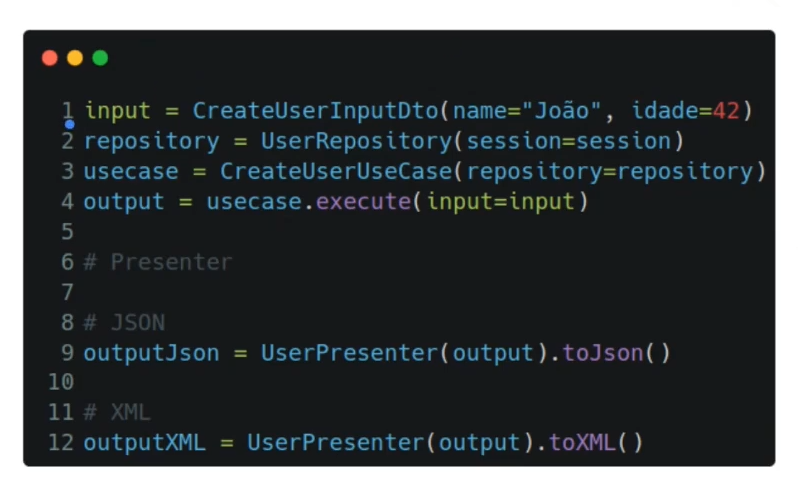

# Arquitetura Limpa (Clean Architecture) I
- Termo criado em **2012** por **Robert C. Martin**
  - [Uncle Bob - The Clean Architecture](https://blog.cleancoder.com/uncle-bob/2012/08/13/the-clean-architecture.html)
- Focada em **reduzir o acoplamento** entre as camadas arquiteturais
- Comunicação entre as camadas é realizada a partir de **contratos**
- **Orientada aos casos de usos** da aplicação

## Princípios Fundamentais
- **Independência de Frameworks:** Arquitetura agnóstica a frameworks
- **Testabilidade:** Facilitação de testes unitários
- **Desacoplamento:** Evitar acoplamento entre camadas
- **Separação de Responsabilidades:** Independência entre regras de negócio e detalhes de implementação

### O que é uma boa arquitetura?
- Aquela que torna o sistema:
  - Fácil de **entender**
  - Fácil de **desenvolver**
  - Fácil de **manter**
  - Fácil de **implantar**

### Entidades (Entities)
- Ditam as **regras do negócio** da aplicação
- Também conhecido como o **domínio da aplicação**
  - Conceitos de DDD
    - Entidade rica
    - Entidade não é anêmica
    - Tem seus próprios métodos
    - Entidade se valida
- Detalhes técnicos **não devem impactar** as regras de negócios da aplicação

### Casos de Uso (Use Cases)
- **Ações e funcionalidades** da aplicação
- Detalhes técnicos **não devem impactar** nos casos de usos
- **Single Responsibility Principle** (SRP)
- Exemplos:
  - Registrar Usuário
  - Autenticar Usuário
  - Realizar Pagamento

### Infraestrutura
- Camada **mais externa** do sistema
- implementação dos **detalhes técnicos da aplicação**
- **Dependência** para dentro
- Implementação dos **repositórios**
- **Persistências** dos dados
- **Fácil** substituição

### DTO (Data Transfer Object)
- **Não possuem** regras de negócios
- Dados de **comunicação entre os limites arquiteturais**
- Dados de **Input** e **Outputs** dos **casos de usos**
- Cada caso de uso possui o seu **DTO** de **input** e seu **DTO** de **output**

### Presenters
- Objetos de transformações de dados
- Adequa um **DTO de output** para um **formato específico de entrega**
  - JSON
  - XML
  - GraphQL
  - ... entre outros

#### Exemplo de Presenters

### Desafios e Limitações
- Complexidade **inicial** na adoção
- Impacto em **times acostumados** com arquiteturas tradicionais
- Overhead para **pequenas aplicações**

## Desenvolvimento
- __init__.py: no Python isso significa que agora essa pasta é um módulo e que pode ser usado em outros lugares

## Atalhos
- **ctrl + K + C:** comenta um corpo de texto

