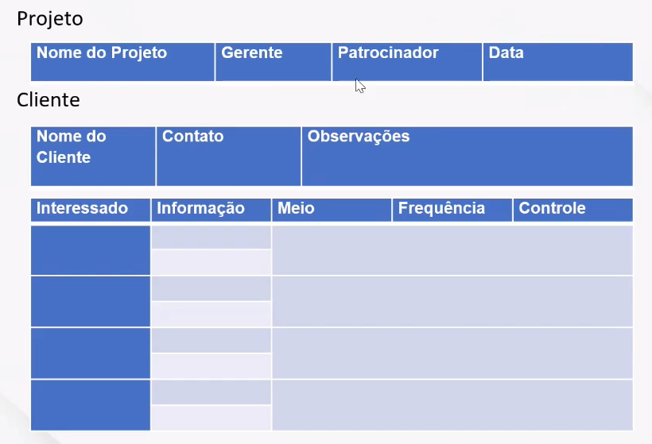

# Comunicação I
## Primeiras Considerações
### Novo Ambiente
* Instabilidade permanente
* Competitividade global
* Clientes mais exigentes
* Tecnologias como commodity

### As Primeiras Formas de Comunicação
* 5 milhões de anos: primeiros hominídeos (Australopithecus) - Emoções e comunicação não-verbal
* 14.000: Primeiras pinturas nas cavernas (Altamira) - Comunicação oral (fala)
* entre 3500 e 3000 antes de Cristo: Início da escrita (Sumérios) - Comunicação escrita
* entre 1000 e 1500 depois de Cristo: Primeiro livro impresso (Gutenberg)
* entre 1500 e 2000 depois de Cristo: Telefone, Rádio, TV, Internet

## Introdução
### Introdução
* Estudos de Harvard (EUA): 70 A 90% do tempo de trabalho de um líder é dedicado de alguma maneira à comunicação. Um líder passa a maior parte do tempo comunicando-se (telefone, e-mail, reunião, entre outros).
* Portanto, **PARA LIDERAR É PRECISO COMUNICAR**.
* Apesar disso, um dos principais motivos de conflito entre líderes e colaboradores é a comunicação, ou a falta dela, o que compromete diretamente o desempenhos dos mesmos.
* Geralmente, isso acontece porque a mensagem entre um e outro não é passada com clareza e, assim, não havendo compreensão.
* Contudo, no mundo corporativo atual, o papel do líder é desenvolver, agregar e influenciar pessoas, aprimorar as habilidades de comunicação, estimular o contato pessoal e usufruir de mensagens claras e objetivas

* "A palavra é metade de quem a pronuncia, metade de quem a ouve." (Montaigne, filósofo)
* "O mais importante na comunicação é ouvir o que não foi dito." (Peter Drucker, consultor de empresas)
* "O que as pessoas dizem, o que as pessoas fazem e o que elas dizem que fazem: são coisas inteiramente diferentes." (Margaret Mead, antropóloga)

### Informar x Comunicar
* **Informar:** ato unilateral
* **Comunicar:** fazer-se entender e provocar reações no outro
* Interação e saber ouvir

* A COMUNICAÇÃO é mais do que simplesmente transmitir o significado: esse significado também precisar ser compreendido. 

### Prejuízos para o grupo quando as informações não são passadas
* Grandes prejuízos financeiros
* Desvinculações
* Stress no trabalho
* Retrabalhos

### Como perceber que algumas informações não estão sendo passadas
* Declínio do fluxo de informações
* Deterioração moral
* Mensagens verbais ambíguas
* Sinais não verbais
* Sinais externos

### Elementos no Processo de Comunicação
* Emissor --- Codificação da mensagem ---> Canal --- Mensagem decodificada ---> Receptor --- Feedback ---> Emissor
  * Ruído: em toda a comunicação
  * CONTEXTO

### Atividade 1
Stop Managersplaining On Video Calls And Give People A Voice
1. Como coordenar videoconferências? Dicas, sugestões, regras...
2. Como coordenar equipes em trabalho remoto, enquanto outra parte está no escritório?

### Elementos do Processo de Comunicação
* **EMISSOR:** sujeito que produz e tem a intenção de transmitir uma mensagem
* **MENSAGEM:** é a ideia em que o emissor deseja comunicar
* **RECEPTOR:** sujeito que recebe e interpreta a mensagem

* **CODIFICAÇÃO:** tradução da mensagem em um código conhecido
* **CANAL OU MEIO:** por onde circula a mensagem
* **DECODIFICAÇÃO:** interpretação do código utilizado na mensagem, tradução da mensagem

* **RUÍDO:** possíveis interferências que podem diferenciar a mensagem enviada da mensagem recebida. Fonte de erro ou distúrbio
* **FEEDBACK:** resposta dada pelo receptor a partir da mensagem decodificada por ele

* **CONTEXTO:** meio ambiente e variáveis externas

### Hierarquia da riqueza de canais
* Anúncios, boletins e relatórios gerais -> Memorandos, caras -> E-mail -> Telefone -> Conversa cara a cara

### Processo de Comunicação
#### Dificuldades com o emissor
* Sobrecarga de informações
* Falta de disposição para falar
* Codificação incorreta
* Incorreção da linguagem
* Complexidade
* Desequilíbrio emocional

#### Dificuldades com o receptor
* Distração
* Falta de disposição para ouvir
* Decodificação incorreta
* Cansaço
* Relação apressada
* Desequilíbrio emocional

### A Comunicação nas Organizações
* **Fluxos formais descendentes:** objetivos, estratégias, instruções, comunicados etc
* **Fluxos formais horizontais:** colaboração, comunicação intra e interdepartamental etc
* **Fluxos formais ascendentes:** problemas, sugestões, relatórios etc
* **Fluxos informais:** bate-papo, socialização, "cafezinho", "rádio corredor" etc

### Comunicação Interpessoal
#### Comunicação escrita
* Engloba e-mails, cartas, jornais internos, informativos em murais, intranet, WhatsApp
* **Vantagens:** fica registrada e armazenada. Se tiver dúvida, poderá ler
* **Desvantagens:** tempo para escrever e ausência de mecanismo de *feedback*

#### Comunicação não verbal
* Nenhuma discussão sobre comunicação estaria completa sem uma análise da comunicação não verbal, que inclui:
  * os avanços corporais
  * a entonação ou ênfase dada às palavras
  * expressão facial
* Se você ler a ata de uma reunião, não sentirá o impacto do que foi dito da mesma forma que sentiria se tivesse participado dela ou se a tivesse assistido em vídeo. Por quê Porque não há registro de comunicação não verbal.
* As expressões faciais, ao lado de entonações de voz, podem mostrar arrogância, agressividade, medo, timidez, etc.

* Segundo pesquisas, em uma conversa presencial, dá-se mais crédito à comunicação não verbal, conforme se ilustra no gráfico abaixo.
  * Expressão corporal: 55%
  * Tom de Voz: 38%
  * Palavras: 7%

### Comunicação Informal: Rádio Peão
* Rede de rumores
* **Principais características:** 
  * não é controlada pela direção da empresa
  * considerada confiável pela maioria dos funcionário
  * largamente utilizada para servir aos interesses de quem as integra

* O que alimenta a rádio peão?
  * situações importantes para as pessoas
  * ambiguidades
  * condições que despertam ansiedade
* Os rumores começam porque são uma boa fofoca!

#### A rede de rumores é parte importante do sistema de comunicação de qualquer grupo
* Fornece aos executivos os sentimentos sobre o moral de sua organização
* Identifica temas que os funcionários consideram importantes
* Ajuda a canalizar a ansiedade dos funcionário
* Criam a sensação de proximidade e amizade entre as pessoas que compartilham informações

* A rádio peão pode ser eliminada? NÃO!
* é possível apenas minimizar suas consequências negativas, limitando abrangência ou impacto
* ou utilizar a seu favor e em benefício da empresa, pois sempre existem formadores de opiniões

#### Sugestões para reduzir o impacto da rede de rumores
* anunciar um cronograma para a tomada de decisões importantes
* explicar decisões e comportamentos que possam parecer inconsistentes ou misteriosos
* enfatizar vantagens e desvantagens das decisões atuais e planos futuros
* responder aos rumores com calma, racionalidade e respeito
* incentivar os funcionários chegarem a você com preocupações, dúvidas, sugestões e ideias

# Comunicação II
### Dicas para se tornar um líder comunicativos
* Três habilidades:
  * Escuta Ativa
  * Congruência
  * Adaptação da Linguagem

#### Escuta Ativa
* Ouvir com toda a atenção, sem julgamentos
* Intenção genuína de entender e compreender o que a pessoa fala
* Evitar distrações e interrupções
* Prática do espelhamento

#### Congruência
* Coerência entre o que pensamos, dizemos e fazemos
* Quando existe congruência, a comunicação é mais eficaz, pois a expressão não verbal reforça o que é dito

#### Adaptação da Linguagem
* As palavras tem significados diferentes para pessoas diferentes
* Explique o que quer dizer e verifique se a pessoa entendeu
* **Exemplo:** "Você precisa ser mais **pró ativo** no atendimento a esse cliente. A pessoa proativa antecipa os problemas que podem acontecer e planeja o que irá fazer caso os problemas ocorram".
* **Para se certificar que entendeu:** O que você fará para ser pró ativo no atendimento àquele cliente?

### Estilos Comunicacionais
* as pessoas têm estilos comunicacionais diferentes
* os estilos aqui apresentados são um modelo reducionista, simplificador, mas ajudam a compreender algumas diferenças comunicativas importantes
* entender essas diferenças pode ajudar a minimizar dificuldades e conflitos na comunicação interpessoal

### Comunicação: Uma Questão de Estilo
#### Assertividade vs. Sensibilidade
* **Assertividade:**
  * **Baixa:**
    * muda pouco o tom de voz
    * introvertido
    * fala estudada, mais lenta
    * aperto de mão indiferente
    * pergunta mais do que afirma
    * manifesta seu desejo de forma vaga e indireta
    * fala apoiado ou recostado
  * **Alta:**
    * varia o tom conforme a emoção
    * extrovertido, enérgico
    * fala mais impulsiva e rápida
    * aperto de mão firme
    * afirma mais
    * manifesta abertamente seu desejo
    * projeta o corpo ao falar

* **Sensibilidade:**
  * **Baixa:**
    * reservado quanto às emoções
    * pouco expressivo
    * busca fatos e detalhes
    * faz pouco contato visual
    * olhar severo ou sério
    * fala pouco de si
  * **Alta:**
    * aberto quanto às emoções
    * muito expressivo
    * observa as pessoas
    * faz muito contato visual
    * olhar e gesto amigáveis
    * afetivo, gosta de falar de si

|                                                 | Assertividade baixa                                             | Assertividade alta                                                |
| :---------------------------------------------- | :-------------------------------------------------------------- | :---------------------------------------------------------------- |
| Sensibilidade orientada para pessoas e relações | Estilo comunicacional "AFETIVO/APOIADOR" (Estereotipo Feminino) | Estilo comunicacional "CATALIZADOR"                               |
| Sensibilidade orientada para coisas ou ideias   | Estilo comunicacional "ANALÍTICO"                               | Estilo comunicacional "RACIONAL/OBJETIVO" (Estereotipo masculino) |

### Comunicação: Uma Questão de Estilo
#### Dar e Receber Feedback
|                                   | Solicita pouca informação/feedback | Solicita muita informação/feedback        |
| :-------------------------------- | :--------------------------------- | :---------------------------------------- |
| Fornece pouca informação/feedback | Fechado ou tímido, não se comunica | Curioso, desconfiado ou impertinente      |
| Fornece muita informação/feedback | Dominante, monologador             | Dialogador, comunicação autêntica, aberta |

**ATENÇÃO:** pessoas com estilos muito diferentes têm maior probabilidade de dificuldades e conflitos de comunicação

### O que é assertividade?
"É o comportamento que torna a pessoa capaz de agir em seus próprios interesses, a se afirmar sem a ansiedade indevida, respeitando seus direitos sem negar os alheio." (Robert E. Albert)

### Tipos de comportamento
* Passivo
* Passivo-agressivo
* Agressivo
* Assertivo

#### Comportamento passivo
* Raramente se envolve, tem vergonha, falta de confiança, nunca reclama. Costumamos achar que estão sempre felizes no emprego, mas quando forçados ao limite, não se sabe o qe poderão fazer.
* Uma resposta que expressa a opinião de forma vaga e indireta é usualmente chamada de passiva
* Baixa frequência de respostas, ou seja, quando o indivíduo "fala pouco" ou "se cala"
* Quando um funcionário é solicitado a colaborar numa reunião, por exemplo, mas se exime de expor suas ideias, está exibindo um comportamento chamado "passivo"
* Quando um supervisor expõe uma ideia ou interpretação sobre um assunto que o funcionário conhece profundamente e este reconhece falhas na exposição, mas não as corrige, dizemos que o funcionário "esteve passivo" na reunião

#### Respostas passivas
* Respostas passivas podem também ocorrer através de questões, como por exemplo "será que não é melhor conduzirmos o projeto de outra maneira?"
* Respostas passivas podem também consistir de frases que eximem o falante de responsabilidade como, por exemplo, "Certas pessoas vão preferir que o projeto seja conduzido de outra maneira"

#### Comportamento passivo-agressivo
* Sempre tem algo a dizer, depois da hora, evita conflitos, raramente se manifesta, reclama pelas costas

#### Comportamento agressivo
* Opiniões fortes, não tem medo de expressá-las mesmo quando a pergunta não foi dirigida a ele
* Se na reunião, o funcionário expressa sua opinião de forma hostil, inflexível e em voz alta como, por exemplo, "este projeto não serve" dizemos que ele "foi agressivo"

#### Comportamento assertivo
* Fala por si mesmo, usa linguagem corporal, mantém o contato visual. Não tem medo de perguntar o porquê
* "No exemplo anterior, assertividade seria observada caso o funcionário descrevesse claramente o motivo pelo qual acredita que sua ideia é mais adequada, como por exemplo "acredito que é melhor conduzirmos o projeto de outra maneira, porque..."
* Comportamentos assertivos incluiriam a expressão dos sentimentos do falante de forma direta e clara, **sem infringir** os direitos dos outros (Jentsch & Smith-Jentsch, 2001)
* "Os comportamentos assertivos mais diretamente relacionados à efetividade do trabalho em equipe incluem apontar erros/problemas, verbalizar soluções, e expressar e defender as próprias opiniões (Smith-Jentsch, Salas, & Baker, 1996)

##### Características de pessoa assertiva
* não passa pela vida cheio de inibições, cedendo à vontade alheia
* desenvolve controle de si mesmo nas relações interpessoais
* é espontâneo na expressão dos sentimentos sem hostilidade, frente às situações de invasão por parte de outras pessoas

##### Desenvolvendo a assertividade
###### Ser claro, conciso e específico
* Falar de forma direta. Usar exemplo explicativos
* Não pressupor que a outra pessoa já sabe, os outros não leem pensamentos
  * **Em vez de:** "lembra que fizemos uma reunião de equipe uns tempos atrás e que me passaria os dados hoje, então conseguiu fazer"
  * **Dizer:** "combinamos que passaria os dados até hoje. Já estão prontos?"
  * **Aceite críticas e manifeste intenção de mudança:** "sua apresentação foi muito longa." "Obrigada, vou ver no que posso reduzir." **Estar flexível para mudança**

* Dizer **EU** significa que você assume a responsabilidade pelos seus pensamentos, sentimentos e ações e que não culpa os outros.
  * **Em vez:** "sabe como é, ninguém consegue decidir sobre estes pontos, não é?"
  * **Dizer:** "eu estou com dificuldade em decidir"

##### As situações mais usuais enfrentadas pelos gerentes, nas quais se verificam o comportamento assertivo
* Negociar
* Conduzir reuniões
* Resolver conflitos
* Comunicar decisões contrárias ao desejo da equipe
* Estabelecer metas
* Formar e conduzir equipe
* Demitir
* Efetuar avaliações e dar feedback (perguntar antes como a pessoa se avalia)

###### A importância do Feedback e do Diálogo
* **Focalize os fatos e não a pessoa:** se você está fornecendo feedback crítico, enfoque a ação, os fatos e não a pessoa. Evite críticas e repreensões em público.
* **Evite a sobrecarga de informações:** aborde o que é importante, essencial
* **Evite só focar no erro:** dê também feedbacks positivos. Aponte os acertos. Indique como o erro pode ser evitado ou corrigido. Elogie individualmente e em público
* **Observe as reações e a compreensão do outro e esteja preparado para ouvi-lo:** considere que você pode estar errado. Após falar, peça para o outro lhe dizer o que pensa, qual a sua opinião a respeito

### Colaboradores bem informados estão dispostos a:
* Apoiar a instituição
* Evitar espalhar boatos
* Acreditar que a administração está sendo feita da melhor maneira possível
* Concentrar-se no trabalho
* Manter atitude positiva dentro e fora da empresa

### Técnica do espelhamento
* Gostamos do que é parecido
* PRINCIPAL: DISCRIÇÃO, SUTILEZA
* uma cópia aberta terá o efeito oposto

#### Importantíssimo
* Fundamento número 1 da comunicação: **Reconhecer o outro**
* Necessidade comum a todos: ser reconhecido, valorizado em seus sentimentos, pensamentos e atitudes

### A Comunicação Efetiva
* **Amorosidade**
  * Aceitação e convivência com o outro
  * Reconhecimento das diferenças e limitações
  * Não implica necessariamente em concordar com o outro
  * Investir tempo e esforços para compreender o outro e estar junto

### Teoria U: Otto Scharmer

### Escuta
* Escuta Factual
  * Cultivar a curiosidade
  * Capturar as observações
* Escuta empática
  * Amar a outra pessoa e ativar a inteligÊncia do coração
* Escuta Generativa
  * Não "fazer nada", "não intervir". Estar presente e envolvido, abrindo espaço para o que está prestes a emergir

1. Ouvir sua própria intenção (ouvir a si mesmo)
2. Ouvir os parceiros centrais no campo (ouvir os outros)
3. Ouvir o que você é chamado a fazer (ouvir o que emerge)

* **Mudança de foco:** dos **erros** próprios e do outro, para as **necessidades** de todos
  * Quais são minhas necessidades não atendidas
  * Quais são suas necessidades não atendidas
  * Cada agressão é uma expressão trágica de necessidades não atendidas

* CONCEITO DA **"LINGUAGEM DA CULPA"**
  * Estou irritado porque **você** chegou de novo atrasado para nossa reunião!
  * **Você** me desapontou ao não ter falado com o procurador-chefe
  * **Mensagem:** você é culpado
  * **Intenção:** você tem que mudar

* CONCEITO DA **"LINGUAGEM DAS NECESSIDADES"**
  * Você chegou depois do horário marcado. Fico frustrado, porque gostaria que todos nós cuidássemos de nossos combinados
  * Você ainda não ligou para o procurador-chefe. Estou preocupado agora, porque a confiança dele é muito importante para mim.
  * **Postura:** Quero encontrar um caminho para atender as suas e as minhas necessidades

### Os 3 Processos Básicos da CNV (Comunicação Não-Violenta)
* **Autocompaixão:** recebendo de nós mesmos
* **Autenticidade:** expressar-se
* **Empatia:** recebendo o outro

* Observação, Sentimento, Necessidade, Pedido

### Gerenciamento das comunicações em Projetos
* O Gerente de Projeto tem a responsabilidade de saber quais mensagens devem ser enviadas, para quem, em que momento e traduzi-las em linguagem adequada
* Todas as pessoas do Projeto devem estar preparadas para enviar e receber informações e também devem compreender como as informações em seu poder afetam o projeto como um todo

### Plano de Gerenciamento
* Deve fornecer informações sobre:
  * Como os dados serão coletados, organizados e arquivados
  * Os métodos a serem utilizados para distribuir as informações
  * O tipo de informação a ser distribuído
  * Quando cada tipo de informação será produzido
  * Métodos de acessar as informações entre as comunicações programadas
  * O método utilizado para atualizar e refinar o plano durante o projeto

### Eventos críticos de comunicações em Projetos
* Reunião de Kick-off (lançamento do projeto)
* Reuniões de acompanhamento
* Relatórios de desempenho:
  * Informações do andamento (status)
  * Informações de progresso (o que já foi feito)
  * Informações do previsão (forecast)
  * Informações de desvio de custo e cronograma

### Sugestão de atividade 3 - Desenvolvimento do Plano de Comunicação
* What?: O que? Qual informação
* Why?: Por que? Com qual propósito
* Who?: Quem é o responsável?
* Who?: Para quem? Quem precisa da informação
* When?: Quando serão necessárias e qual periodicidade
* Where?: Onde ocorrerão ou serão armazenadas
* How?: Como? Templante, Procedimento, Best Practices      

### Plano de Comunicação

## Apêndice - Dicas de apresentação (Habilidades de Apresentação em Público)
### Desempenhe os papéis
* Planejador 
* Comunicador
* Avaliador da apresentação

### Planejador
* O que comunicar? (o tema/conteúdo)
* Para quê? (os objetivos)
* Para quem? (o público-alvo)
* Como? (as técnicas de apresentação)
* Quanto tempo? (a duração)
* Quando? (a data)
* Onde? (o local)

### Esquema Lógico da Apresentação
* Introdução:
  * Capta o interesse
  * Registra a importância do tema
  * Define os objetivos
* Desenvolvimento
  * Apresenta os argumentos
* Conclusão
  * Sintetiza os temas propostos

### Harmonize
* O conteúdo
* e a forma da mensagem

### Administre a tensão e o medo
* preparando-se mental e fisicamente,
* ensaiando e praticando sempre

### Antes da apresentação
* mantenha-se atualizado culturalmente
* visualize uma apresentação bem-sucedida

### Durante a apresentação
* Fale **com** a plateia, e não **para** a plateia
* Pratique um comunicação voltada para os resultados. Desenvolver métodos e técnicas de persuasão, apresentar e vender ideias devem ser as metas do profissional que busca o sucesso

### Na comunicação verbal evite
* respirar mal
* falar muto baixo ou muito alto
* pronunciar mal as palavras
* falar muito depressa ou muito devagar
* usar vícios de linguagem como: tá?, né?, ok, certo?, entendeu?, percebe?, é isso aí!, tipo assim, a gente, acho que e outros
* falar como robô, em tom monocórdio
* cometer erros gramaticais
* engolir esses e erres
* falar com estridência
* embolar as palavras
* ser prolixo ou monossilábico
* organizar mal as ideias e a apresentação
* expressar-se sem objetividade e clareza
* usar termos técnicos para públicos leigo
* contar piadas e usar chavões
* desculpar-se por estar despreparado
* não levar em conta o momento, o local e o mais oportunos para transmitir determinadas mensagens
* usar argumentos inconsistentes
* perder-se em detalhes
* baixar a voz no final das frases
* não destacar as ideias principais
* usar citações em excesso e vocabulário inadequado
* não aliar a técnica à naturalidade na comunicação

### Na comunicação não-verbal evite
* gestos que conotem nervosismo e inibição
* ajeitar a gravata
* manusear chaveiro, caneta
* ajeitar o cabelo ou os óculos
* coçar-se, pigarrear ou bocejar
* apoiar-se ora numa perna ora em outra
* fixar os olhos no chão, no teto ou numa só pessoa da plateia
* olhar através das pessoas
* ficar parado como estátua ou com as pernas abertas
* movimentar as mãos excessivamente
* estufar o peito ou cruzar os braços
* mascar ou roer unhas
* pôr as mãos para trás
* dar as costas para a plateia
* esfregar as mãos ansiosamente
* andar pelo palco sem razão
* balançar o corpo
* pôr as mãos nos bolsos
* olhar para o vazio
* pôr as mãos na cintura
* apoiar-se nos móveis do cenário
* consultar excessivamente o relógio
* fazer mau uso dos recursos audiovisuais
* ameaçar o público com o ponteiro ou a caneta laser
* esconder-se atrás dos recursos audiovisuais
* perder a interação visual com o público

### Na comunicação interpessoal evite
* usar a comunicação como forma de poder
* parecer egocêntrico, arrogante ou subserviente
* manipular a plateia
* esquecer o valor da empatia
* ser irônico ou sarcástico
* não ouvir a plateia ou demonstrar preconceitos
* apresentar-se sem estar preparado
* ignorar a etiqueta empresarial
* chegar atrasado
* revelar preferências pessoais
* ter gestos, atos e palavras incoerentes
* ser inflexível
* não saber administrar conflitos interpessoais
* receber as perguntas da plateia como se fossem uma ofensa pessoal
* dizer que vai "roubar o tempo" dos espectadores
* não controlar o tempo da exposição
* tentar enganar a plateia falando do que não conhece
* ignorar a linguagem corporal dos espectadores
* subestimar a importância do processo de sinergia

### O uso das palavras!
* **Não** fiquem curiosos...
* Evite **tentar**, faça!
* Troque o **Se** por **Quando**
* Depois de alguma limitação, coloque o **ainda**
* Substituir Condicional pelo presente: **queria** por **quero**
* Limitações no passado: **não consegui** ao invés de **não consigo**
* Trocar o **espero** pela **ação**: espero melhorar isso... vou melhorar isso

### Após a apresentação
* Avalie criticamente os resultados e faça as correções necessárias para a sua próxima apresentação

## Observações
* [Teste de Associação Implícita](https://implicit.harvard.edu/implicit/brazil/takeatest.html)
* [Amor Sem Escalas](https://www.imdb.com/title/tt1193138/)

