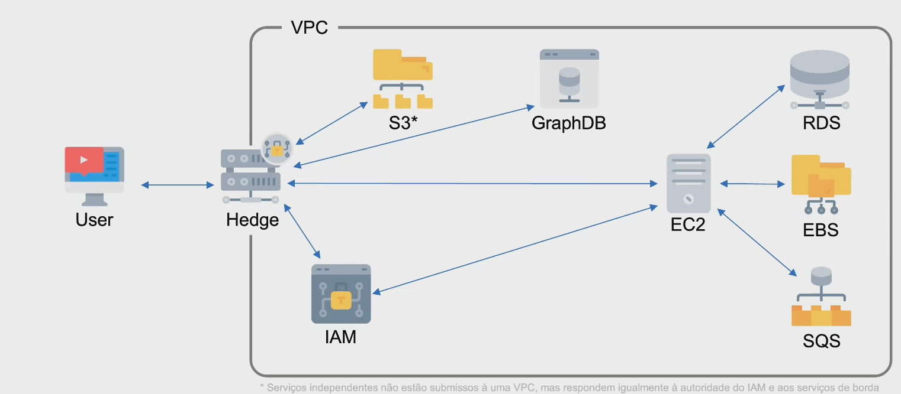
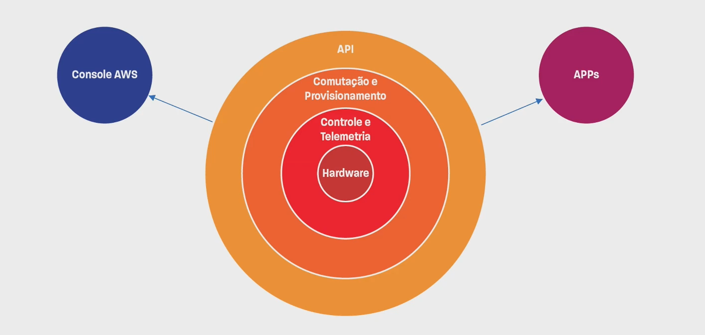
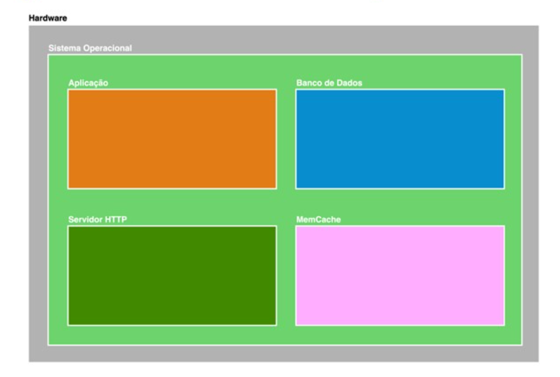
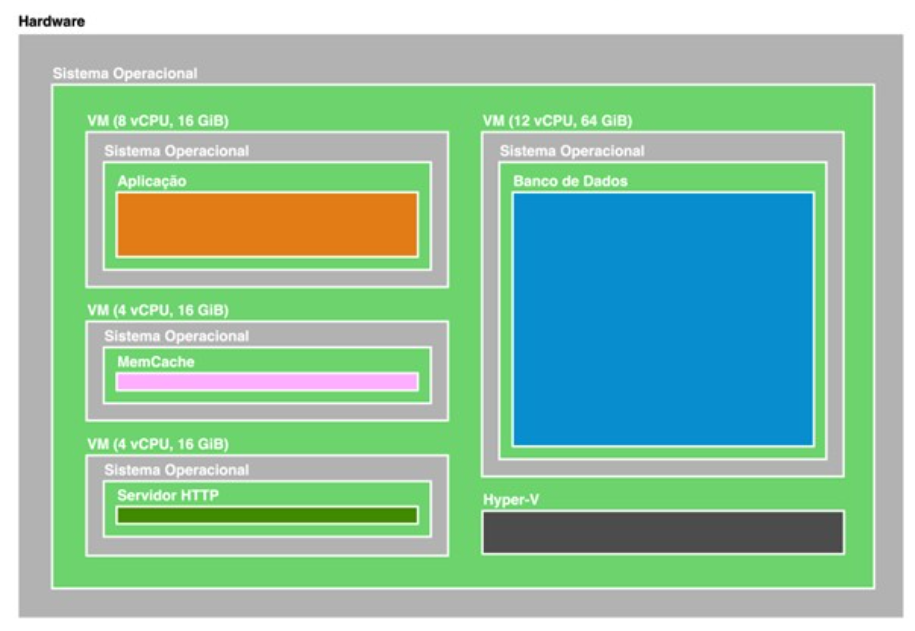
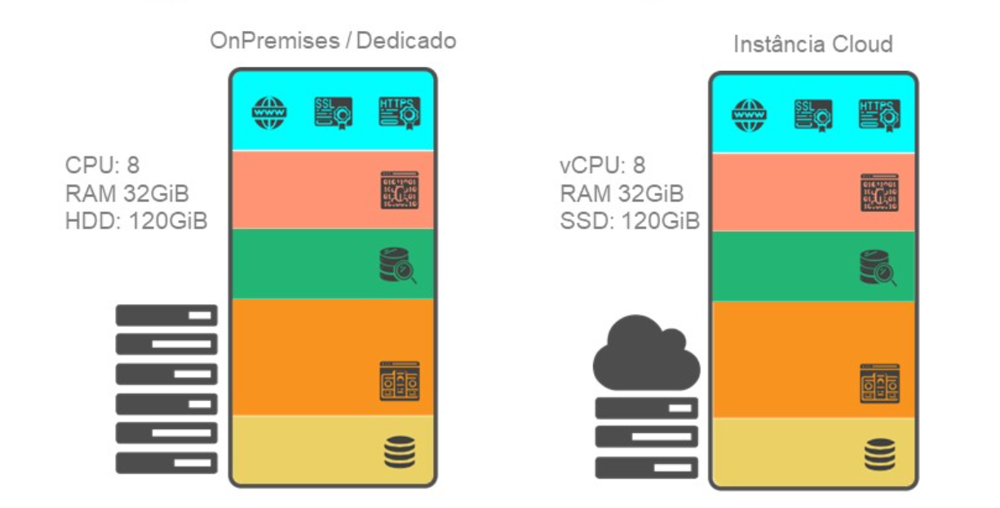
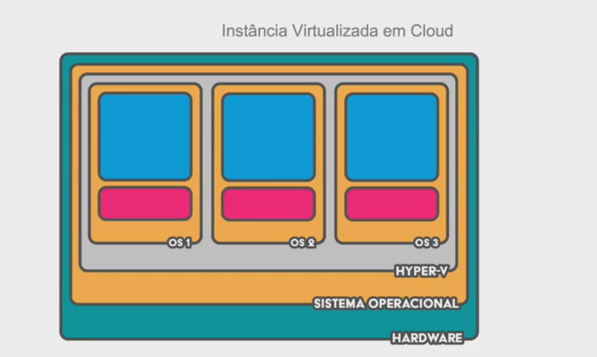
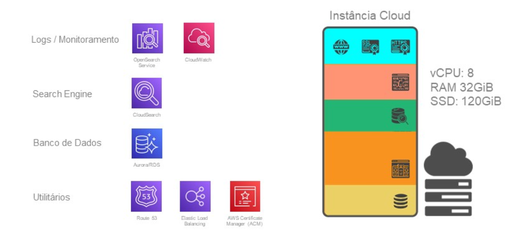
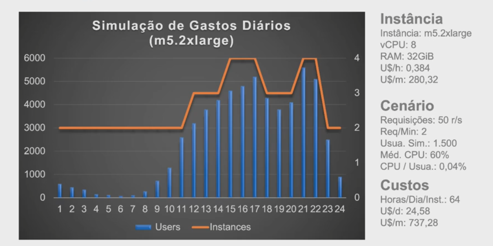
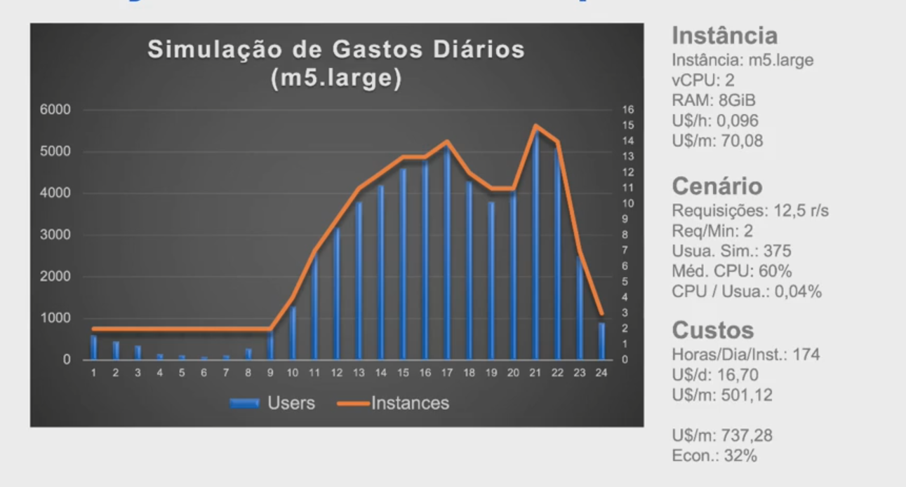
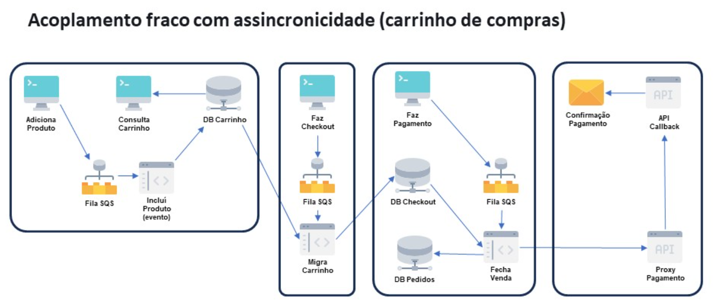

# Infra As Code (IAC) I
## Evolução da Infraestrutura
### Uma breve história sobre infraestrutura em nuvem
* **Anos 90:**
  * Servidores eram implantados dentro dos provedores de acesso à internet
  * Os servidores eram computadores comuns que não tinham mais potência para serem usados como desktops
  * Pagávamos pelo serviço e não pela solução
  * Não havia redundância de energia
  * Não havia redundância de link
  * Não havia redundância de dados
  * Não havia segurança de infraestrutura
  * E toda interação com o hardware era feita através de A.P.I. (Alguém que Pressiona Interruptor)
* **Anos 2000:**
  * Serviços como CPanel começam a ganhar mercado
  * Processadores multi-core se tornam mais populares
  * Os links ficam mais poderosos
  * Data centers de hospedagem mais bem estruturados surgem
  * Os serviços de hospedagem evoluem para ambientes compartilhados dentro de hardwares mais fortes
  * A interação com o hardware ainda é por de A.P.I. (Alguém que Pressiona Interruptor)
  * Ganha-se uma vantagem com máquinas virtualizadas, o reboot remoto do ambiente virtual
* **De 2003 a 2006:**
  * A Amazon (e-commerce) precisa de soluções que não existem no mercado
    * Alta escalabilidade para suportar picos de tráfego
    * Elasticidade para reduzir o custo operacional quando não tiver demanda
    * Flexibilidade para diferentes tipos de projetos
    * Extensibilidade para derivar serviços a partir de outros serviços
    * Redundância de dados, energia e link
    * Segurança
  * Surge o S3
  * Surge o SQS
  * Surge o EC2
  * Surgem diversos outros serviços derivados como SNS (Sistema de Mensageria Broker), RDS (Bancos de Dados), etc.

* **Diferenciais do hardware em nuvem:**
  * Hardware compartilhados com alto controle sobre o consumo
  * Redundância
    * Múltiplas placas de rede
    * Múltiplos links
    * Múltiplas fontes de alimentação
    * Múltiplas redes elétricas com alimentação de emergência
  * Segurança física e lógica
  * Controle e monitoramento remoto do hardware em nível granular
  

### Arquitetura Client/Server
* User <------> Server
  * Toda a aplicação ficava no mesmo hardware

### Arquitetura Cloud (conceito fundamental)
* User <------> Hedge <------> VPC (Virtual Private Cloud)
  * O servidor cloud é responsável por toda a segurança da infraestrutura (Hedge: infraestrutura de borda)
  * o VPC engloba:
    * **IAM (Identity Access Management):** podemos customizar partes do Hedge, ou seja, é uma camada de aplicação onde podemos inserir permissões de acesso daquela infraestrutura
    * Quando toda a requisição de controle de grupos, acessos e IAM, podemos acessar a infraestrutura, como o EC2. O EC2 também pode consultar o IAM para verificar as permissões para acessar por exemplo, um RDS, EBS (Disco Anexado), SQS
    * O **S3** por padrão não está dentro da VPC
    * **GraphDB** (muito comumente consumido pelo front-end)
* **Elastic Load Balancer:** providencia um SSL e faz parte da camada de borda (Hedge)

### Onion Architectural Vision
* O Cloud é capaz de ter múltiplos serviços que conseguem se consumir e até se gerenciar, pedindo permissões, por exemplo.
* **Controle e Telemetria:** responsável por fazer leitura em tempo real de todos os itens que estão dentro do hardware e funciona como operação remota, como, por exemplo, metade do processador pode ser desligado
* **Comutação e Provisionamento:** temos vários servidores e cada servidor tem seu próprio controle e telemetria interna, porém eles precisam ser disponibilizados
  * Por exemplo, temos um dado com 5 petabytes. O servidor não armazena tudo em um único disco. Na verdade ele usa comutação que é responsável por identificar quais hardwares ou serviços fazem parte de um único serviço/dado que será disponibilizado pelo usuários. Ele é capaz de comutar e trazer outros hardwares para dentro da solução desse serviço que vimos como uma coisa só.
* **API:** garante que todas as camadas sejam operadas. Algumas podemos operar e outras não
  * Console AWS
  * APPs

## Provedores
### Provedores Cloud
* Amazon Web Services
* Google Cloud
* Oracle Cloud
* Azure
* Hostinger
* locaweb
* uol host

### Serviços de Integração
* **Terraform:** é um serviço de Infra As Code que é compatível com diversas plataformas e ela consegue, através de um único template publicar a aplicação na AWS, Azure ou Google Cloud. Mas é bom lembrar que usar soluções como Terraform nos limita em relação a quantidade de serviços que conseguimos utilizar através do Terraform. E usar multi-cloud antes da hora, pode aumentar os custos de forma desnecessária
  * Infrastructure as Code
  * Multi-cloud provisioning
  * Manage Kubernetes
  * Manage network infrastructure
  * Manage virtual images
  * Integrate with existing workflows
  * Enforce policy as code
  * Inject secretes into Terraform
* **Containers:** um container é criado a partir de uma imagem
  * Docker
  * Kubernetes

## Isolamento
### Isolamento Físico
* **Restrições vantajosas:**
  * Não é necessário que operadores estejam presencialmente no data center
  * Não é necessário que operadores acessem fisicamente os servidores
* **Ganhos de Produtividade:**
  * Monitoramento remoto de cada elemento do ecossistema
  * Monitoramento automatizado
  * Análise de telemetria e desempenho do hardware
  * Migração remota de recursos lógicos
  * Identificação automatizada de degradação ou falhas de hardware
  * Manutenção programada
* **Melhoria de segurança:**
  * Acesso reduzido ao hardware
  * Redução de chances de vazamento ou comprometimento de dados
  * Redução de ocorrências de acidentes e erros humanos
  * Controle de danos e compartimentação de efeitos colaterais
* **Ganhos financeiros:**
  * Aumento da capacidade de escala de gestão dos recursos tecnológicos
  * Redução de incidentes
  * Redução de consumo de recursos energéticos
  * Preços mais competitivos e flexíveis

### Isolamento Lógico
* **Estabilidade:**
  * Redundância de recursos
  * Redução de pontos de falha
  * Balanceamento de recursos
  * Migração de recursos e aplicações sem interferência dos operadores do data center
* **Produtividade:**
  * Independência no controle de infraestrutura
  * Integração via código ou ferramentas de terceiros para gestão automatizada
  * Acesso às métricas de infraestrutura e aplicações para análise e otimização
  * Abstração de infraestrutura para consumo e desenvolvimento de serviços
  * Versionamento e controle de ambientes
* **Segurança:**
  * Dados transitórios criptografados
  * Dados estacionários criptografados
  * Alta granularidade nos níveis de permissões
  * Alta granularidade de rede em nível lógico
* **Controle:**
  * Autonomia de segurança
  * Autonomia de provisionamento
  * Autonomia de escalabilidade
  * Autonomia de controle de acesso
* **Custos:**
  * Consumo de recursos controlado pelo cliente em tempo real
  * Automação
  * Integração
  * Controle aberto e transparente dos custos

### Inovação
* Acesso a hardware e software de última geração sem imobilizar patrimônio
* Integração de APIs de terceiros que utilizam sua própria conta para executar aplicações e serviços de última geração
* A facilidade de qualquer um se tornar um provedor de serviços especializados
* A granularidade permite criar, validar e, evoluir ou encerrar projetos com rapidez e baixos custos
* Consumir serviços e softwares sob demanda sem a necessidade de aquisição de licenças e sem carência de uso

## Granularidade
### Fundamentos de Infraestrutura Cloud
* **Categorias de serviços AWS:**
  * Análises
  * Integração de aplicações
  * Blockchain
  * Aplicações empresariais
  * Gerenciamento financeiro na nuvem
  * Computação
  * Central de atendimento
  * Contêineres
  * Banco de dados
  * Ferramentas de desenvolvedor
  * Computação de usuário final
  * Web e plataforma móvel front-end
  * Jogos
  * Internet das Coisas
  * Machine learning
  * Gerenciamento e governança
  * Serviços de mídia
  * Migração e transferência
  * Redes e entrega de conteúdo
  * Tecnologias quânticas
  * Robótica
  * Satélite
  * Segurança, identidade e conformidade
  * Tecnologia sem servidor
  * Armazenamento
  * Cadeia de suprimentos

* A AWS tem aproximadamente 276 serviços diferentes

* Macro categorias de serviços em nuvem
  * **Computacionais:** loca um recurso computacional (CPU e memória) e coloca uma carga para ser rodada
    * EC2
    * Lambda
    * Machine Learning
    * ...
  * **Dados:** está pagando pela solução
    * S3
    * RDS
    * ...
  * **Rede:**
    * VPC
    * VPN
    * ...
  * **Borda**
    * Firewall: protege especificamente a rede
    * WAF (Web Applications Firewall): protege ataques em aplicações, linguagens, bancos de dados. São dinâmicos e inteligentes
    * CloudFront (CDN): armazenar e entregar conteúdo estático
    * ELB (Elastic Load Balancer)
    * ...

* **Abstração de serviços**
  * Quanto mais próximo da computação pura mais barato é o custo computacional CPU/Memória
  * Quanto mais abstraído maior é o custo/tempo
  * Quanto mais abstraído mais especializado
  * Processos de consumo constante custam mais barato em serviços computacionais como EC2
  * Processos de consumo esporádico e oscilante custam mais barato em serviços elásticos com Lambda, Fargate, Kubernetes e similares. O mesmo vale para bancos de dados.
  * Use a granularidade da nuvem a seu favor para ganhar escalabilidade a custos baixos

### Otimização de recursos computacionais

* Representação de como funciona uma aplicação em um servidor dedicado
* Tudo em um único servidor nos servidores dedicados

* Aqui são separados em VMs e o tamanho da para cada aplicação
* o HyperV está alocado para cada VM
* O fato de ter um OS entre a VM e o Hardware, prejudica a performance do que está rodando ali dentro

* O erro mais comum é migrar o que está no on premises com a mesma capacidade computacional para o Cloud, pois a instância virtual não temos acesso direto ao hardware
  * No on premises, ele sai do sistema operacional e vai diretamente para o hardware
  * enquanto na instância cloud, ele sai do serviço, passa pelo sistema operacional virtualizado, vai para o HyperV (que tem todas as camadas de segurança como criptografia, isolamento e tudo o que precisa para ter uma VM rodando) e depois para o host e para o hardware. Ou seja, temos a mesma capacidade de processamento de dados, mas tem um delay no transito dos dados

* Além do sistema operacional da VM, temos o Sistema Operacional real
* Se os sistemas operacionais virtualizados precisam consumir hardware/recursos demais eles vão disputar o mesmo funil passando pelo HyperV. Quanto mais hardware eles precisarem, mais o HyperV vai consumir do hardware para tratar todas essas requisições.

* Decompõe a aplicação em serviços
* Menos tempo de configuração e tempo

* Comparação de uso de recursos computacionais
  * 
  * 

### Granularidade
* Instâncias menores
* Auto escalabilidade
* Ambientes enxutos
* Microsserviços
* Serviços distribuídos
* Gestão de dados independente

R: Automação

## Arquitetura
### Estrutura de Projetos em IaC
* **Well Architected Frameworks da AWS**
  * **Princípios:**
    * Pare de adivinhar suas necessidades de capacidade
    * Sistemas de teste em escala de produção
      * Usar logs de produção, para testar a aplicação na fase de testes
    * Automatize tendo em mente a experimentação arquitetônica
    * Considere arquiteturas evolucionárias
    * Impulsione arquiteturas usando dados
    * Melhore durante os dias de jogo
  * **Pilares:**
    * Excelência operacional
    * Segurança
    * Confiabilidade
    * Eficiência de desempenho
    * Otimização de custos
    * Sustentabilidade

* **Princípios da arquitetura eficiente**
  * Acoplamento fraco
    * 
    * Podemos separar cada etapa em microsserviços e cada equipe responsável pode conhecer profundamente as regras de negócio desta etapa
  * Gestão de dados independente
    * **NoSQL**
      * Schemeless
      * Alta performance
      * Gestão compartilhada entre memória e disco
      * Persistência eventual*
      * Big Data
      * Redundância / Cluster
      * Backup difícil
    * **Key/Value**
      * Chave/Valor
      * Alta performance
      * Gestão compartilhada entre memória e disco
      * Persistência eventual e volátil*
      * Alto custo de escala
      * Alto custo de armazenamento
      * Redundância / Cluster
      * Sem Backup
    * **Objetos: S3, Google Storage**
      * Schemeless
      * Performance Média*
      * Persistência forte*
      * Baixo custo de escala
      * Baixo custo de armazenamento
      * Alto custo de recuperação de dados*
      * Redundância
      * Backup / Replicação
    * **SQL**
      * Schema
      * Performance baixa*
      * Persistência forte*
      * Alto custo de escala
      * Alto custo de armazenamento
      * Redundância e Cluster de alta complexidade
      * Backup / Replicação
  * Independência de camadas
  * Versionamento
  * Testes
  * Automação de deploys / pipelines
  * Monitoramento
  * Plano de contingência
  * Auto-reparação
  * Análise e evolução constante

## Observações e Referências
* [O que é o AWS CloudFormation?](https://docs.aws.amazon.com/pt_br/AWSCloudFormation/latest/UserGuide/Welcome.html)
* [Cloudflare](https://www.cloudflare.com/pt-br/)
* [Plataforma Solution](https://plataformasolution.com.br/)
* [AWS - Well Architected Framework](https://aws.amazon.com/architecture/well-architected)
* [Azure - Well Architected Framework](https://learn.microsoft.com/en-us/azure/well-architected/)
* [Google - Well Architected Framework](https://cloud.google.com/architecture/framework)