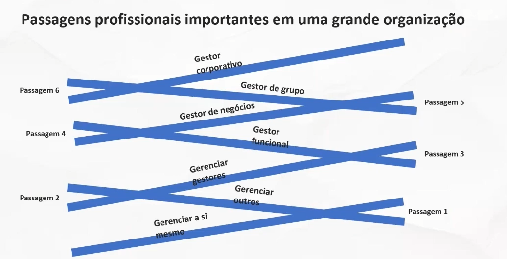
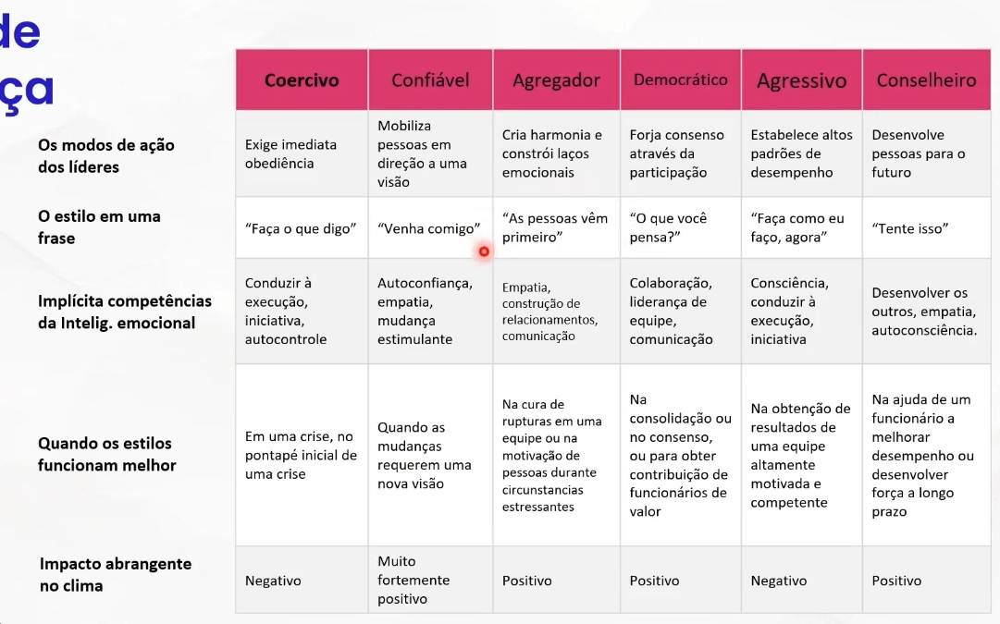
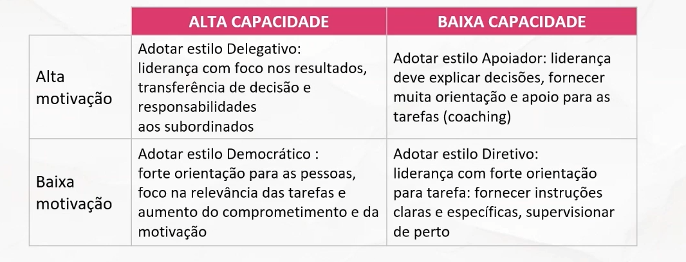
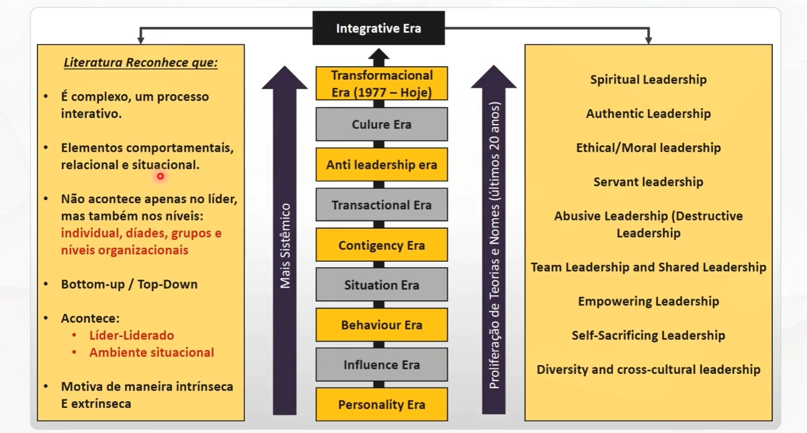
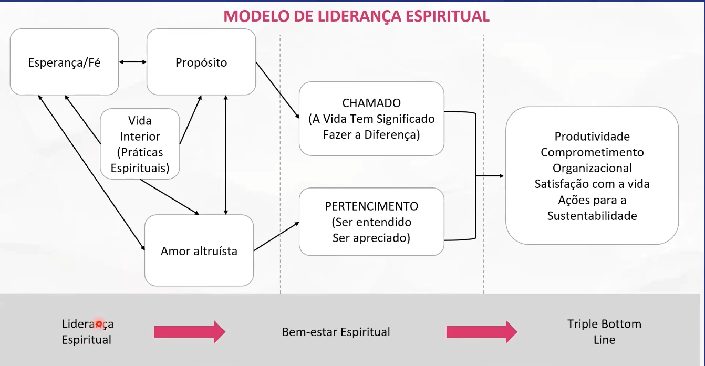

# Liderança em Projetos de Tecnologia I
- "Quando chegamos a determinado ponto da nossa vida profissional a nossa missão é muito menos conectada com o que sabemos/queremos fazer no trabalho e mais conectada com a nossa capacidade de **conseguir fazer com que o outro saiba e queira fazer o trabalho**."

- **A natureza mutável do trabalho e das organizações**
  - Globalização;
  - Intensificação da Competição;
  - Nova tecnologia da informação e comunicações;
  - Conectividade e Colaboração;
  - Sustentabilidade/Resiliência às Crises.

## Motivação e engajamento: o que te motiva?
### Motivação
#### O que te motiva?
- **Motivação:** conjunto de processos que dão ao comportamento uma intensidade, uma direção determinada e uma forma de desenvolvimento próprias da atividade individual
- **Motivado:** diz-se do indivíduo que se comporta com determinação ou intensidade em busca de algum objetivo

- Para Hitt el al "os **fatores motivacionais** são responsáveis pela disponibilidade das pessoas de aplicarem seu capital intelectual em benefício do sucesso da empresa"

- "Forças oriundas do interior de uma pessoa, que são responsáveis pelo direcionamento, pela intensidade e pela persistência intencionais dos esforços, orientados para **alcançar objetivos específicos** que não dependam de capacidades ou de demandas ambientais."

#### Aumentos na Produtividade
- **Des=f(C, M, A)**
  - **Capacidade:**
    - Recrutamento
    - Seleção
    - Treinamento
    - Desenvolvimento
  - **Motivação:**
    - Enriquecimento de cargo
    - Promoções
    - Coaching
    - Feedback
    - Recompensas
  - **Ambiente:**
    - Empowerment
    - Equipes
    - Liderança
    - Cultura

#### Motivação Extrínseca
- Está relacionada a **recompensas materiais**, tais como:
  - Salários
  - Benefícios adicionais
  - Seguro de vida
  - Promoções
  - Ambiente e condições de trabalho

#### Motivação Intríseca
  Está relacionada a **recompensas psicológicas**, tais como:
  -  O reconhecimento da habilidade de alguém
  -  Sentido de desafio e realização
  -  Reconhecimento positivo ou apreciação
  -  Ser tratado de maneira considerável

#### Teoria das necessidades de Maslow
- Parte da ideia de que as pessoas buscam satisfazer necessidades específicas, formadas a partir de uma **escala de importância** que pode ser representada por uma pirâmide
  - Autorregulação
  - Necessidade de estima
  - Necessidades sociais de pertencer
  - Necessidade de segurança
  - Necessidade fisiológica

#### Teoria ERG
- Essa teoria é uam releitura contemporânea da Teoria das Necessidades de Maslow, em que se postula a existência de três grupos de necessidades essenciais 

#### Teoria de Mc Clelland
- O psicólogo americano Mc Clelland, em sua teoria, também classifica a questão da motivação individual e coletiva **com base nas necessidades humanas**
  - **Realização:** pessoas que desejam fazer as coisas melhor e de maneira mais eficaz do que outras pessoas já possam ser feito
  - **Afiliação:** pessoas que t~em o forte desejo de se sentir queridas e de permanecer em bons termos com a maioria das pessoas
  - **Poder:** pessoas que têm vontade de influenciar outras pessoas e eventos

#### Teoria dos dois fatores
- Desenvolvida pelo estudioso americano Frederick Herzberg, que considerava haver pelo menos dois **conjuntos de elementos fundamentais** à motivação nas empresas
  - **Fatores Higiênicos (ambientais):**
    - Salários
    - Benefícios sociais
    - Políticas da empresa e regulamentos internos
  - **Fatores emocionais:**
    - Conteúdo do cargo
    - Tarefas e deveres relacionados à função exercida

#### Princípios de Enriquecimento do Trabalho
- Aumentar a responsabilidade dos indivíduos para o seu trabalho através da remoção de alguns controles
- Dar às pessoas a responsabilidade por um processo completo ou unidade de trabalho
- Disponibilizar informações diretamente aos empregados, em vez de enviá-los através de seus gestores
- Capacitar as pessoas a assumir novas tarefas mais difíceis, que nunca tenham utilizado antes
- Atribuir indivíduos tarefas específicas que permitem que eles se tornem especialistas

##### Maior Ênfase em Aspectos Culturais e Menos em Compensação Financeira
- Quão importante são os seguintes elementos de trabalho para você?
  - **Pacote de Remuneração:**
    - 8. Salário fixo atrativo
  - **Ambiente de Trabalho:**
    - 2. Bom relacionamento com colegas de trabalho
    - 3. Bom equilíbrio trabalho / vida pessoal
    - 4. Bom relacionamento com superiores
    - 7. Estabilidade do trabalho
  - **Conteúdo do Trabalho e Oportunidade:**
    - 1. Apreço pelo trabalho
    - 6. Desenvolvimento de carreira e aprendizado
    - 9. Conteúdo do trabalho interessante
  - **Imagem e Reputação da Empresa:**
    - 5. Estabilidade financeira da empresa
    - 10. Valores da empresa

# Liderança em Projetos de Tecnologia II
## Liderança
### Qual líder te inspira?
- Qual **qualidade ou valor** ele demonstra em suas ações?

### Bases para uma Organização de Alta Performance
- **Clima:** como nos sentimos sobre tudo
- **Cultura:** a forma como fazemos as coisas aqui
- **Valores:** expressos e vividos através de comportamentos
- **Visão de mundo:** hipóteses da Velha versus Nova Economia

| Empresa  | A empresa é conhecida por                      | Líderes dessa são conhecidos por                                                             |
| :------- | :--------------------------------------------- | :------------------------------------------------------------------------------------------- |
| Walmart  | Preços baixo, sempre                           | Administrar custos com eficiência, pontualidade na execução                                  |
| McKinsey | Ser uam conselheira de confiança de executivos | Liderar equipes que "desconstroem" problemas empresariais, sintetizar dados e criar soluções |
| Apple    | Inovação e design                              | Criar produtos e serviços novos que rompem normas do setor                                   |

#### Liderança no Século 21: a necessidade de um novo paradigma?
- "Gestores Pensam" e "Empregados Agem" -> Líder Apoia e Empodera (Empoderamento e espaço para o desenvolvimento)

#### Desafio Atuais da Liderança
- **Liderança Enxuta:** Menos de hierarquia, não Senioridade;
- **Liderança Virtual:** Lidar com Força de Trabalho Dispersa;
- **Liderança de Equipe:** Mudanças de Papéis e Responsabilidades;
- **Liderança da Diversidade:** Conduzindo gênero, idade e cultura;
- **Balanceamento de Valor Liderança:** Vinculando Valores Organizacionais e Individuais;

#### Como liderar equipes virtuais?
- **[Gestão de Equipes Virtuais](https://blog.zignet.com.br/2024/04/30/gestao-de-equipes-virtuais-dicas-para-liderar-com-eficiencia-em-um-ambiente-de-trabalho-remoto/):** Dicas para Liderar com Eficiência em um Ambiente de Trabalho Remoto

- **De:** Ordenar e Controlar
- **Para:** Cultivar e Coordenar

- Liderança não é um identidade, mas uma **tarefa**!!!
- **Como trabalhamos nossa liderança temporária?**

#### Competência do Estar Líder
- **Liderança Distributiva** - Thomas W. Malone
  - MIT "Inventing the Organizations of the 21st Century"
1. Traduzir coisas complexas em situações simples;
2. Visualizar o futuro;
3. Relacionar-se bem;
4. Executar com criatividade;

#### Habilidades do líder e gestão de times
- **Enquete:** qual a principal competência o líder precisa demonstrar para liderar equipes?
  - A CEO da IBM, Virginia Rometty, tem as habilidades interpessoais necessárias para atingir o sucesso na gestão. Habilidade de comunicação e liderança colocam em destaque gestores como Rometty, mostrada aqui em um painel de discussão em Washington. Rometty é uma líder inovadora capaz de impulsionar a cultura empreendedora da IBM e suas habilidades e ajudaram a...

### Pipeline da Liderança
- **Escopo do Tempo, Valores e Habilidade Requeridas**

- Necessidade de se concentrar mais na **Estratégia** e nos **Talentos**, e não apenas na receita e no volume.
  - Concentração de iniciativas de aprendizado nas habilidades certas para o nível certo
  - O desenvolvimento dos líderes se faz pela **exposição** e **desafios** de diferentes **complexidades**
- O **Líder** em **exposição** a cada nível de **Complexidade**:
  - Necessidade de desenvolver um novo conjunto de competências
  - Rever sua forma de administrar seu tempo de dedicação aos assuntos do dia a dia
- Pontos críticos no desenvolvimento da Liderança:
  - Arquitetura que concentre os programas e processos de recursos humanos;
    - Padrões em comum para desempenho e o potencial
  - Os programas de liderança devem ter um alinhamento mínimo quanto aos desafios futuro da organização (estratégia e valores)
- Pontos críticos no desenvolvimento da Liderança:
  - Há um "gap" na competência na seleção de pessoas por parte dos executivos
  - O RH direcionou esforços na identificação e atração de talentos, foco no "input". O desejado seria o foco no "output"
  - Necessidade de um contexto conectivo nas ações de RH no desenvolvimento de liderança
- Fatores externos do Pipeline de Liderança:
  - Não adequação do talento externo
    - Necessidade de adequação à cultura da empresa
    - Falta de uma rede de relacionamento
  - Necessidade de clareza em relação aos papéis
  - Conteúdo dos cargos em contante mudança
    - Capacidade de liderar à distância
- Encontrar e desenvolver líderes:
  - Na promoção de pessoas, expectativa que deem conta do trabalho, e não o conhecimento e habilidade de lidar com um nível de liderança
  - "Contratar pessoas talentosas faz sentido como prática mas não como estratégia"
- Potencial inexplorado de Liderança:
  - Possibilidade de desenvolvimento de líderes internamente
  - Definição de potencial como algo que alguém pode realizar no futuro
  - Potencial baseado nas realizações do passado e capacidade de aprender com tarefas maiores e mais complexas

- Cada passagem representa mudanças no requisitos do cargo:
  - Habilidades
  - Aplicação de tempo
  - Valores profissionais

#### Passagem 1: Gerenciar outros
- Habilidades importantes para aprender nessa passagem:
  - Orientação e mensuração do trabalho dos outros
  - Planejamento
  - Definição de trabalho
- Mudança mais difícil envolve valores. Aprender a valorizar o trabalho de gestão
  - Dedicar tempo as pessoas
  - Praticar o coaching

#### Passagem 2: Gerenciar gestores
- Atribuir tarefas gerenciais e de liderança
- Mensurar progresso na gestão e orientação
- Coaching como uma das ferramentas essenciais
- Dominar habilidades de escutar. Saber ouvir não apenas o que está sendo dito, mas também o que não está sendo dito.
- Ajudar as pessoas a realizar o trabalho envolve:
  - Prestar atenção a elas
  - Monitorar o que e como o trabalho está sendo realizado
  - Isso requer tanto tempo quanto esforço
- Sinais de um gestor de gestores na posição
  - Dificuldade de delegar
    - Quanto maior o nível da liderança
  - Gestão de desempenho inadequada
    - Incapacidade de se comunicar de forma produtiva
  - Não desenvolvimento de uma equipe forte
  - Em geral, não demonstra interesse em questões estratégicas

#### Passagem 3: Gestor funcional
- Pensamento em prazo mais longo, 3 a cinco anos 
- Habilidades de trabalho em equipe com outros gestores
- Conhecimento pleno e detalhado do modelo de negócios e das metas de longo prazo
- Visão ampliada quanto a recursos com base nas necessidades dos negócios

#### Passagem 4: Gestor de negócios
- Atribuir tarefas gerenciais e de liderança
- Desafios no equilíbrio e escolhas entre metas futuras e as necessidades atuais 
- Responsabilidade por integrar funções

##### Triângulo de alinhamento
- **Direcionamento estratégicos:**
  - Produto 
  - Mercados
  - Concorrentes
  - Clientes
- **Competência coletiva (pessoas):**
  - Experiência
  - Habilidades
  - Mentalidade
  - Perspectiva
- **Competência organizacional:**
  - Estrutura
  - Definição de cargos
  - Processos
  - Alocação de pessoal
  - Cultura

#### Passagem 5: Gestor de grupo
- Habilidade de avaliação de estratégia com objetivos de alocação de capital e de pessoal
  - Perguntas certas e análise de dados relevantes
  - Informações relevantes da capacidade de planejamento de seus gestores de negócio
- Dispender 50% ou mais do seu tempo no coaching e desenvolvimento do seus diretos

#### Passagem 6: Gestor corporativo
- Desafio na diversidade de instâncias nas quais precisam prestar contas:
  - Conselho, comunidade, acionistas, força de trabalho etc.
- Lidar com desafios de curto e longo prazo
- Focar nas suas habilidades, aplicações de tempo e valores profissionais à direção da execução
- 3 características se destacam para o perfil:
  - Sendo de propósito, além dos números
  - Visão clara do caminho a ser tomado
  - Capacidade de comunicar o propósito e o caminho a um grande número de pessoas

#### Identificação de problemas do pipeline de liderança:
- Mais comum, gerentes de 1º nível realizando trabalho de colaboradores Individuais
- Quando empresas aceitam o desequilíbrio, fica difícil atingir a eficácia
- Empresas adotam pensamento do curto prazo, tornando difícil o diagnóstico do desequilíbrio
- **LACUNAS**
  - Um nível deixa de oferecer feedback em relação ao desempenho do nível imediatamente inferior
- **SOBREPOSIÇÃO**
  - Tanto o gestor funcional quanto o gestor de gestores instruem um gerente de primeiro nível

### Estilos de Liderança
- Líderes com **melhores resultados** não contam somente com um estilo de liderança

#### Coercivo
- É o menos eficaz em muitas situações. **A decisão extrema, de cima para baixo**, de um líder, destrói o nascimento de novas ideias
- Deve ser usado somente em extrema cautela e em algumas situações

#### Confiável
- Líder confiável é um **visionário**; ele motiva as pessoas por meio de esclarecimentos a elas de como seus trabalhos se encaixam dentro de uma grande visão para a organização
- Os líderes confiáveis dão as pessoas **suficiente espaço de ação** para desenvolver seus próprios meios

#### Agregador
- Líder agregador dão as pessoas a **liberdade de fazer seu trabalho** de forma que elas pensam ser a mais eficaz
- Para um senso de reconhecimento e recompensa pelo trabalho bem-feito, o líder agregador oferece amplo feedback positivo

#### Democrático
- Por despender tempo obtendo ideias das pessoas e abastecer-se, um líder constrói confiança, respeito e compromisso
- Ao deixar os colaboradores, por si sós, **terem uma palavra nas decisões que afetam seus objetivos na forma de fazer esse trabalho**, o líder democrático conduz à elevação da flexibilidade e da responsabilidade

#### Agressivo
- Estabelece padrões de desempenho extremamente altos e exemplifica a si mesmo neles
- É obsessivo a respeito de como fazer as coisas melhor e mais rápido, e pede o mesmo de todos em torno deles

#### Conselheiro
- Os líderes conselheiro ajudam os colaboradores a identificar suas forças e fraquezas exclusivas e atá-las às suas aspirações pessoais e de carreira
- Sobressaem na delegação de poderes; eles dão as pessoas tarefas desafiadoras

### Delegar
- **Delegar não é empurrar tarefas!!!!**
- Acompanhar, ajudar, reforçar, avaliar
- Preparar sucessores
- Elabore um plano para delegar:
  - O que? (ação específica)
  - Para quem?
  - Como quer que seja feito? (Estratégias)
  - Quando?
  - Forma de acompanhamento

### Confiança/Lealdade
- Nos relacionamento que escolhi, sou fiel, tenho fé e confio no caráter, habilidade, força e verdade dos outros
  - O fator confiança: a base para uma liderança extraordinária
  

### Integridade
- Eu digo o que faço e faço o que digo. Sou coerente.
  - "Integridade é uma escolha pessoal, um compromisso inflexível e consciente em honrar valores e princípios éticos, morais e espirituais. (Barbara Killenger)

### Por que alguém deveria ser liderado por você?
- **Primeiro passo: autoconhecimento**
  - **TESTE DO ESPELHO**
    - Essa pessoa é alguém que você respeita e admira?
    - Essa pessoa vive de acordo com seus valores?
    - Quais suas qualidades e defeitos?
    - É um líder que você seguiria?

#### Autoconhecimento
- **Propósito:** identificação a paixão e o sentido
- **Identidade:** quem é você? quem deseja ser?
- **Crenças e valores:** o que realmente importa? no que acredita que pode limitar seu potencial?
- **Competências:** como está usando suas habilidades? quais novas competências precisa?
- **Comportamento:** o que está fazendo? o que gostaria de fazer? o que seja mudar?
- **Ambiente:** perguntas com: onde, quando e com quem?

#### O que fazem os líderes?
- Servir de exemplo
- Acompanhar o dia a dia
- Dar feedback
- Perceber as reações após feedbacks
- Trabalhar o emocional da equipe
- Avaliar desempenho
- Mostrar caminhos
  

#### Papel do Líder
- Liderança "Exemplar"
- Aspectos que devem ser considerados no trabalho com a equipe

1. Desafiar o estabelecido
2. Inspirar uma visão compartilhada
3. Capacitar as pessoas para a ação
4. Apontar o caminho
5. Encorajar o coração

#### O desafio de liderar
- **Foco na tarefa:** prejudica-se o relacionamento e causa insatisfação
- **Foco no relacionamento:** difícil manter a ordem e obter resultados positivos na produção

- Portanto, liderança é executar as tarefas enquanto se constroem os relacionamento

#### Teoria da Liderança Situacional 
- A liderança deve se adaptar conforme o nível de motivação dos liderados e sua capacidade para realizar as tarefas

#### Qualidades da Liderança Espiritual
- **PROPÓSITO:**
  - Amplo apelo aos principais interessados
  - Define o destino e a jornada
  - Reflete altos ideais
  - Incentiva a esperança/fé
  - Estabelece Padrão de Excelência
- **AMOR ALTRUÍSTA:**
  - Confiança / Lealdade
  - Perdão / Aceitação / Gratidão
  - Integridade
  - Honestidade
  - Coragem
  - Humildade
  - Bondade
  - Compaixão
  - Paciência / Sensibilidade / Resiliência
  - Excelência
  - Diversão
- **ESPERANÇA/FÉ:**
  - ResiliÊncia
  - Perseverança
  - Faça o que é preciso
  - Metas de alongamento
  - Expectativa de recompensa / vitória
  - Excelência

### Liderança na era da complexidade
- **Porque continuamos esperando por heróis?**
  - PRESSUPOSTOS:
    - Os líderes têm as repostas. Eles sabem o que fazer
    - As pessoas fazem o que lhes é dito. Elas só têm que receber bons planos e instruções
    - Alto risco exite alto controle. Quando as situações se tornam mais complexas e desafiadoras, o poder precisa ser deslocado para o topo (com líderes que sabem o que fazer).

- **RESULTADO:**
  - **Modelo de Comando e Controle**
    - Aqueles na base da hierarquia se sujeitam a visão maior e a experiência daqueles acima. Líderes prometem nos tirar dessa confusão; e nós voluntariamente entregamos a nossa autonomia individual em troca de segurança
  
- A única consequência previsível é que os líderes criam mais caos, se isolando com apenas alguns poucos assessores chave, e tentam encontrar uma solução simples (e rápida) para um problema complexo. E as pessoas os pressionam para fazer justamente isso. Todo mundo quer ver o problema desaparecer; gritos de "consertem-no!" surgem do público. Os líderes se esforçam para que pareça que tudo está sob controle. Mas a causas dos problemas de hoje são complexas e interligadas. Não há respostas simples, e nenhum indivíduo sozinho pode saber o que fazer.

### Mas como mudar essa perspectiva?
- **PROJETO ARISTÓTELES DO GOOGLE**
  - Iniciativa criada em 2012 para estudar 180 times do Google e entender porque alguns deles dispararam, enquanto outros ficaram para trás. Sua hipótese inicial era de que eles precisavam da combinação perfeita de pessoas, mas após acolher muitos dados e rearranjá-los, era praticamente impossível encontrar padrões ou qualquer evidência de que a composição do time fazia alguma diferença. 

- Nos times de alta performance, o todo é maior que a soma das partes. Não interessa ter 1 ou 2 pessoas brilhantes se elas não sabem colaborar com o time.
- O desempenho do time está diretamente relacionado à forma como seus membros trabalham juntos.

1. Enquadre o trabalho como um problema de aprendizado e não de execução: deixe claro que existe muita incerteza à frente e grande interdependência. Dadas essas duas coisas, vocês nunca estiveram nesse lugar antes e precisam do cérebro e voz de todos no jogo. Todos estão aprendendo juntos como fazer. É uma questão de humildade situacional: ver e assumir a realidade como ela é.
2. Reconheça sua própria possibilidade de falhar: você sabe que é falho e isso não te faz menos líder. Na verdade, saber falar de seus erros convida os outros a fazerem o mesmo e rompe com a cultura do silêncio. Diga coisas simples como "acho que deixei passar algo, preciso ouvir de você"
3. Modele a curiosidade: faça muitas perguntas, tenha um interesse genuíno sobre a percepção e ideias dos outros, esteja aberto(a) a desaprender para reaprender, se necessário. Isso cria a necessidade de expressar-se.

