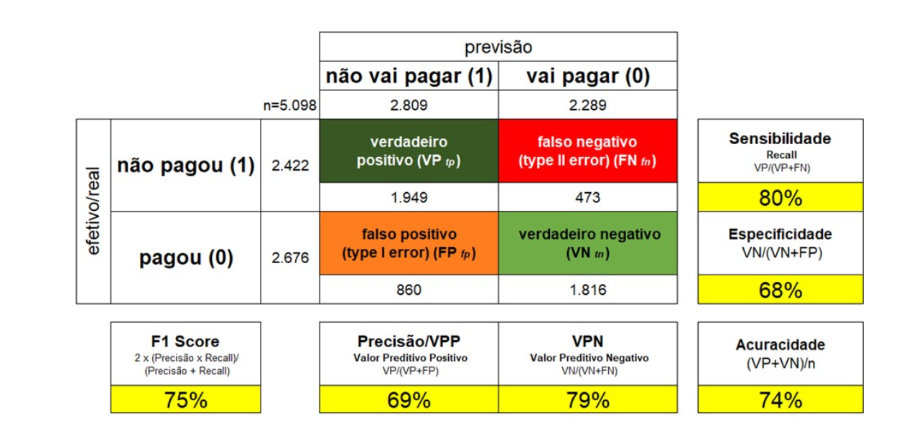

# Tendências em Inteligência Artificial e Big Data
## Tendências em Inteligência Artificial
1. Intro Big Data
2. O que é um modelo preditivo?
3. Simplificando: o que é IA, afinal?
4. IA com dados estruturados
5. IA com dados não estruturados
6. Qualidade e explicação de modelos preditivos
7. Alguns pontos importantes sobre IA generativa
8. Regulação, ética, justiça, transparência

## O que é big data?
* Há 4 mil anos as informações eram armazenadas em Creta
* Hoje em dia é de forma digital, mais informação, mais fácil de pesquisar, copiar e compartilhar

Saímos de:
* Estoque (de dados) -> Fluxo (de informação)

* [Armazenar dados está cada vez mais barato](https://ourworldindata.org/grapher/historical-cost-of-computer-memory-and-storage)
* Coletamos muito mais dados

* Big Data não nasceu na academia, foi do mercado

* **Definição:** "Big data é um conjunto de informações em alto **volume**, alta **velocidade** e/ou alta **variedade**, que demanda formas inovadoras e custo-efetivas de processamento de informações, permitindo uma visão aprimorada, **tomada de decisões** e automação de processos." [Gartner](https://www.gartner.com/en)

### Os clássicos 3 V's do big data
* **Volume:**
  * como o próprio nome diz, volume massivo de dados
  * alinhado com fato de que temos acesso a cada vez mais dados
* **Variedade:**
  * diversidade de formatos e fontes
  * dados heterogêneos
* **Velocidade:**
  * rapidez de geração
  * fluxo contínuo
  * velocidade de processamento

Obs: O big data surgiu por volta de 2000. Porém, sempre conseguimos utilizar grande volume de dados, claro, com algumas limitações de hardware. A principal diferença é que antes do big data, nós só conseguíamos trabalhar com dados estruturados. O big data nos deu a possibilidade de trabalhar com dados não estruturados

### Outros 2 V's importantíssimos do big data
* **Veracidade:**
  * "Integridade"
  * Precisão dos dados
  * Confiabilidade das informações
  * Validade das fontes
* **Valor:**
  * Insights estratégicos
  * Benefícios comerciais
  * Vantagem competitiva

Obs: dado não vale nada se ele não for trabalhado. Além disso, dados são combustíveis, mas o analytics é o motor. Analytics é tudo o que envolve dados como visualização de dados, IA, etc
Big data é um conceito

## Dados
* **Dados não estruturados:** qualquer tipo de dados: posts, imagens, áudio, vídeo, livros
* **Dados semiestruturados:** XML e JSON
* **Dados estruturados:** tabelas; nosso dia a dia empresarial; em geral linhas e colunas; bancos de dados relacionais

Estruturados -> Semiestruturados -> Não estruturados
----------------------------------------------------> maior complexidade, maior necessidade de recursos

## O que é um modelo preditivo?
* Uma função matemática capaz de identificar padrões por meio de uma série de dados previamente coletados

### Como podemos definir um cachorro?
0 ou 1
* ser vivo?
* tem 4 patas?
* é mamífero?
* é da família canidae?
* é doméstico?

* **Nesse exemplo só faltou a coluna label (target) dizendo se é cachorro ou não, pois é assim que a máquina vai aprender**

* Cachorro?    1 1 1 1 1 = Probabilidade de 5/5 = 100%
* Lobo?        1 1 1 1 0 = Probabilidade de 4/5 = 80%
* Gato?        1 1 1 0 1 = Probabilidade de 4/5 = 80%
* Galinha?     1 0 0 0 1 = Probabilidade de 2/5 = 40%
* Big Mac?     0 0 0 0 0 = Probabilidade de 0/5 = 0%
* iPhone?      0 0 0 0 0 = Probabilidade de 0/5 = 0%

* Ou seja, o modelo preditivo retorna a probabilidade de qualquer coisa ser um cachorro uma vez avaliados 5 critérios

* P(cachorro) = 0.2x de peso para cada característica

### Simplificando a IA
* **Super Inteligência Artificial (ASI, "Artificial Super Intelligence"):** máquinas autoconscientes. Ainda não existe, mas está sendo estudada para que seja ética e segura
* **Inteligência Artificial Geral (GAI, "General Artificial Intelligence"):** IA que procura soluções para os quais ela não foi especificamente treinada
* **Inteligência Artificial Restrita (NAI, "Narrow Artificial Intelligence"):** é a IA com objetivos específicos. A maior parte dos modelos baseados em IA que conhecemos e estão no nosso dia a dia são desse grupo. 

* **Obs:** as duas primeiras ainda não existem

#### Machine Learning (Aprendizado de máquina)
Quando estamos usando machine learning, estamos usando análise preditiva, fazendo previsões
* Predictive Analysis (Análise Preditiva): "prever" está mais rápido, mais barato e mais assertivo. E possibilita novas aplicações"
* O termo mais correto é "predição", mas para simplificação estamos usando "previsão"

* Autonomia veicular nunca foi pensado como um problema de previsão!
  * autonomia não é novo, mas tradicionalmente é utilizada em ambientes controlados, como por exemplo armazéns

* obs: o computador funciona por condicionais:
  * Os **condicionais** são simples:
    * **Se** alguém está na frente, **Então** pare
    * **Se** prateleira está fazia, **Então** vá para a próxima prateleira

* **Autonomia numa cidade é impossível com o método tradicional! Muitos condicionais**
  * **Se** está escuro
  * **Se** está chovendo
  * **Se** uma criança corre para frente do carro
  * **Se** outro veículo freia a frente
  * **Se** farol está apagado
  * **Se** placa é ilegível
  * **Se** há blitz da lei seca
  * etc etc etc

* O mundo real é imperfeito: e conseguimos identificar as **similaridades**
  * por exemplo, diversos tipos de placas de Pare
  * diversos modelos de bicicletas
* Similaridade é óbvio para o ser humano, mas não para um computador

* autonomia veicular só pode ser resolver com previsão!
  * o que um "bom humano" faria?

* no início o "programa" comete erros... mas aprende com estes erros e atualiza o "programa" sempre que prevê de forma errada o que um "bom humano" faria. As previsões melhoram até o momento que o "programa" fica melhor que um "bom humano"; neste ponto, o "programa" pode atuar sozinho
* quem faz as previsões são os "programas", só que em IA tem outro nome: **algoritmos**

**Obs:** A IA aprende com acerto ou erro

## IA com dados estruturados
### Um exemplo próximo do dia a dia: turnover (RH)
* **Por que é um bom exemplo?**
  * Toda empresa tem RH!
  * Toda empresa detesta perder colaboradores
  * Substituição de colaboradores pode custar até ~250% do salário anual
* **Qual o objetivo?**
  * Projeto para redução do turnover usando um modelo de análise preditiva que determina a probabilidade individual de um colaborador pedir demissão.

* Pessoas (características):
  * Horas Extras Média Mensal
  * Sobreaviso
  * Operacional
  * Abono Pecuniário
  * Empréstimo
  * Horas Ausentes Média Mensal
  * Salário Base
  * Insalubridade
  * Sindicalizado
  * Atraso
  * Sexo (M)
  * Intercepto
  * Idade
  * + Desligado (é que oe define azul ou vermelho): é um dado target

* Essas características são o dataset
* **Regressão logística**

* Podemos separar um grupo de alunos por critérios (são 12 pessoas)
  * **Nomes:** teremos 12 grupos diferentes, porque nenhum nome é igual
  * **Idade:** todos tem 12 anos, então teremos um grupo
  * **Gênero:** parece uma boa separação, porque teremos dois grupos

* **P-Valor:** quanto mais próximo do zero, mais aquele dado vai diferenciar o porque as pessoas se desligam da empresa

* **Possibilidades ilimitadas de análise**
  * Concentração em algum gestor? Unidade? Processo?
  * Homogêneo entre sexo? Idade? Cargo?
  * Baixo turnover está correlacionado com promoções?
  * O turnover está correlacionado com tempo de casa? Menores? Maiores? Ou não se relaciona?
  * Quais principais "drivers" do ALTO turnover? E do BAIXO turnover?
  * Levamos em conta os drivers de baixo turnover no processo de recrutamento?

* Usando IA, quem cria os condicionais é o computador!

## IA com dados não estruturados
* Ao contrário dos modelos de dados estruturados, quando trabalhamos com dados não estruturados (principalmente imagem, vídeo e áudio), usamos modelos prontos em nuvem criados por outras empresas

### Tarefas: respostas
* **Classificação:** Gato
* **Classificação e Localização:** Gato; coordenadas
* **Detecção de objetos:** Gato, Cachorro, Pato
* **Segmentação por instâncias:** Gato, Cachorro, Pato

### Serviço de análise de vídeo: análise espacial
* Resumo de vídeo e localizador de quadros
* Contar pessoas em uma área
* Detectar quando pessoas cruzam uma linha
* Detectar quando pessoas entram ou saem de uma área determinada
* Monitorar distanciamento social

## Qualidade e explicação de modelos preditivos
### Qualidade dos dados
1. Não existe modelo bom quando os dados de treinamento são ruins
2. Porém, mesmo com dados de qualidade, não necessariamente podemos criar um modelo!
   1. Indíviduo 1: Rei Charles
      * Homem
      * Nascido em 1948
      * Residente no Reino Unido
      * Casado 2 vezes
      * Mora em um castelo
      * Classe A
      * Grande poder aquisitivo
   1. Indíviduo 1: Ozzy Osbourne
      * Homem
      * Nascido em 1948
      * Residente no Reino Unido
      * Casado 2 vezes
      * Mora em um castelo
      * Classe A
      * Grande poder aquisitivo
* Parecem iguais, mas não são

### Qualidade da previsão
* Matriz de Confusão

* **Métricas importantes:**
  * **VPN:** 79%: 1 em cada 5 não vai pagar - Risco: Inadimplência
  * **Precisão/VPP:** 3 em cada 10 que deixamos de vender iriam pagar - Risco: perda de receita

## Explicação
* Lloyd Shapley
* Scott Lundberg

* Modelo da biblioteca Shap
* Conseguir explicar o modelo e os dados finais

## Alguns pontos importantes sobre IA generativa
* Precisamos olhar para o chatGPT como se ele fosse o nosso assistente
  * Geração de texto
  * Geração de códigos de programação
  * Resposta a perguntas
  * Sumarização de texto
  * Tradução de idiomas
  * Correção de texto: erros ortográficos e gramaticais
  * Diálogo: manter uma conversa fluente, mantendo o contexto da conversa

### Open-source
* Stanford Alpaca
* Vicuna
* Meta
* 22-hours/cabrita
* Mistral AI_

* GPT não é "melhor" que os métodos de machine learning já consolidados
* GPT é diferente: resolver problemas que antes não conseguíamos resolver de forma trivial

### GPT (e não o chatGPT) será utilizado em tarefas de automação
* Automação precisa de supervisão adequada
* Caso KFC do Kristallnacht

## Regulação, ética, justiça, transparência
* A IA é enviesada pelo autor do modelo

## Key takeaways
1. IA não é nova moda; é uma **ferramenta** para reduzir custos ou aumentar receita
2. Cultura de dados é uma jornada, não um destino
3. O que faz diferença não é o software. Antes de mais nada, pessoas é que fazem a diferença. **Pessoas sabem definir problemas**
4. ... mas o ouro são os **dados**
5. **IA é o meio, não o fim**. O que interessa é o resultado.
6. Se existe um **caminho mais simples**, esse é o caminho!
7. Afinal, por onde eu começo?
8. DADOS

## Observações e Referência
* [FCA2 Auto Analyser Web](https://fabianocastello.com.br/fca2/)
* **[Neo4J](https://neo4j.com/):** Banco de dados orientado a grafos
* **Rebellion Robots** - Teatro
* [Google Cloud Vision API](https://cloud.google.com/vision?hl=pt_br)
* [Azure AI Vision](https://portal.vision.cognitive.azure.com/gallery/sptialanalysis)
* [O sinal e o ruído](https://a.co/d/02nzY4UV)
* [Regressão Logística](https://aws.amazon.com/pt/what-is/logistic-regression/)
