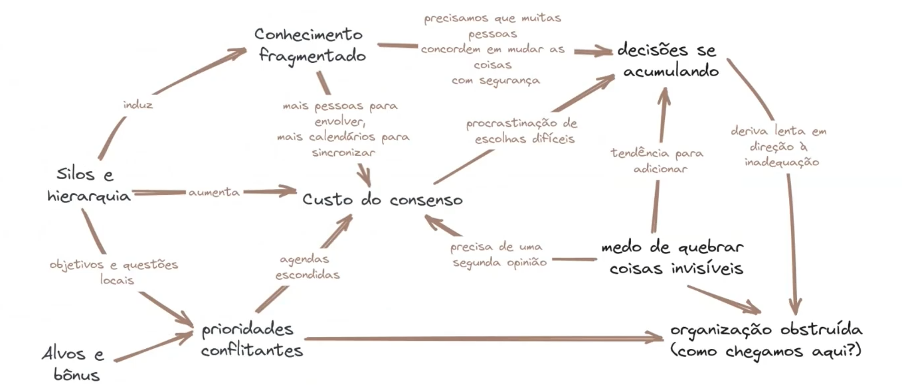
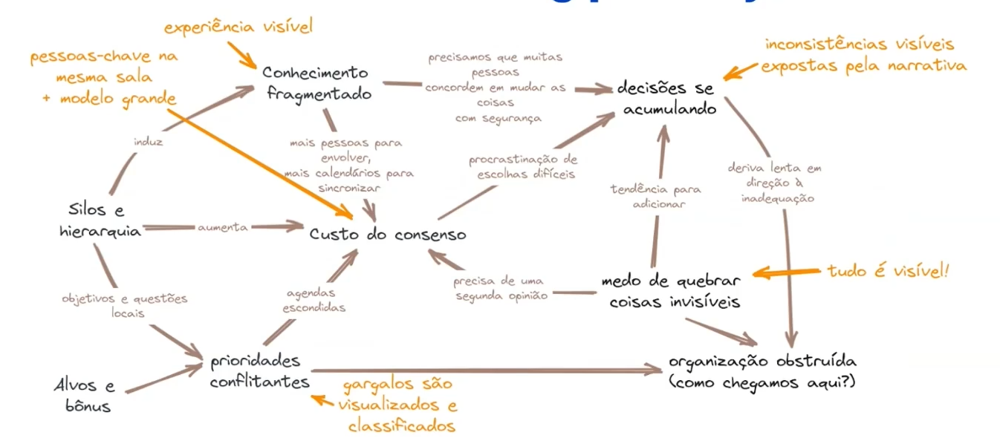
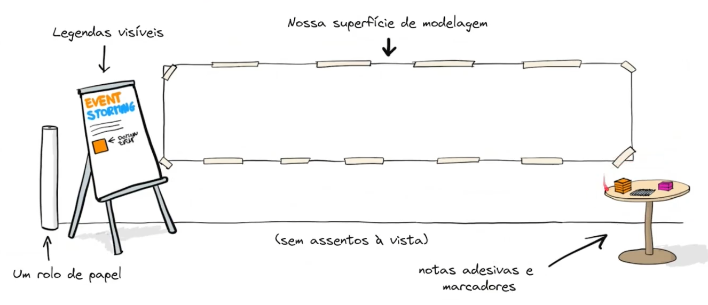
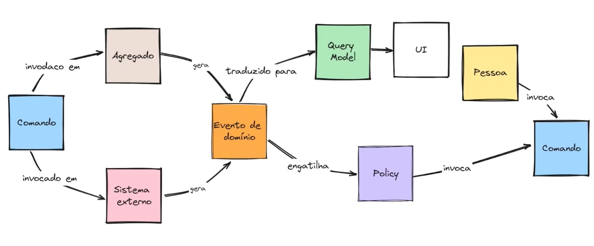
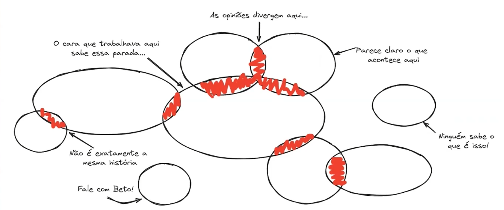

# Event Storming em Projetos de Software
## Os silos organizacionais
* Dentro de uma organização temos diversos setores, e as vezes esses setores parecem empresas dentro de uma organização. E na verdade esses setores deveriam se conhecer.
* Pode ter redundância de trabalho
* Falta de cooperatividade
* Falta de comunicação
* Perda de eficiência
* Resistência à mudanças
* e tomadas de decisões fragmentadas

### O problema do espaço organizacional

### Como o Event Storming pode ajudar

## Conhecendo o Event Storming
* Criado por **Alberto Brandolini**
* Técnica para **entendimento** do **domínio** das aplicações através dos seus **eventos**
* Realizando workshops envolvendo **experts do domínio** e a **área técnica**

### Desenvolvendo a linguagem ubíqua
* Intersecção da linguagem dos experts do domínio com a linguagem da área técnica

### O Workshop

### Mapeamento dos **eventos** do sistema
* Uma aplicação é um conjuntos de eventos
* Eventos são ações que acontecem no passado
  * Ex: Item a adicionado ao carrinho

* **Evento de Domínio:**
  * Papel de cor **LARANJA**
  * Verbo no passado
  * Relevante para experts do domínio

#### Entendo o que são **eventos**
* Isso não é um evento:
  * O inverno está chegando

* Esses podem ser eventos:
  * Queda drástica na temperatura foi detectada
  * Sinais de alerta assustadores foram reconhecidos

#### Alguns exemplos de **eventos** de domínio
* Usuário autenticado
* Assinatura rejeitada
* Fatura emitida
* Item adicionado ao carrinho
* Usuário cadastrado
* Código enviado ao e-mail cadastrado
* Pagamento recusado
* Autenticação realizada
* Item retirado do carrinho
* Pagamento realizado

### Bloco: **Pessoa**
* Geradores de evento:
  * Usuário aleatório
  * Usuário VIP
  * Viajante
  * Cliente
  * Troll raivoso

### Bloco: **Comando**
* **Usuário** engatilha um **comando** que vai gerar um **evento de domínio**

### Múltiplos eventos para a mesma interação
* Usuário -> Cadastrar conta:
  * Conta cadastrada
  * Cadastro interrompido por falha
  * Conta existente detectada

* O usuário pode gerar um ou mais eventos ao cadastrar uma conta.

### Bloco: **Sistemas externos**
* Gateway de pagamento
* Google Authenticator
* E-mail
* WhatsApp

### Bloco: **Query Model/Informação**
* A partir disso, podemos tomar uma decisão

* Viajante -> Comprar ticker (A DECISÃO) -> Site de ônibus

* As informações necessárias para decidir
  * Saindo de ...
  * Para ...
  * Saindo às ...
  * Chegará às ...
  * Preço ...

### Bloco: **Policy (Política)**
* A policy fica entre um **evento** e um **comando**
  * Sempre que evento(s) então comando(s)
* Cadastro finalizado -> política de boas-vindas -> enviar pacote de boas-vindas

### De onde vêm os eventos de domínio?
* Talvez de uma AÇÃO inicializada pelo usuário:
  * Usuário -> Cadastrar ticket
* Talvez de um sistema externo à aplicação:
  * Gateway de pagamento
* Talvez seja o resultado de um tempo que passou:
  * Período de testes finalizado
* Ou talvez eles sejam consequência de outro evento de domínio:
  * Usuário inscrito na lista de e-mails -> sempre que, então -> 

### Cronologia dos eventos
* Começando de algum lugar...
  * Mapeando os eventos
* Cronologia dos eventos
  * Aqui podem aparecer contextos da aplicação (basicamente áreas que não se conversam)

### Bloco: **Agregados**
* São as entidades do sistema
* Entidade Assinatura
  * Reativar Assinatura -> Assinatura Reativa
  * Suspender Assinatura -> Assinatura Suspensa
  * Ativar Assinatura -> Assinatura Ativada
  * Cancelar Assinatura -> Assinatura Cancelada

* Comandos -> Eventos

### Visão do exemplo Event Storming
* Usuário -> Ativar assinatura -> Assinatura -> Assinatura ativada

### ...algo mais próximo da realidade
* Usuário (pessoas Amarelo) -> Fazer assinatura (comando Azul) -> Assinatura (entidade Cinza) -> Assinatura iniciada (evento Laranja) -> Envia dados de pagamento para o Gateway (policy Roxo) -> Assinatura aprovada ou rejeitada (eventos Laranja)

### Bloco: **Hotspots** e **Oportunidades**
* Hotspots (Lilás) servem para mapear problemas, riscos, etc
  * Brecha de segurança
* Oportunidades (verde escuro) servem para capturar ideias
  * Por que não adotar blockchain?
  * Trial na assinatura
  * Taxa menor no Stripe

### Bloco: **Arrow Voting**
* é usado em oportunidades ou hotspots

### "A figura que explica todas as coisas"

### Bounded Contexts

### Eventos de fronteira
* Descobrir os bounded contexts
* O bounded contexts podem gerar possíveis microsserviços

* Contexto de:
  * Planos de Assinatura
  * Catálogo de Serviços
  * Autenticação de Usuário

### Revisando os blocos do Event Storming
* **Comando:** executa uma ação
* **External System:** qualquer plataforma externa
* **Agregados:** regras de negócios que são chamados por um comando
* **Hotspot:** possíveis problemas ou riscos
* **Query Model:** informação para apoio de decisão
* **Evento:** resultado de uma ação
* **Policy:** é chamado quando algo acontece
* **User:** pessoa que participa dos processos
* **Oportunidade:** novas ideias
* **Arrow Voting**
* **Limites**

## Observações e Referências
* [Stat's Studio](https://www.stats-studio.com/login)
* [Excalidraw](https://excalidraw.com/)
* [Aprenda Domain-driven Design: Alinhando Arquitetura de Software e Estratégia de Negócios](https://a.co/d/0fqX6iAb)

