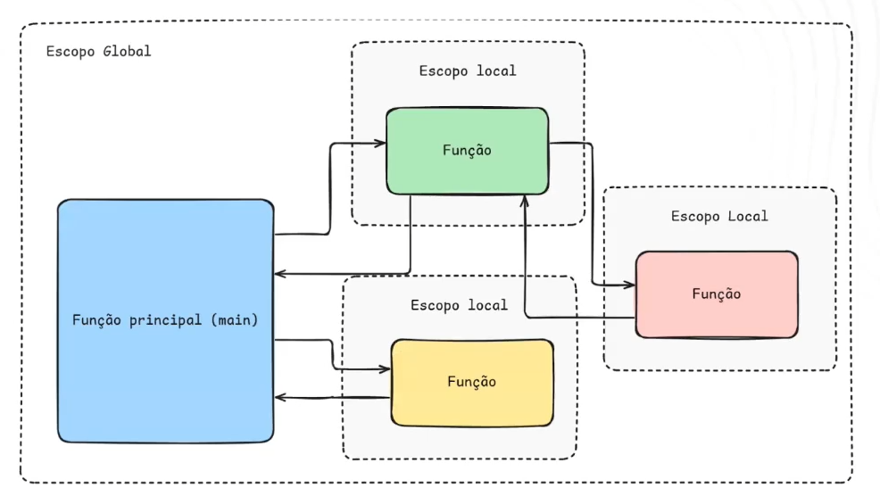
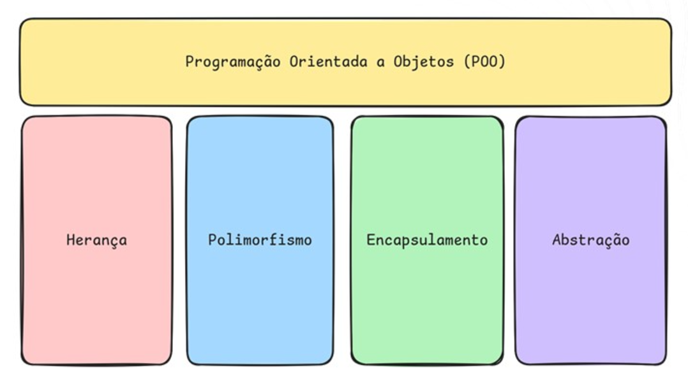
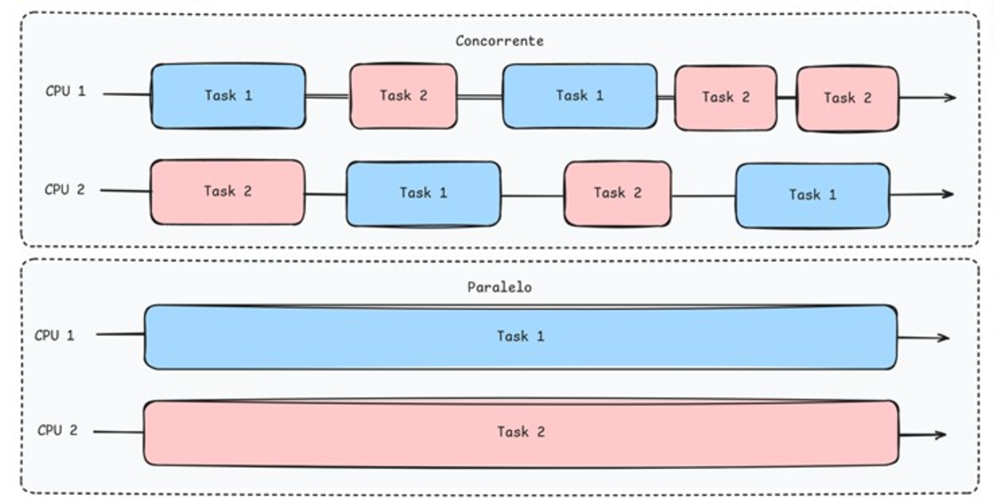
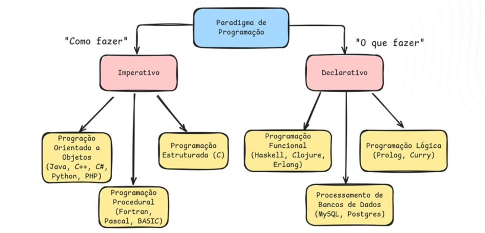

# Paradigmas de Desenvolvimento de Software I
## O Paradigma é a Base da Solução
- Padrões de Projeto
- Padrões Arquiteturais
- Paradigma de Programação

## Paradigma Imperativo (Década de 50)
- **Contexto:** o paradigma imperativo foi um dos primeiros estilos de programação adotados, em uma época em que o foco era controlar diretamente os recursos do computador
- **Linguagens Iniciais:** Assembly, Fortran
- **Características:** comandos sequenciais, uso de variáveis para armazenar estado e controle explícito do fluxo de execução
- **Impacto:** esse paradigma serviu como a base para a programação estruturada e oferece controle direto sobre o hardware

## Paradigma Funcional (Década de 1950)
- **Contexto:** baseado na teoria matemática das funções, esse paradigma cresceu com a popularização de linguagens específicas
- **Linguagens:** Lisp, Haskell
- **Características:** o paradigma funcional evita estados mutáveis e efeitos colaterais, priorizando funções puras e imutabilidade
- **Impacto:** oferece vantagens em programação concorrente e processamento de dados, sendo muito utilizado em problemas de matemática e computação científica, assim como em frameworks modernos para manipulação de dados e concorrência

## Paradigma Procedural (Década de 1960)
- **Contexto:** o paradigma procedural surgiu como uma evolução natural do imperativo, ao introduzir estruturas que organizam o código em procedimentos ou sub-rotinas. Isso ajudou a tornar o código mais modular e reutilizável
- **Linguagens:** C, Fortran, COBOL, Pascal
- **Características:** organização do código em procedimentos ou funções que podem ser chamados para realizar tarefas específicas. O programa é construído como uma sequência de chamadas a esses procedimentos, o que facilita o fluxo controlado de execução
- **Vantagens:** melhor modularidade em comparação ao imperativo puro, permitindo a reutilização de código e a redução de redundância
- **Exemplos de uso:** aplicações científicas, engenharia e sistemas empresariais que requerem processos repetitivos e organizados

## Paradigma Estruturado (Década de 60)
- **Contexto:** conforme os programa se tornaram mais complexos, surgiu a necessidade de criar uma estrutura mais organizada para o código
- **Linguagens:** C, Pascal
- **Características:** introdução de estruturas de controle (como loops e condicionais), subrotinas e funções, facilitando a manutenção e legibilidade do código
- **Impacto:** o paradigma estruturado abriu caminho para o desenvolvimento de programas mais organizados, reduzindo a "codificação spaghetti" (código desorganizado e de difícil leitura)

## Paradigma Lógico (Década de 1970 e 1980)
- **Contexto:** criado para aplicações de inteligência artificial e resolução de problemas baseados em lógica
- **Linguagens:** Prolog, Datalog
- **Características:** foca em declarar relações e regras que descrevem o problema, deixando para o computar a busca de soluções lógicas
- **Impacto:** embora não seja amplamente utilizado para aplicações comerciais, é essencial em áreas de IA, como linguagens naturais e inferência lógica

## Paradigma Orientado a Objetos (OO) (Década de 80)
- **Contexto:** surgiu como resposta à necessidade de modularidade e reutilização de código para sistemas cada vez mais complexos
- **Linguagens:** Java, C++
- **Características:** organiza o código em "objetos" que representam entidades do mundo real ou conceitual, encapsulando dados e comportamentos
- **Impacto:** tornou-se o paradigma dominante em desenvolvimento corporativo e jogos, promovendo a criação de bibliotecas reutilizáveis e ajudando a gerenciar a complexidade de sistemas grandes

## Paradigma Reativo (2000 em diante)
- **Contexto:** com o aumento da demanda por sistemas em tempo real e responsivos, o paradigma reativo se tornou mais relevante
- **Ferramentas e Tecnologias:** RxJS, Reactor, frameworks de programação reativa
- **Características:** utiliza fluxo de dados assíncronos e programação orientada a eventos, onde mudanças em uma parte do sistema reagem automaticamente a mudanças em outra
- **Impacto:** essencial para aplicações modernas como dashboards em tempo real, plataformas de streaming e sistemas distribuídos

## Paradigma Concorrentes e Paralelos (ao longo das décadas)
- **Contexto:** com a chegada dos processadores multicore, a programação concorrente e paralela tornou-se necessária para aproveitar melhor o hardware
- **Ferramentas e Tecnologias:** Threads, OpenMP, MPI, frameworks de atores como Akka
- **Características:** foco na execução simultânea de múltiplas tarefas para aumentar o desempenho e a eficiência de aplicativos que processam grandes volumes de dados
- **Impacto:** essencial para áreas como computação científica, simulações, e big data, ajudando a criar programas mais rápidos e capazes de processar grandes volumes de dados em paralelo

## Paradigma Imperativo e Declarativo

### Preparando uma xícara de café usando os paradigmas
- **Imperativo:** "João, pegue a cafeteira. Coloque água até o nível indicado. Abra o compartimento do pó de café. Coloque três colheres de pó. Feche o compartimento. Coloque a cafeteira na base. Aperte o botão de ligar. Aguarde até o café ficar pronto. Pegue uma xícara e coloque o café nela."
- **Declarativo:** "João, faça uma xícara de café."

## Prática
[Função Lambda](./pratica/aula/funcional/lambda.py): dobro = lambda ENTRADA: SAÍDA
[List Comprehension](./pratica/aula/funcional/puras-alta-ordem.py): [funcao(x) for x in lista]

# Paradigmas de Desenvolvimento de Software II
[Atributo Privado no Python](./pratica/aula/orientada-objeto/encapsulamento.py): self.__saldo_inicial = saldo_inicial 
[Executar prolog](./pratica/aula/logico/logicas.pl):
- swipl logicas.pl

