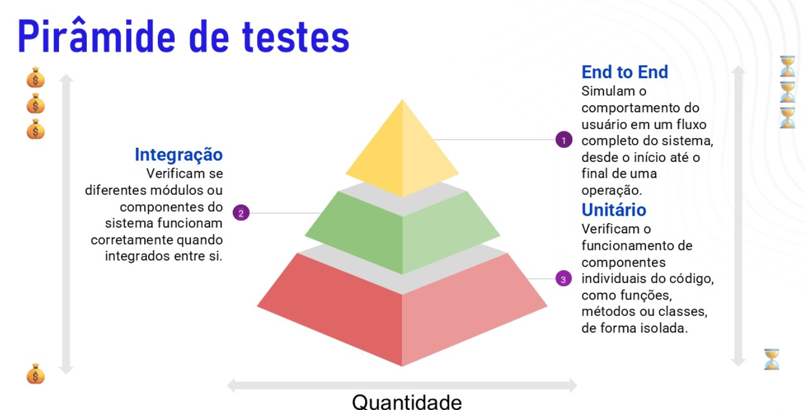

# Gerenciamento de Testes (TDD) I
## Ciclo de vida do TDD
- **Vermelho:** faça um teste que falhe
- **Verde:** faça o teste funcionar
- **Refatorar:** elimine a redundância

## Objetivos e Impactos
### Objetivos do TDD
- Reduzir a incerteza e a ansiedade no desenvolvimento de software
- Aumentar a qualidade e a confiabilidade do código desde as etapas iniciais
- Promover um desenvolvimento mais ágil e seguro

### Impacto do Medo no Trabalho
- O medo em excesso leva a programadores hesitantes, com menor proatividade e menos abertura para a colaboração
- Pode afetar a motivação, causando frustração e bloqueando o aprendizado e a criatividade

## Pirâmide de testes

### Testes Unitários
- **O que são:** os testes unitários verificam o funcionamento de componentes individuais do código, como funções, métodos ou classes, de forma isolada
- **Objetivo:** garantir que cada unidade de código funcione corretamente de maneira independente
- **Foco:** testar uma única parte do código, sem dependência de outras partes ou de sistemas externos, como bancos de dados
- **Exemplo:** testar os métodos de uma classe, como a validação dos seus atributos
- **Vantagens:**
  - rapidez na execução, pois testam apenas pequenas partes do código
  - facilidade de identificação de onde está o problema quando um teste falha, já que cada teste é focado em um único componente
- **Ferramentas Comuns:**
  - JUnit (Java)
  - NUnit (.NET)
  - Jest (JavaScript)
  - PyTest (Python)

### Testes de Integração
- **O que são:** os testes de integração verificam se diferentes módulos ou componentes do sistemas funcionam corretamente quando integrados entre si
- **Objetivo:** garantir que a interação entre módulos de código (por exemplo, interação entre entidades diferentes, ou entre uma aplicação e seu banco de dados) ocorre como esperado
- **Foco:** testar o funcionamento do sistema em conjunto, geralmente incluindo as dependências entre componentes
- **Exemplo:** testar a funcionalidade onde duas entidades interagem
- **Vantagens:**
  - identificação de problemas de integração que testes unitários não conseguem cobrir, como erros de comunicação entre módulos
  - útil para verificar a compatibilidade entre diferentes partes do sistema que precisam operar juntas
- **Ferramentas Comuns:**
  - Sprint Test (Java)
  - DBUnit (para testar banco de dados)
  - Mockito (para simulação de dependências)

### Testes de end-to-end (E2E)
- **O que são:** testes end-to-end (E2E) verificam o funcionamento de uma aplicação em um fluxo completo, como um todo, para assegurar que os componentes integrados fornecem a resposta esperada para o cliente
- **Objetivo:** garantir que o sistema funcione como um todo, validando o comportamento do software do ponto de vista do usuário final
- **Foco:** testar a aplicação inteira, simulando como o sistema responde a operações reais
- **Exemplo:** testar um endpoint de login, enviando uma requisição de autenticação de usuário e verificando se o sistema responde com sucesso
- **Vantagens:**
  - confiança de que o sistema está pronto para o usuário final, pois cobre o fluxo completo
  - capacidade de identificar problemas de integração entre sistemas e fluxos complexos que dependem de múltiplos serviços e componentes
- **Ferramentas Comuns:**
  - Postman
  - Cypress
  - Swagger

## Ciclo de Vida de um Teste
- Planejamento e especificação dos testes
- Desenvolvimento e implementação dos testes
- Execução e registro dos resultados
- Análise e acompanhamento de falhas

## Planejamento e Estratégia de Testes
- Definição dos critérios de aceitação e cobertura de testes
- Planejamento de casos de teste e escopo de testes
- Riscos e critérios de priorização de testes
- Alocação de recursos e estimativa de esforço

## Boas Práticas no TDD
- Manter testes independentes e atômicos
- Nomeação clara e descritiva dos Testes
- Evitar dependências e acoplamento excessivo nos testes
- Refatorar frequentemente para evitar "test code smells"

## Cobertura de Testes e Métricas
### O que é Cobertura de Testes?
- Mede o quanto do código é executado durante a execução dos testes
- Indicador essencial para avaliar a eficácia e a amplitude dos testes
- Ajuda a identificar áreas não cobertas que podem conter defeitos

### Métricas de Qualidade para Testes e Análise de resultados
- **Taxa de cobertura:** percentual de cobertura considerado adequado para a aplicação
- **Métricas de Defeitos:** número e tipo de defeitos encontrados em áreas cobertas e não cobertas
- **Indicadores de Efetividade:** relação entre cobertura e defeitos, mostrando a precisão dos testes em identificar erros
- **Tendência ao Longo do Tempo:** análise da evolução da cobertura e qualidade dos tests em cada release

### Ferramentas para Análise de Cobertura de código
- **Jacoco** (Java), **Instabul** (JavaScript),**Coverage.py** (Python)
- **SonarQube:** para análise contínua de qualidade do código e integração com ferramentas de CI/cada
- **Codecov e Coveralls:** para visualização e monitoramento de cobertura de código em projetos de código aberto e CI/D=CD

### Gerenciamento de Defeitos
- Processo de identificação e categorização de defeitos
- Ciclo de vida de um defeito: detecção, análise, correção e verificação
- Ferramentas para gerenciamento de defeitos (ex.: Jira, Bugzilla)
- Relacionamento entre defeitos e cobertura de testes

## Testes como Documentação do sistema
- Testes, especialmente os automatizados, oferecem uma visão clara de como o sistema deve se comportar em diferentes cenários
- Servem como documentação atualizada automaticamente: sempre que o código é alterado, os testes refletem essas mudanças

## Vantagens dos Testes como Documentação
- **Especificação Executável:** os testes mostram como cada funcionalidade deve operar, substituindo descrição manuais
- **Atualização Contínua:** cada execução de teste verifica e mantém a documentação funcional do sistema
- **Entendimento de Comportamento do Sistema:** testes unitários, de integração e end-to-end explicam a lógica e interações dos componentes em situações reais

# Gerenciamento de Testes (TDD) II
01:23:48

