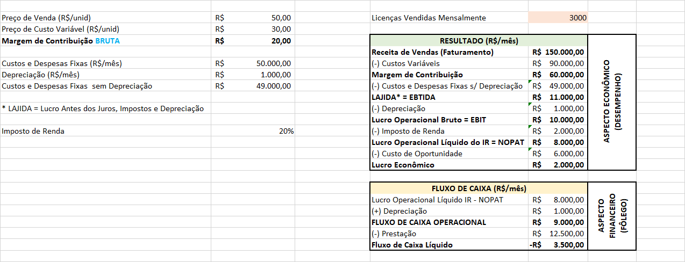
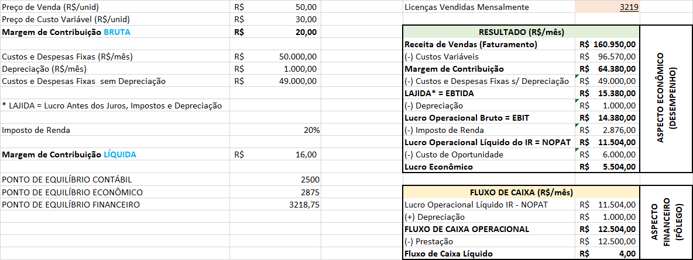
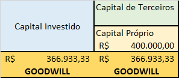

# Investimento e Valuation de Empresas I
## Conceitos Iniciais de Valuation
* Valuation é um conjunto de técnicas
* O valor de uma empresa não está no passado e sim daqui para frente, na capacidade de gerar caixa. Basicamente isso é o conceito chave de valuation.
* Fair Value: qual é o valor justo?

* O que eu preciso saber de Finanças se não sou da área?
* Como entender a **saúde financeira** da minha empresa?
* Estou ganhando dinheiro com meu negócio?
* Estou agregando VALOR ao meu negócio?

### O Mundo Mudou - Mudanças da Globalização
* CIAs abertas de maior valor do mundo

| 2013  |    Apple $416 B    |  Exxon $404 B  | Berkshire Hathaway $257 B |  Petro China $255 B   |       Walmart $246 B       |
| 2024  | Microsoft $3.109 B | Apple $2.696 B |      NVIDIA $2.216 B      | Saudi Aranco $2.014 B | Alphabet (Google) $1.841 B |

* Com a tabela acima, conseguimos perceber que o valor está em empresas de tecnologia
* O valor está mais associado ao intangível

|              | Valor Mercado Atual ($ bi) | Valor dos Ativos ($ bi) | GOODWILL ($ bi) |
| :----------- | :------------------------- | :---------------------- | :-------------- |
| MICROSOFT    | $ 3.109                    | $ 471                   | $ 2.638         |
| APPLE        | $ 2.696                    | $ 354                   | $ 2.342         |
| NVIDIA       | $ 2.216                    | $ 66                    | $ 2.150         |
| SAUDI ARANCO | $ 2.014                    | $ 671                   | $ 1.343         |
| ALPHABET     | $ 1.841                    | $ 43                    | $ 1.538         |

* **VALOR DA EMPRESA** = CAPITAL INVESTIDO (15%) + GOODWILL (85%)

* Valor dos Ativos é o capital investido
* Goodwill (riqueza): valor de mercado - valor dos ativos
  * Quanto o negócio vale a mais em relação ao valor que investiu

* Empresas unicórnios (empresas em que o valuation passa de $1 bi) - CB Insights

### Empresa para a Área de Finanças
* Unidade econômica geradora e distribuidora de **Caixa**
* **Objetivo:** agregação de **valor**
  * EMPRESA X FIRMA X NEGÓCIO
  * UBER, APPLE, AMAZON

* As empresas estão mais para negócios do que empresas, por exemplo, a Apple trabalha com negócio e a fabricação dos produtos eles compram de outros lugares que tem as telas, as placas, chips etc

### Patrimônio x Riqueza
// TODO
* Patrimônio reflete o **PASSADO**
* RIQUEZA reflete o **FUTURO**
* **VALOR > Expectativa**

* Riqueza é o quanto vale a mais do que investimos nela
* Riqueza para os sócios é o valor investido + riqueza (geração de valor)

### Visão geral de um empresa
* **Empresa:** Recursos Humanos, Marketing, Sistemas de Informação, Finanças, Produção e Logística, Jurídico
* **Finanças:** Finanças Corporativas, Valuation, Finanças Públicas, Finanças Comportamentais, Gestão ee Riscos, Mercado Financeiro

### Sucesso de uma empresa
* Precisamos conhecer um pouco de **Finanças, Contabilidade e Economia**
* Essas três áreas nos faz entender o valor do negócio, pois nos darão medidas para calcular o valor
* No dia a dia temos vários agentes (stakeholders) no negócio como: clientes, bancos, fornecedores, funcionários, governo, etc

#### Contabilidade
* Ciência que transforma diferentes medidas em uma única unidade
* Por exemplo, eu tenho energia que pago por kwh, funcionários (mão de obra), máquinas, equipamentos, licenças etc
  * A contabilidade pega todos esses custos diários da empresa e transforma tudo em uma única unidade que é o monetário

* **O que é a contabilidade?**
  * "Na economia, entidades (pessoas ou organizações das pessoas) realizam atividades e transações que geram efeitos econômicos (lucro), financeiros (caixa) e patrimoniais (estrutura de capital de investimentos) para essas entidades".
    * Temos que ter lucro, mas temos que ter principalmente caixa, pois é onde pagamos as contas
  * "A contabilidade é uma tentativa de representação dos **efeitos econômicos, financeiros e patrimoniais** ocorridos em uma organização durante um período de tempo".
  * Obs: nem sempre cortar custos está a associado a diminuir números, é mais provável que temos ineficiências no negócio
  

* **Ativo:** Caixa, Valores a Receber, Estoques, Máquinas, Patentes, Licenças, etc
* **Passivo (obrigações):** Fornecedores, Contas a Pagar, Empréstimos, Impostos
* **Patrimônio Líquido:** Dinheiro dos sócios que investiram na empresa

* **Decisões de Investimentos e Risco Econômicos:** estão nos Ativos (concorrentes e investimentos na empresa)
* **Decisões de Financiamentos e Risco Financeiro:** nos passivos e no Patrimônio Líquido (onde vamos gerar obrigações)

#### Balanço Patrimonial
* **Ativo:** Bens ou Direitos, Aplicações de Recursos, Representam benefícios presentes ou futuros, Essência econômica versus Forma Jurídica, Controle.
* **Passivo:** Obrigações já assumidas com terceiros (no momento do balanço), Capital de terceiros
* **Patrimônio Líquido:** obrigações para com os sócios, Capital próprio

* Ativo = Passivo Total + Patrimônio Líquido

* Caixa é controle de entradas e saídas, ou seja, tudo aquilo que a empresa recebe menos o que ela paga, é o que fica no caixa

#### Demonstração de Resultado do Exercício
* **Receitas:** são os benefícios obtidos com a operação
* **Custos/Despesas:** indicam os gastos realizados para a obtenção de receitas
  * Tudo o que é gasto dentro da empresa para gerar o produto etc, é CUSTO
  * Tudo o que é gasto para colocar o produto para fora da empresa, é DESPESA
* **Resultado do Exercício:** Lucro / Prejuízo / Equilíbrio

* **Demonstração de Resultado do Exercício (DRE):** o que ganhamos, o que consumimos e o que geramos

#### Demonstração dos Fluxos de Caixa
* **Atividades Operacionais:**
  * Recebimento de Clientes
  * Pagamentos a Fornecedores
  * Pagamento de Salários, etc.
* **Atividades de Investimento:**
  * Aplicações Financeiras de Longo Prazo
  * Imobilizado
  * Investimentos, etc
* **Atividades de Financiamento:**
  * Empréstimos Obtidos
  * Aumento de Capital
  * Pagamentos de Dividendos, etc

Ativo = Ativo Circulante + Ativo Não Circulante
Passivo = Passivo Circulante + Passivo Não Circulante + Patrimônio Líquido

* **Circulante:** o que circula, movimente. É o recebimento dos clientes, pagamentos dos fornecedores
* **Não Circulante:** o que foi investido. Computador, máquina, tecnologia

### Entendendo Finanças
* **Empreendedor:**
  * Percepção de uma **oportunidade** e capacidade de colocar em prática
  * Olfato para **lucro** e audição para o **caixa**
* **Oportunidade:** venda de produtos
* **Dúvida diária:** estou indo bem? como saber?

#### Caso Prático - Entendendo Finanças
* Abre a empresa no final de Março!
* Abrimos uma conta no banco para separar CPF e CNPJ (Princípio da Identidade)
* No exemplo
  * **Ativo:** $ 10.000
  * **Passivo (Capital de Terceiros) + Patrimônio Líquido (Capital Próprio):** $ 10.000
* **Caixa:** $ 10.000
* Abril: compra mercadoria à vista = $ 1.000
* Vende todas as mercadorias por $ 1.800 em 5 parcelas sem entrada
  * Ou seja, vou receber R$ 360,00 em MAIO, JUNHO, JULHO, AGOSTO e SETEMBRO
* Resultado:
  * Receita de Vendas                     R$ 1.800,00
  * (-) Custo das Mercadorias Vendidas   -R$ 1.000,00
  * **Lucro Bruto                           R$ 800,00**
  * (-) Despesas operacionais             R$ 100,00
  * **Lucro Operacional                     R$ 700,00**

* Lucro Operacional = **ASPECTO ECONÔMICO** (DESEMPENHO)
  * É quanto ganho ao comprar e vender mercadoria (operação)

**Fluxo de Caixa de Abril**
* Entradas de Caixa         R$ 0
* (-) Saídas de Caixa       -R$ 1.000,00
* (-) Saídas de Caixa       -R$   100,00
* **(=) Fluxo de Caixa        -R$ 1.100,00**
* **Saldo Inicial de Caixa    R$ 10.000,00**
* **Saldo Final de Caixa      R$  8.900,00**

* **ASPECTO FINANCEIRO** (FÔLEGO)

**Balanço Patrimonial**
* Ativo Março
  * Caixa                 R$ 10.000,00
  * Contas a Receber      R$ 0
  * **TOTAL                 R$ 10.000,00**
* Passivo + PL Março
  * Capital               R$ 10.000,00
  * Lucros Reinvestidos   R$ 0
  * **TOTAL                 R$ 10.000,00**

* Ativo Abril
  * Caixa                 R$  8.900,00
  * Contas a Receber      R$  1.800,00
  * **TOTAL                 R$ 10.700,00**
* Passivo + PL ABril
  * Capital               R$ 10.000,00
  * Lucros Reinvestidos   R$    700,00
  * **TOTAL                 R$ 10.700,00**

* **ASPECTO PATRIMONIAL**

LUCRO -> ASPECTO ECONÔMICO -> DESEMPENHO
CAIXA -> ASPECTO FINANCEIRO -> FÔLEGO

### Conceito de Valor (Custo de oportunidade)
* Valor
* Custo de Oportunidade: remuneração mínima, que os donos do capital querem para colocar dinheiro na empresa
* Riqueza Esperada (Fair Value)

* Supondo que temos 10 mil investidos no banco de CDB 10% ao ano
* Quando estamos investindo, queremos sempre 10% mais o prêmio (que é o risco)
  * Isso é o custo de oportunidade

* Instituto ASSAF

#### Custo de oportunidade
* Presente em **todas** as escolhas
* Benefícios da alternativa **preterida**
* Custo **implícito**
* Proporcional ao **risco**

#### Anatomia do Resultado
* LUCRO ECONÔMICO = Lucro Operacional - Custo Capital
  * Se for positivo, gera valor
  * Se for negativo, destrói valor, ou seja, a empresa vale menos do que foi investido

#### ROI - Retorno sobre o Capital Investido
* Indica o quanto o negócio foi capaz de gerar de retorno aos proprietários de capital (credores e acionistas).
* ROI = Lucro Operacional / Capital Investido

* Interpretação:
  * Indica a eficiência da empresa em gerar lucros de seus ativos operacionais
  * O ROI é economicamente atraente se estiver acima do custo de oportunidade do capital investido

* Capital Investido: R$ 10.000,00
* Resultado Operacional: R$ 700,00
* ROI = 700 / 10.000 = 7%

* Resultado Operacional:                    R$ 700,00
* (-) Custo de Oportunidade: 5% x 10.000 =  R$ 500,00
* LUCRO ECONÔMICO                        =  R$ 200,00

* LUCRO ECONÔMICO: Índice de sucesso do negócio

* Lucro Econômico R$ 200,00
* Custo de Oportunidades: 5%
* **Riqueza (Goodwill)** = 200,00 / 0,05 = R$ 4.000,00
  * Quanto a empresa vale a mais do quanto investi nela
  * Ou seja, 10.000 (Capital Investido) + 4.000 (Riqueza Gerada) = R$ 14.000,00 (Valor)

#### Caso Prático - Entendendo Finanças
* Vendo 3.000 licenças por mês R$ 50,00 = 150.000
* Custo e Despesas Variáveis R$ 30,00
* Custos e Despesas Fixas $ 50.000/mês
  * Depreciação R$ 1.000,00/mês (serve para abater do lucro, que é tributável e essa depreciação não sai do)
* Dívidas Prestação mensal de R$ 12.500,00
* Capital Próprio R$ 400.000,00 -> Custo de Oportunidade 1,5% ao mês R$ 6.000,00

* No fluxo de caixa, nós somamos a depreciação novamente, pois ela não sai do caixa
* Essa empresa não gera caixa suficiente
* Ela tem viabilidade econômica, mas não tem viabilidade financeira

* PONTO DE EQUILÍBRIO CONTÁBIL: Se quisermos pagar todas as contas, basta dividir o Custos e Despesas Fixas (R$/mês)/Margem de Contribuição BRUTA, resultando 2500 licenças por mês
  * Porém, vendendo apenas 2500 assinaturas, vemos que não temos nem viabilidade econômica, nem viabilidade financeira
* Margem de Contribuição LÍQUIDA = Margem de Contribuição BRUTA - Imposto = R$ 16,00
* PONTO DE EQUILÍBRIO ECONÔMICO = PONTO DE EQUILÍBRIO CONTÁBIL + Custo de Oportunidade/Margem de Contribuição LÍQUIDA = 2875 licenças
* PONTO DE EQUILÍBRIO FINANCEIRO = PONTO DE EQUILÍBRIO CONTÁBIL + (Prestação - Depreciação)/Margem de Contribuição LÍQUIDA = 3219 licenças

* Goodwill = valor econômico / custo de oportunidade

* Até o momento usamos o método gerencial

## Estrutura de um Valuation
### Valuation
* O método agora será mais robusto, pois levaremos a empresa mais a diante
* PREMISSAS
  * O Valor é Formado por "Premissas":
    * **Continuidade - Crescimento - Ambiente Econômico**
  * Fair Value é Válido Enquanto as Premissas Forem Verdadeiras
  * Risco do Fair Value está na Definição das Premissas

### Estrutura de Avaliação
* **A - Due Diligence**
  * Processo de avaliação de forma bem detalhada, das informações de uam empresa objeto de negociação, tendo por objetivo identificar eventuais distorções das diversas práticas empresariais
  * **Inclui:** áreas financeiras, contábil, previdenciária, trabalhista, operacional, tributária, tecnológica, jurídica, etc

* **B - O que preciso saber?**
  * **Conjuntura:** Variáveis Macroeconômicas que atuam sobre os resultados da empresa
    * Petróleo
    * PIB
    * Taxas de Juros
    * Câmbio
  * **O Mercado:** 
    * Potencial da Concorrência
    * Comportamento do Mercado Consumidor
    * Por que o produto é vendido?
    * Market Share
  * **O Negócio:** Perspectivas da empresa. Como serão realizadas:
    * Produção
    * Vendas
    * Distribuição
    * Tecnologia Empregada
    * Como fica o negócio no futuro?
  * **A Empresa** 
    * Quais são as condições da Empresa em avaliação para atender os cenários futuros?
    * Quais os seus pontos fortes e principais limitações?

* Por exemplo, uma companhia aérea é diretamente ligada ao PIB, pois as viagens são feitas à negócio ou à passeio
  * Se o PIB está aquecido, há mais pessoas viajando
  * O Câmbio, pois quase tudo está atrelado ao dólar
  * Petróleo, por causa do combustível
  * Taxa de juros, para adquirir aeronaves

* **C - Base de Informações**
  * Banco de Dados e Informações: Empresa, Mercado, Principais Indicadores Econômico
  * Informações INTERNAS (pelo menos 5 anos)
    * Balanços
    * Resultados
    * Custos
    * Margens de Lucro
    * Comportamento das Vendas
    * Investimentos realizados
  * Informações EXTERNAS
    * Evolução do PIB
    * Taxas de Inflação
    * Taxas de Juros da Economia
    * Risco
    * Indicadores Econômicos Setoriais

* **D - Ativos que estão sendo avaliados**
  * Ativos cujas expectativas de retornos estão consideradas nos fluxos de caixa da empresa em avaliação

* **E - Projeções**

* **F - Horizonte de Tempo**
  * Indeterminada
    * Explícito - Previsível
    * Perpetuidade
  * **Exemplo:** CIA Aérea
    * **PIB:** 12 anos
    * **Taxa de Juros:** 10 anos
    * **Petróleo:** 8 anos
    * **Variação Cambial:** 8 anos
  * Período Explícito = 8 anos

* **G - Estrutura de equilíbrio**
  * Investimento em Giro
  * Investimento em Capital
  * Estrutura de Capital
  * Competitividade

* **H - Risco e Retorno Exigido**

### Métodos de Valuation
#### Valor Contábil
* A contabilidade não apura e não aponta o custo de oportunidade, pois ela não divulga o custo de oportunidade
* Os ativos não definem o valor da empresa, somente demonstra uma fotografia do momento/período da empresa

* **MODELOS CONTÁBEIS:**
  * Valor Patrimonial: Calculado com base no Valor do PL do Balanço da Empresa
  * Valor de Liquidação/Descontinuidade: Valor de todos os bens listados no Balanço (-) Dívidas (Passivos)
* Descontinuidade da Empresa
* Não considera Sinergia entree os Ativos
* Não considera as Oportunidades de Crescimento e Criação de Valor
* Obsolescência dos ativos por Alterações nos Padrões Tecnológicos

* **VALOR DE MERCADO:**
  * vValor de Mercado das Ações de uma CIA Aberta
    * PL = Qtd de Ações x Cotação das Ações
  * Preço e Qtd das Ações devem ser calculadas em valores médios
  * Método mais Indicado para Empresas de Capital Aberto e para Ações de Alta Liquidez
  * **PREMISSA DO MÉTODO:** O mercado precifica as ações de forma justa
  * **LIMITAÇÃO:** Alta Concentração de Capital no Brasil

* **MÚLTIPLOS (AVALIAÇÃO RELATIVA):**
  * Valor calculado com base em Transações Realizadas com Empresas
  * Semelhantes (mesmo segmento de atividade)
  * **Fundamento Básico:** Empresas **Semelhantes** devem apresentar Preços **Semelhantes**
  * Não considera possibilidades de Crescimento Futuro
* A precificação de **Ativos Comparáveis** é feita em relação a uma variável comum: Múltiplos de EBTIDA, Múltiplos de Receitas, Múltiplos de Lucro etc
* **Múltiplos Específicos:** Múltiplos por Alunos Matriculados, Tonelada de Cana Moída etc
* Metologia **SIMPLIFICADA** de avaliação. Deve ser usada junto com outros métodos.
* **Dificuldade:** Identificar Empresas Semelhantes
* Método não Considera Estilos de Gestão, Capacidade Competitiva etc
* COMO FORMAR UM MÚLTIPLO: 
  * Identificar Empresas Comparáveis que sejam Precificadas pelo Mercado
  * Relacionar o preço com uma Variável Comum

* **ALGUNS MÚLTIPLOS NO BRASIL**
|                            | Múltiplos EBTIDA | Múltiplo Venda |
| :------------------------: | :--------------: | :------------: |
| Agropecuária e Agricultura |       7,29       |      1,65      |
|          Calçados          |      13,38       |      3,10      |
|     Comércio em Geral      |      11,42       |      1,12      |
|      Eletrodomésticos      |       3,15       |      1,12      |
|  Máquinas e Equipamentos   |      13,50       |      3,12      |
|  TECNOLOGIA DA INFORMAÇÃO  |      13,15       |      3,06      |

* **FLUXO DE CAIXA DESCONTADO (FCD)**
  * Método mais **Aceito e Recomendado**
    * Considera **Expectativas Futuras** de Retornos Expressas a Valor Presente
  * O Valor de um Ativo é Determinado pelas Expectativas de Benefícios
    * Futuros de Caixa, pela Capacidade de Retorno (Ganho) da Empresa
  * Valor de **Continuidade** da Empresa
  * Considerando que as Empresas não Possuem Prazo de Vida Determinado
    * (Princípio da Continuidade) o Cálculo do Valor pelo FCD é Baseado em Fluxos de Caixa **Indeterminados** (Contínuos)

  * **PERÍODO DE PROJEÇÃO:**
    * **Horizonte de Tempo:** (é a junção dos dois períodos, onde acaba o explícito, começa o de perpetuidade)
      * **Explícito (previsível):** é possível prever o comportamento das variáveis que afetam os resultados
      * **Perpetuidade:** inicia-se após o período previsível
    * Quanto maior o período previsível, melhor será a qualidade da Avaliação

    * **FORMULAÇÕES:**
      * Pegar esse fluxo de caixa a valor presente, pegando o valor de hoje descontando o valor de taxa que tem ao longo do tempo (somente dos anos explícitos)
        * Por exemplo, geramos 100 reais de fluxo de caixa no ano 1 com 10% ao ano, nós fazemos V = 100 / (1 + 0,1)1 = 90,91 reais = valor presente do fluxo de taxa
        * No ano 2, V = 100 / (1 + 0,1)2
      * Valor Residual = [FC n+1/(K - g)]/(1 + K)n e se admitir que não vai crescer nada é Valor Residual = [FC n+1/(K)]/(1 + K)n

## Referências e Observações
* ASSAF NETO, Alexandre. LIMA, FABIANO GUASTI. **Curso de Administração Financeira**, 4 ed. São Paulo: Atlas, 2019.
* [Instituto ASSAF](https://www.institutoassaf.com.br/) 
  * [KE - CUSTO DO CAPITAL PRÓPRIO](https://www.institutoassaf.com.br/indicadores-e-demonstracoes-financeiras/nova-metodologia/indicadores-de-desempenho-e-valor-de-balancos/)
* [yubb](https://yubb.com.br/)
* [Itaú BBA](https://www.itau.com.br/itaubba-pt): projeções para os próximos anos
* [Economia em Dia - Bradesco](https://www.economiaemdia.com.br/economiaemdia/html/index.html)
* [Focus - Relatório de Mercado](https://www.bcb.gov.br/publicacoes/focus)

