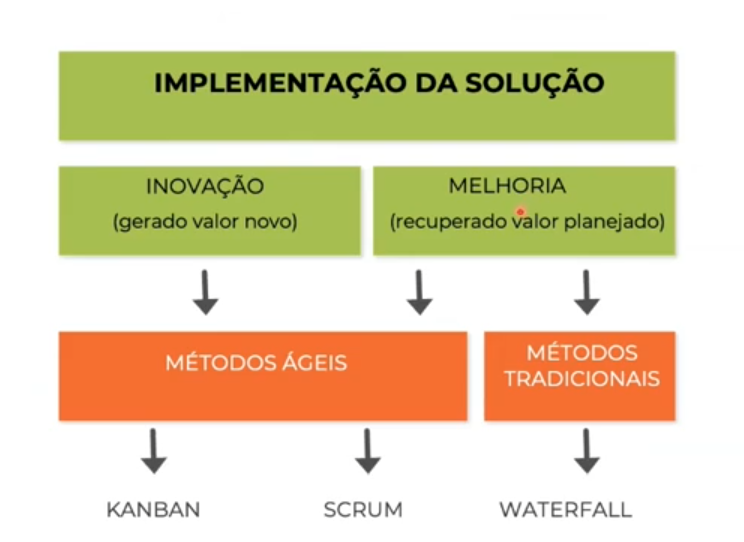
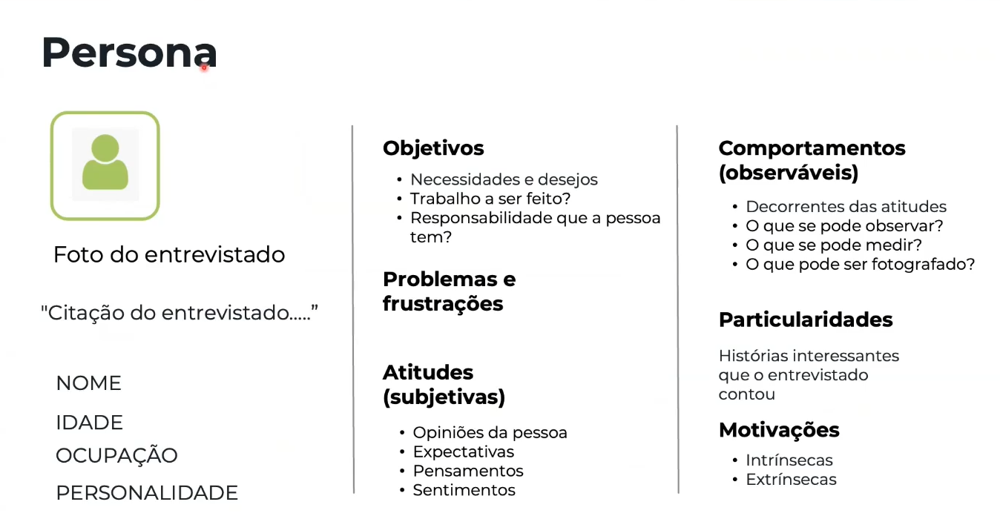
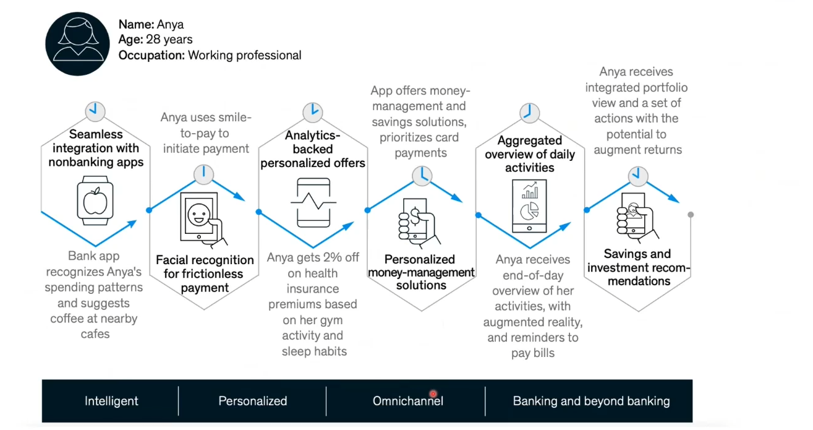
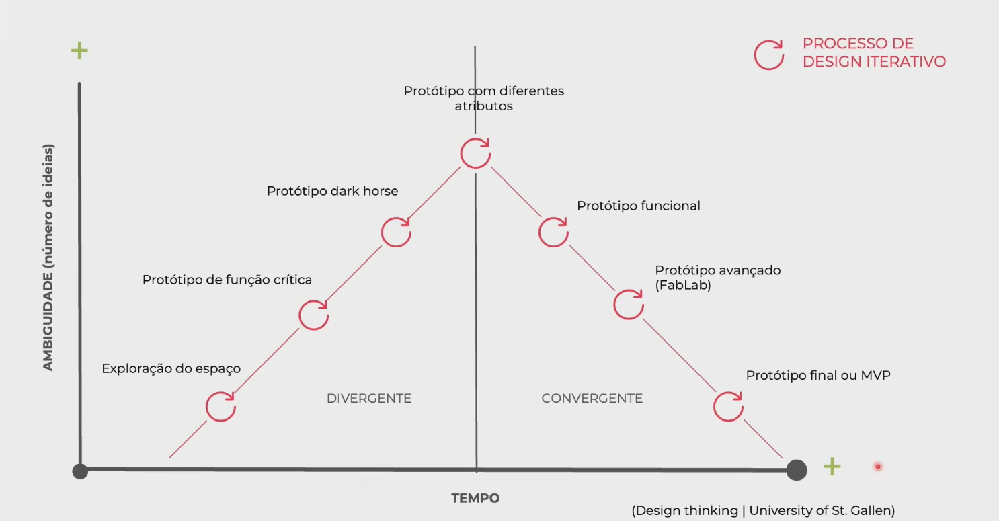
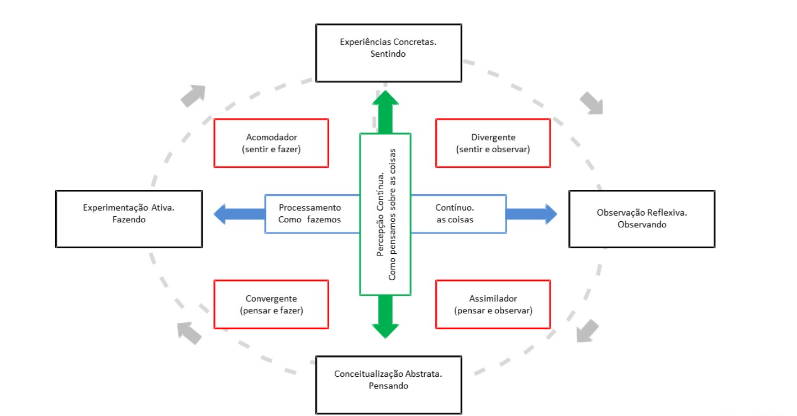
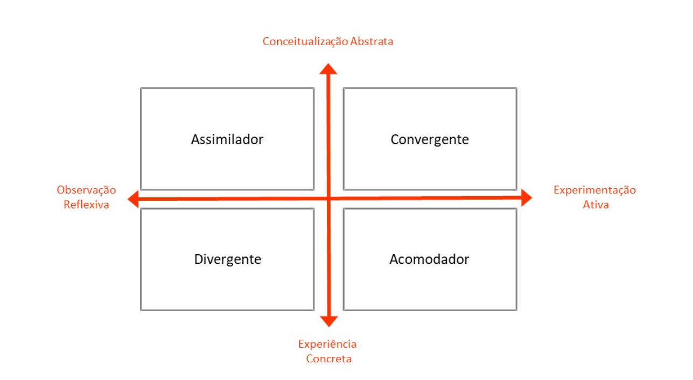

# Design Thinking I
## Bloco I
* **Tecnologia:** Importância de ler os sinais do contexto
  * O avanço da tecnologia impacta todos os indivíduos, negócios e políticas públicas
  * Abordagem sistêmica e não mais linear
  * Precisamos desenvolver novas perspectivas e novos pontos de vista para inovar: 
    * Equipes com diversidade de gêneros, etnias, gerações, formações acadêmicas e culturas (diversidade é importantíssima para geração de novas ideias)
    * Rigor na implementação das ideias
* **Mudanças:** provocam transformações organizacionais
  * **Ciência** gera conhecimento
  * **Tecnologia** aplica novos conhecimentos
  * A **mudança** é acelerada
  * Sociedade
  * Organizações precisam se **adaptar** e rever seus modelos de negócios
  * Novas demandas do mercado
  * Colaboradores precisam se **adaptar**
  * **Aprendizado** para mudanças dos modelos mentais
  * Novos modelos de gestão e nova cultura organizacional

### Desmitificando as inovações
#### Inovações?
* **Pedra lascada:** verdadeira evolução cognitiva. Ajudou as pessoas a se alimentarem melhor
* **Telescópio**
* **Imprensa**
* **Carros** 
* **Fotografia:** os pintores tiveram que se reinventar
* **Gadgets:** smartphone, computador, etc
* **Biomimética:** a partir de soluções da natureza
* **Microscópio:** e já chegamos no nanoscópio

#### Salto em altura
* Inovações no esporte
* Quando as pessoas pulavam de frente, o recorde era 2,23m
* Quando passou a pular de costas, record foi de 2,43m

#### Pit Stop F1
* De 1 a 3 min na década de 50
* Mac Laren: 1,80 seg em 2023

#### O que não é uma inovação?
* Sagway
* Google Glass
* Newton
* Amazon Go
* Betamax
* New Coke

#### Inovação logística
* Empresa Kimberly-Clark
  * 15% de redução de custos de transporte
  * 19% de redução da quantidade de material de embalagens
  * Diminuição nas devoluções por causa de danos
  * Total de 20% de aumento das margens brutas
* Embarque nos aviões da United Airlines
  * Sistema WILMA de embarque:
    * Janela
    * Meio
    * Corredor
  * Redução de 2 minutos

### Podemos ter inovação além de uma visão tecnocêntrica? 
* Empresas que focam nas necessidades dos clientes:
  * Waze
  * Netflix
  * Uber
  * Amazon
* Empresas que não entenderam as novas demandas:
  * Kodak
  * Blockbuster Video
  * Nokia

### Diferentes conceitos
* Inovação: Ideia + ação + resultado
* Invenção: Patentes -> que quando lançado vira uma inovação
* Melhorias (Contínua): Diminuir desperdícios
* Resolução de problemas: Ideia + ação

### O que podemos fazer com novas ideias?
* Mundo Natural
* Mundo Artificial

### Ondas de inovação de Schumpeter
* Começamos a reduzir os tempos de inovação

#### Definições clássicas de inovação
* **Adam Smith:** foco na eficiência
  * Como meio de maximizar a produtividade e o crescimento econômico
* **Joseph Schumpeter:** introduziu o conceito de "destruição criativa", enfatizando que a inovação é crucial para o desenvolvimento econômico. A inovação pode envolver:
  * Novos produtos
  * Métodos de produção aprimorados
  * Exploração de novos mercados
  * Novas estruturas organizacionais
* **Significado ampliado da inovação**
  * A inovação não se limita a criar algo completamente novo. O foco é adicionar valor significativo e promover avanços econômicos

#### Tempo para atingir um milhão de usuários
* **Netflix:** 3,5 anos
* **Airbnb:** 2,5 anos
* **Facebook:** 10 meses
* **Spotify:** 5 meses
* **Instagram:** 2,5 meses
* **iPhone:** 74 dias
* **ChatGPT:** 5 dias (atingiu 100 milhões de usuários em 2 meses)
* **Threads:** atingiu 100 milhões de usuários em 5 dias

Passamos de meros consumidores de conteúdo para prosumers.

#### Diferentes maneiras de inovar
* Aberta ou fechada: a maioria é fechada, pois querem proteger o capital intelectual

* Inovação (Aberta ou fechada):
  * Sistemas de sugestões
  * Benchmarking
  * Stage Gates
  * Tecnológica
    * Inteligência Artificial
    * P&D
      * Produtos, serviços e experiências
      * Processos
  * Resolução de problemas:
    * Melhorias contínuas
    * Design Thinking
    * TRIZ

#### Desenvolvimento de produtos
* Stage Gates (método tradicional utilizado por muitas empresas)

* Ideia
  * Geração ideia
  * Investigação Preliminar
  * Preparação Plano de Negócios
  * Desenvolvimento
  * Testes
  * Lançamento
* Revisão

#### Ciclo de adoção da inovação
* Entusiastas: 2,5%
* Visionários: 13,5%
* O abismo
* Pragmáticos: 34%
* Conservadores: 34%
* Céticos: 16%

#### Tipos de inovação

* Incremental: tesoura de material escolar colocada para cortar sachês de ketchup e mostarda
* Disruptiva: primeiro iPHone (2007) combinou o iPod, o telefone e o browser de internet, praticamente sem botões

#### Abordagem de experimentação
* Não temos mais todas as respostas
* Precisamos elaborar perguntas bem feitas
* Temos que testar diferentes hipóteses

* "O problema não é como levar novas ideias para nossa mente, mas como tirar de lá as ideias velhas."
  * Citação de Dee Hock, fundador e ex-CEO da Visa

#### Inovação é transformar conhecimento em valor.
* Há limites na eficiência das operações fabris
* Inovação não é um evento!
* É um processo lento e gradual

#### Diferentes tipos de inovação
* A maneira mais prática é através da resolução de problemas
  * Inovação de produtos
  * Inovação de processos
  * Inovação de marketing
  * Inovação organizacional
  * Inovação de modelo de negócios
  * Inovação social
  * Inovação sustentável
  * Inovação logística

#### Dificuldades de inovar
* Muitas empresas acham o processo intimidador, pelos seguintes motivos:
  * A inovação não tem garantia de sucesso (medo do desconhecido)
  * Requer mudança de mentalidade e de cultura organizacional
  * Ameaça as competências atuais dos colaboradores 
  * Impacta as estruturas de poder
  * É difícil de medir
  * Pode trazer complicações operacionais

#### Como podemos rapidamente começar a inovar?
* Identificando e solucionando os problemas relacionados aos stakeholders do ecossistema de negócios
* Reduzindo ou eliminando os pontos de fricção ou atrito dos stakeholders ao longo de suas jornadas diárias
* Resolução de problemas é um processo de aprendizagem, portando está relacionado com a cognição

#### Diferentes métodos de resolução de problemas
* A3
* TOC
* Design Thinking
* TRIZ
* 8D
* MASP
* PDCA
* LEAN SIX SIGMA

* Resolução de problemas não tem receita infalível, mas tem método.

### Filosofia
* Racionalismo
  * Rene Descartes 1596 - 1650: O método é o PDCA que é usado hoje
    * se tiver dados de forma lógica e dedutiva, resolvemos qualquer problema

* Empirismo
  * Francis Bacon: precisamos estar em contato com o contexto do problema para conseguir resolver
  * Galileu
  * John Locke
  * David Hume

#### Dois tipos de raciocínio para resolver problemas
* **Dedutivo:** Coleta dados históricos -> Análise dos dados para investigação de causas -> Conclusões e recomendações
* **Indutivo:** Hipóteses de causas -> Análise e validação das causas -> Resultados -> V/F -> Conclusões e recomendações

* Método para problemas complexos: Design Thinking
* Método para problemas bem definidos: PDCA (Planeja, Executa, Controla e Atua)

* 01: Resolução de Problemas (Identificar + Solucionar)
* 02: Problemas
  * Complexos (Incerteza)
  * Bem definidos (risco)
* 03:
  * Complexo: Método empírico com experimentação
  * Bem definidos: Método racional analítico
  * Ambos são métodos científicos
* 04: 
  * Complexo: Design Thinking
  * Bem definidos: TQM/PDCA
* 05: a base para solucionar problemas é o conhecimento
  * Complexo: Dados inexistentes
  * Bem definidos: Dados históricos existentes

##### As empresas erram muito na implementação

##### Problemas bem definidos e os problemas complexos:
* Bem definidos:
  * Fácil definição
  * Solução única
  * Métodos de qualidade
  * Racionais e lineares
  * Algoritmos
* Problemas complexos:
  * Difícil definição
  * Solução múltipla
  * Stakeholders
  * Tentativa e erro
  * Não terminam

#### Por que os problemas estão mais complexos?
* Ritmo da Mudança

**Qual a importância da resolução de problemas numa organização?**
* Inovação
* Experiência do Paciente (Px)
* Experiência do Cliente (Cx)
* Estratégia
* Experiência do Colaborador (Ex)
* Empreender
* Redução de desperdícios
* Liderança
* Gestão da mudança

#### Os 4 tipos de valor para o cliente
* Valor Funcional
* Valor Social
* Valor Econômico
* Valor Experiencial

##### Conceito de valor: para as empresas e para os clientes
* **Valor econômico:** capacidade de uma empresa gerar lucros e fluxo de caixa:
  * **Enterprise Value (EV):** o valor total de uma empresa, levando em consideração sua capitalização de mercado, dívida e caixa.
  * **Lucro antes de juros, impostos, depreciação e amortização (EBTIDA):** lucratividade operacional
  * **Retorno sobre o Investimento (ROI):** eficiência na utilização de capital para geração de lucros
* **Valor par ao cliente:** representa quanto os produtos ou serviços de uma empresa atendem as necessidades e desejos de seus clientes
  * Qualidade e funcionalidade dos produtos/serviços
  * Experiência do cliente em toda a jornada de compra
  * Percepção e confiança na marca

###### Diferentes tipos de valor
* **Valor para o funcionário:** funcionários talentosos e engajados geram valor de diversas maneiras:
  * Produtividade e inovação
  * Cultura empresarial positiva
  * Baixa rotatividade, reduzindo custos
* **Valor social:** um fator cada vez mais importante, o valor social reflete o impacto positivo de uma empresa na sua comunidade e no ambiente. Isso pode incluir:
  * Práticas éticas e fornecimento responsável
  * Esforços de sustentabilidade ambiental
  * Programas de investimento comunitário

##### Conceito de valor para B2B e B2C
* A Bain & Company identificou 40 elementos de valor críticos, agrupados em cinco categorias:
  * **Elementos básicos:** preço e especificações
  * **Funcionais:** necessidades econômicas ou de desempenho do produto
  * **Facilidade de fazer negócios:** elementos que melhoram a interação entre comprador e vendedor
  * **Individuais:** elementos que ressoam um nível pessoal, como reduzir a ansiedade
  * **Inspiradores:** elementos que oferecem uma visão de futuro ou melhoram a responsabilidade social

* **Conclusão:** as empresas B2B devem adaptar suas propostas de valor para alinhar com os elementos que os clientes mais valorizam, utilizando pesquisas e análises para compreender as propriedades e expectativas dos clientes, garantindo uma oferta mais atraente e competitiva no mercado.

##### Conceito de valor para B2B e B2C
* **Drivers (Alavancas) de valor B2B:**
  * Tomada de decisão
  * Processo de compra complexo
  * Relacionamentos importam
* **Drivers (Alavancas) de valor B2C:**
  * Apelo emocional
  * Decisões individuais rápidas
  * Sensibilidade ao preço

* **Observações importantes:**
  * **Sobreposição:** há sobreposições entre B2B e B2C, como elementos emocionais em decisões B2B e preocupações racionais em compras B2C
  * **Valor é subjetivo:** o valor é percebido pelo cliente. Entender profundamente seu mercado-alvo é essencial em ambos os contextos
  * **Valor ao longo da jornada**

##### Valor experiencial (B2C e B2B)
* **Valor agregado:** dimensão objetiva
* **Valor percebido:** dimensão subjetiva

##### Importância do conceito de valor nas experiências
Espaço de interações (onde a experiência ocorre)
* Organização
  * -> Propostas de valor
  * <- Captura de valor
* Cliente
  * **-> Valor percebido**
  * <- Valor esperado

### Revolução Copernicana
* "Grande parte das falhas das empresas é por trabalharem no problema errado." George Kembel

* **E se juntássemos arte e engenharia?**

#### Origem do nome Design Thinking
* 17/05/2004
* "A criatividade é definida pela capacidade de criar ideias associada à coragem de testá-las." David Kelley, co-fundador da IDEO

#### Criatividade
* Quando mudamos a realidade, inovamos
* Ser criativo é uma mudança brusca

* **Criatividade:** ver as coisas de várias perspectivas, desconstruir preconceitos, **ser curioso** e ter a mente aberta
* **Curiosidade:** "perdemos o impulso de **fazer perguntas** pela pressão de executar o trabalho ou por **medo de sermos julgados** por não saber" (prof. Francesca Gino da HBS)
* **Desafiar o status quo** é não se conformar com as coisas como são. Uma dose de **ceticismo** aqui é importante
* No passado as empresas eram organizados para manter o **status quo**, ou seja, a **estabilidade do ambiente**.
* **Não temos tempo** para pensar de maneira incremental: um pouco mais de eficiência ou de agilidade. **Precisamos de descontinuidades** (disrupções), ou seja, temos que **pensar de forma diferente**.

* "Você não vê o mundo como ele é e sim como você é" (Luc de Bradandere)
* **Pensar consiste em processar formas percebidas** e ocorre em 3 estágios: (é um processo individual e subjetivo)
  * **Esteriótipos:** categorias e rótulos que simplificam conceitos (sem eles, seria impossível pensar) - e julgamento restritivo, redutor e dura muito tempo. Provenientes do senso comum.
  * **Padrões:** nosso cérebro é uma máquina de identificar padrões
  * **Paradigmas:** (a maior armadilha que nos aprisiona) - conceitos, modelos ou exemplos. Porém, tendem a nos cegar para as mudanças à nossa volta. Estamos vivendo uma mudança de paradigma (Thomas Kuhn)

#### Exemplos práticos de DT
* Projeto Good Kitchen
* Lifestraw
* Embrace
* Remédios
* Hospitais

#### Design Thinking
* Sempre partimos de um desafio inicial
* **Desafio lançado pelo governo:** como podemos melhorar o menu oferecido aos idosos?
  * **Fase 1:** Pesquisa
  * **Fase 2:** Entendimento
  * **Fase 3:** Ideação
  * **Fase 4:** Experimentação

* **Fase 1 - Pesquisa em dados secundários**
  * 125.000 idosos com problemas de mobilidade e doenças dependem de refeições fornecidas pelo governo da Dinamarca
  * Estimativa de 60% dos usuários tem problemas de nutrição
  * 20% destes sofrem de subnutrição

* Dois tipos de produtos
  * Entregue quente diariamente
  * Resfriado e embalado à vácuo entregue uma vez por semana

* **Fase 1 - Pesquisa em fontes primárias**
  * Entrevistas com especialistas
  * Entrevistas com idosos
  * Entrevistas com funcionários que preparam as refeições
  * Observações no local de preparação das refeições
  * Observações nas casas dos idosos

* Hatch & Bloom levou os funcionários que entregavam as refeições as casas dos idosos
* Entrevistaram o supervisor do processo de preparação das refeições
* Registraram passo a passo todas as ações envolvidas
* **Insight:** baixo status atribuído ao trabalho de preparação de refeições (desmotivação e desmoralização)

* **Insight???**
  * **O que não é um insight**
    * Não é um dado
    * não é uma observação
    * não é um desejo ou uma fala do cliente

* ***Definição de insight**
  * Uma nova maneira de ver o mundo que nos provoca a reexaminar convenções existentes e desafia nosso status quo

* **Outras definições**
  * Uma nova perspectiva que surge a partir de observações sobre o comportamento humano
  * Uma descoberta de motivações não aparentes que move as pessoas a ter determinadas ações

* **Insights (achados ou descobertas)**
  * Observações etnográficas (o que vejo e ouço)
  * Conhecimento tácito (o que conheço)
  * Inferências (por quê)

* **Exemplos de fatos, obervações e insights**
  * Desenvolvimento de uma nova ração animal:
    * **Fato:** as pessoas alimental seus animais 2 vezes ao dia
    * **Observação:** elas tendem a alimentá-los na hora do almoço e do jantar
    * **Insight:** as pessoas sentem culpa de comer na frente dos animais

* **Fase 2: Redefinição do problema**
  * o escopo do desafio foi ampliado para englobar as necessidades identificadas dos funcionários que produzem as refeições

* Problema redefinido
  * Idosos e funcionários tinham uma série de necessidades emocionais que não estavam sendo consideradas (**desconexão e alienação**)
  * **Idosos:**
    * estigma social por dependerem das refeições
    * não participar das escolhas e decisões
    * detestem comer sozinhos (os faz lembrar a ausência da família)
    * quanto menos apreciam a comida, mais perdem o apetite
  * **Funcionários:**
    * funcionários desmotivados fazem rotineiras refeições de baixo custo
    * baixa estima paralisa qualquer inovação
    * **Aspectos positivos:**
      * muito capazes e responsáveis
      * acrescentam condimentos e vegetais
      * eles realmente se importam

* **Fase 3 - Ideação**
  * Workshops de **cocriação** com: 
    * Funcionários de casas residenciais para idosos
    * Voluntários
    * Funcionários do governo
    * Funcionários que preparam as refeições
  * **Caso análogo utilizado:** e se o serviço público de fornecimento de refeições fosse um restaurante?

* **Fase 4 - Experimentação**
  * Criaram diversas hipóteses para solucionar o problemas e fizeram 3 protótipos de menus:
    * com cores distintas
    * com fotos e ilustrações
    * com avaliação e sugestões
  * Testaram diferentes protótipos apresentados para os idosos e funcionários e concluíram:
    * nova embalagem modular
    * novos uniformes
    * novo nome: Good Kitchen
    * Novos canais de comunicação entre os idosos e os funcionários: newsletter e cartões de comentários (analisados semanalmente)
  
* **Resultados**
  * Aumento de 500% na procura na primeira semana
  * Passaram de 650 para 700 clientes em 3 meses
  * Aumento da satisfação dos colaboradores e dos idosos
  * Receberam os 2 prêmios de inovação em 2009:
    * o do governo da Dinamarca
    * de projeto de serviços

* **Desafio Inicial:**
  * Como podemos reduzir o problema da água potável na África?
    * 1.1 bilhão de pessoas não têm acesso
    * 4 bilhões casos de diarreia/ano
    * 1.8 milhões óbitos
  * **Solução:** Lifestraw (um filtro portátil)

* **Desafio inicial: como podemos reduzir os índices de mortalidade infantil na Índia?**
  * um milhão de bebês morrem ao nascer
  * 98% em países subdesenvolvidos
  * Principal causa: hipotermia
  * **Solução:** Embrace

* **Indústria Farmacêutica**
  * Como podemos melhorar as embalagens dos remédios?
    * o remédio recebe pigmentação igual banana para mostrar que está perto do vencimento

#### Como podemos ampliar nossas perspectivas e pontos de vista?
* Casos análogos (ciência)
  * Ajudam a gerar novos insights
  * Inspiram a equipe
  * Podem ser usados na etapa de entendimento das necessidades (fase 2) ou a ideação (fase 3)
  * Similaridades de comportamento, estrutura ou processos de outras situações

#### Casos análogos
##### Inspirações em contextos diferentes
Comparação de hospitais e pit stop Nascar
* Times de resposta rápida
* Importância de ter a mesma equipe
* Flexível, mas com especialidades
* Insights sobre kits de reparação

* Analogia de experiência que os clientes têm na rede de hotéis Ritz-Carlton serviu de inspiração para a Apple montar sua rede de lojas

* Ikea busca novas ideias nos módulos de habitação da Nasa no programa Marte

* **Cirque du Soleil**
  * Inspirado nos grandes espetáculos teatrais
  * Questionaram as premissas

* Biomimética 
  * [Ask Nature](https://asknature.org/)

## Bloco 2
* Abordagem centrar no ser humano
* Entendimento da **necessidades** das pessoas:
  * **Funcionais:** tarefas e jornadas
  * **Sociais:** percepção dos outros
  * **Emocionais:** sentimentos da pessoa
* Diferentes técnicas qualitativas
  * VoC (Voice of Customer)
  * Focus Group - acaba tendo um viés cognitivo
  * Entrevistas Etnográficas
* Abordagem Jobs to be Done: entendimento das necessidades

* Tipos de necessidades
  * **Explícitas:** ponta do Iceberg 1/9
  * **Implícitas:** todas as outras necessidades
    * Tácitas: tem e não sabe explicar
    * Latentes: tem e não sabe que tem

* Uma necessidade é uma falta, um gap não atendido pelas soluções atuais
* Nesses gaps estão as oportunidades

* Necessidades das pessoas
  * Explícitas levam as melhorias incrementais
  * Implícitas (tácitas e as latentes) levam a excelentes insights e grandes ideias (a partir das histórias das pessoas)

* **O grande vilão no início:** identificar oportunidades e pular rapidamente para as soluções

* Necessidades x Soluções
  * **Verbos:**
    * atividades e desejos
    * "Alcançar uma prateleira alta"
  * **Substantivos:** 
    * Soluções
    * "Escada"

### Algumas ferramentas do método
1. Desafio inicial
2. Matriz SADR
3. Mapa de stakeholders
4. Técnicas etnográficas de entrevistas
5. Personas
6. Mapa de empatia
7. Jornada do cliente
8. Prototipagem

## Design Thinking
* **Fase 1: Pesquisas (para coleta de dados existentes)**
  * **Pesquisas em fontes secundárias:**
    * Desk Research
    * Relatórios
    * Artigos
    * Pesquisas e informações disponíveis publicamente
  * **Pesquisas em fontes primárias:**
    * Entrevistas etnográficas
    * Observações contextuais
    * Vivenciar a situação
* **Fase 2: Análise e síntese dos dados coletados**
  * Persona
  * Mapa de empatia
  * Jornada da persona
  * Identificação das necessidades
  * Formação dos insights
  * Elaboração das perguntas bem feitas
* **Fase 3: Ideação**
  * **Geração de ideias:**
    * Brainstorming
    * Brainstorming reverso
    * Brainwriting
    * E se?
    * Casos análogos
  * **Seleção de ideias:**
    * Matriz GUT
    * Impacto x facilidade
  * **Prototipação:**
    * Tangibilizar as ideias selecionadas
* **Fase 4: Experimentação**
  * Mostrar os protótipos para pessoas similares às personas
  * Coleta de feedbacks
  * Refino dos protótipos
  * Selecionar os melhores atributos de cada protótipo
  * Montar um MVP (Produto Mínimo Viável)

### Comportamentos esperados para aplicação do Design Thinking
* Empatia
* Experimentação
* Cooperação

### Método Empírico
* [Duplo diamante](https://medium.com/@maysaochoa/double-diamond-por-onde-come%C3%A7ar-e-quais-ferramentas-aplicar-em-cada-fase-d1ac108c6ff7#:~:text=%E2%80%94%20Vida%20de%20Produto%2C%20Henrique%20Carvalho,e%20qual%20dor%20iremos%20solucionar.)
* [Vida de Produto](https://vidadeproduto.com.br/double-diamond/)

### Primeira ferramenta: Desafio Inicial (CNP)
* Todo projeto inicia com uma pergunta:
  * Estrutura da pergunta (CNP):
    * **Como:** sempre é possível melhorar
    * **Nós:** problemas complexos precisam de equipes
    * **Poderíamos:** considerar alternativas e novas ideias

### Segunda ferramenta: Matriz SADR (Sabemos/Achamos/Dúvidas/Restrições)
* O que sabemos? (fatos)
* O que achamos? (inferências)
* Quais as restrições?
* Que dúvidas ainda temos?

### Terceira ferramenta: Mapa de stakeholders
* [Mapa de Stakeholders](https://www.cursospm3.com.br/blog/mapa-de-stakeholders-como-e-quando-fazer/?gad_source=1&gclid=CjwKCAjwmrqzBhAoEiwAXVpgopij7Eq5UFZSHwkDhjubUpfVvqd1VBO0BZYWlj_bU5YjY5T85uN4YhoCyKcQAvD_BwE)

### Quarta ferramenta: Técnicas etnográficas de entrevista
#### Diferença entre pesquisas quantitativas e qualitativas
* **Exemplo de um projeto de aposentadoria:**
  * **Quantitativa:** genérico, por exemplo, todo o Oceano
    * Qual a idade que a maioria se aposenta?
    * Em média, quanto as pessoas poupam ao longo da vida?
    * Quantas pessoas escolhem outra atividade após a aposentadoria?
  * **Qualitativa:** específico, por exemplo, o ecossistema e a riqueza dos corais
    * Como é se aposentar?
    * Como sua vida mudou?
    * Qual a dificuldade que você sente na aposentadoria?

#### Entrevista Empáticas
* Apresente-se
* Apresente o Projeto
* Estabeleça uma relação de empatia (conexão)
* Evoque histórias
* Explore emoções
* Questione afirmações
* Agradeça e finalize a entrevista

#### Os 3 níveis de Escuta (Otto Scharmer)
* **Primeiro nível:** a partir dos nossos hábitos
  * Downloading (ouvir o que já se sabe)
    * É o resultado de nossas experiências do passado
    * Escuta seletiva: eu presto atenção naquilo que eu já sei
    * Falta de presença
    * Resultado: confirmar o que você já sabe (crenças e julgamentos)
* **Segundo nível:** a partir do ambiente externo
  * Mente aberta - ouvir os fatos (cientistas)
    * Perceber as diferenças do que ouvimos em relação ao que sabemos
    * Anotar as coisas que nos assombram e nos contradizem
    * Porém, nosso cérebro nos sabota! Quando estamos diante de algo que nos contradiz, deixamos de lado
    * Mas aqui residem grandes oportunidades de inovação 
* **Terceiro nível:** a partir de dentro das pessoas
  * Escuta empática - coração aberto
    * Quando você consegue se colocar no lugar do entrevistado
    * Aqui ocorre a conexão emocional
    * Você ouve para aprender e não para julgar!

#### Dicas para uma entrevista
* É uma conversa
* Incentive histórias
* Evite começar uma pergunta com "normalmente"
* Pergunta por que (5x)
* Procure por inconsistências
* Procuro por sinais não verbais
* Não tenha medo do silêncio
* Não sugira respostas às suas perguntas
* Faça perguntas de forma neutra (evite perguntas binárias)
* Apenas dez palavras por pergunta
* Só um pergunta de cada vez e uma pessoa por vez
* Esteja preparado para anotar

#### Técnicas de observação
* Direta no contexto do problema
* Fly on the wall
* Diário
* Sombra

### Quinta ferramenta: Persona
* Persona = pessoa + história (por Alan Cooper)
* Persona é um grupo de pessoas que tem **comportamentos** similares

### Persona: Marketing x Design Thinking
Rei Charles x Ozzi Osbourne: eles tem dados demográficos iguais, mas tem comportamentos diferentes

* Dados demográficos:
  * Homem
  * Nascido em 1948
  * Residente no Reino Unido
  * Casado 2 vezes
  * Mora em um castelo
  * Classe A
  * Grande poder aquisitivo

* Mercados e seguimentos -> Nichos de mercado -> Persona
  * Representa um grupo de pessoas que tÊm comportamentos e preferências similares
  * Ajuda a projetar para um pequeno grupo de pessoas
  * Verifica padrões de comportamento

### Sexta ferramenta: Mapa de Empatia
Projeto de um carro familiar
* **O que as pessoas dizem (coletado nas entrevistas)**
  * Eu jamais compraria uma mini van
* **O que as pessoas fazem (observável)
  * Dirige uma SUV**
  * Assina revista de carros
  * Rejeita fazer test drives
* **O que as pessoas pensam (quais são suas crenças)**
  * Acha que minivan é para mães
  * O carro dele é o reflexo dele
* **O que as pessoas sentem (quais as emoções envolvidas?)**
  * Ofendido
  * Orgulho
  * Jovem

### Sétima ferramenta: Jornada da persona
#### CJM - Jornada da Persona
* é um diagrama que ilustra os passos físicos e emocionais que os clientes percebem (subjetivo) quando interagem com uma organização ao long de um período de tempo, em torno de um objetivo específico
  * Antes do serviço
  * Durante do serviço
  * Depois do serviço

##### Como os clientes são tratados hoje?
* A **hiperpersonalização** (Inteligência Artificial) vai terminar com a "Idade Média" (brincadeira para dizer que tudo o que é desenvolvido é feito para a média das pessoas).

### Dois exemplos de melhoria da experiência dos clientes (B2C e B2B) de bancos
* **Front office**
  * Smile-to-pay facial scanning to initiate transaction
  * Micro-expression analysis with virtual loan officers
  * Conversational bots for basic servicing requests
  * Humanoid robots in branches to serve customers
* **Back office**
  * Biometrics (voice, video, print) to authenticate and authorize
  * Machine vision and natural-language processing to scan and process documents
  * Machine learning to detect fraud patterns, cybersecurity attacks
  * Real-time transaction analysis for risk monitoring

* **Omnichannel:** agência, app, etc para pagamento de contas tem que ser a mesma experiência

## Observações e Referências
* [Ask Nature](https://asknature.org/)
* [Board of Innovation - AI Tools for Innovation](https://www.boardofinnovation.com/blog/ai-tools-for-innovation/)

# Design Thinking II
## Bloco 3
### Oitava ferramenta: Prototipagem
* Protótipos de baixa resolução: como transformamos ideias em realidade?
* [Fast Food](https://www.youtube.com/watch?v=2G7hSOV4egs) tinha uma **hipótese**: eliminação da espera
  * Caso do Mc Donald's: trecho de um filme

#### Função dos Protótipos
* **Novas ideias** e como **comunicá-las**
* Aberto a novas ideias:
  * "sim...e..." ao invés de "sim...mas..."
* Procure tornar as ideias tangíveis - protótipos de baixa resolução e muita experimentação
* **Sugestão:** reduzir o uso de PPTs como na Amazon (Jeff Bezos) e GIM (Lou Gerstner)

#### Protótipos ou modelos: para que servem?
* Tangibilizar uma ideia
* Instrumentos de comunicação
* Vários níveis de protótipos:
  * Porcótipo
  * Provótipo
  * Importante que sejam de baixa resolução
* Querem avaliar nossas hipóteses

#### Tipos de protótipos
* Desenho
* Storyboard
* Produtos 3D
* Aplicativo
* Mapa Mental
* Simulação
* Vídeo
* Canvas

#### BMG Canvas como um protótipo de modelo de negócios
* Para criar ou repensar negócios constantemente
* Canvas é uma ferramenta para visualização de novos modelos de negócios
* Não substitui o plano de negócios
* Melhora a comunicação visual dos conceitos

##### Modelo
* [Business Model Canvas](https://cdn.prod.website-files.com/64830736e7f43d491d70ef30/64c7c201a7f4a5e05072cbe1_A3-Business%20Model%20Canvas-2023.png)
* à esquerda é **Eficiência**
* à direita **Valor**

##### Função da ferramenta
* Partimos de uma oportunidade, de um problema ou de uma hipótese:
  * Costuma-se começar pelo cliente e em seguida pela proposta de valor
  * Uso de post-its para poder movê-los com facilidade
  * O propósito deste "protótipo" é testar hipóteses
  * Abordagem sistêmica e não linear

##### Quatro questões importantes
* Inicialmente - **quem** é o cliente?
* **O que** será proposto de valor?
* **Como** será feito?
* **Quanto** vai custar e quanto irá gerar de lucro?

##### Protótipos de baixa resolução
* Transformando ideias em realidade
  * Errar cedo
  * Construir novas ideias a partir de problemas encontrados

##### Importância da prototipagem
* Erra cedo, sendo assim, o custo de um erro é bem pequeno
* E o risco tende a diminuir conforme o número de protótipos aumentam, pois estão errando e aprendendo muito, o que acaba refinando o produto

* Dyson testou mais de 5.000 protótipos para desenvolver um aspirador sem saco de coleta
  * Sendo assim, quando alguém imitar seu produto, você pode lançar algo renovador novamente em seguida

#### O que podemos prototipar?
* O protótipo é uma versão rápida de uma ideia
* Podemos prototipar produtos, serviços e aplicativos
* Com a atual velocidade das mudanças os protótipos são cada vez mais importante para experimentação
* O protótipo de baixa resolução ajuda a avaliar uma ideia

* O valor de uma ideia é ZERO, a menos que ela possa ser comunicada e criticada

##### Testes dos Protótipos
* Avalie sua ideia, ou seja, sua hipótese

* Deixem os usuários interagirem com os protótipos
* Observem a experiência
* Conectem-se com o usuário com empatia
* Não se apaixonem pelas ideias
  

##### Feedback do protótipo
* O que funcionou?
* Ideias
* O que pode ser melhorado?
* Perguntas

##### Feedback: para que serve?
* para tornas as hipóteses públicas
* para refinar as ideias
* para a prender com o erros
* para selecionar os melhores atributos
* para refinar uma ideia e levar ao FabLab
* este é o embrião do MVP (Produto Mínimo Viável)

#### MVP serve para validar uma hipótese
* é o mínimo que precisamos para lançar um produto/serviço
* as melhorias serão implementadas aos poucos
* é importante, pois leva o inovador rapidamente para a ação (menos planejamento e mais ação)

#### Exemplos de MVP
* Produtos
* Serviço
* Experiência
* Aplicativo

#### Apresentação dos protótipos
* Pitch

#### Grandes consultorias
* McKinsey comprou a Lunar
* Accenture comprou a Fjord
* Deloitte comprou a Doblin
* Capgemini comprou a Frog

#### Liderança Estratégica
* Foco em excelência operacional e geração de valor
  * **Rotinas**
  * **Implementação**
  * **Tomadas de decisões:** já temos os caminhos possíveis
  * **Resolução de problemas:** um gap que não está sendo atendido. Situação atual e situação desejada

Durante resolução de problemas tomamos decisões, mas não do contrário

### Formação dos times de alta performance (diversidade)
* Especialidade
* Papel funcional de cada membro
* Personalidade ou estilo de aprendizagem

### Avaliação do estilo de aprendizagem (KOLB)

### Myers-Briggs Type Indicator (MBTI)
* **Analistas** (Intuitivos e Reacionais)
  * Racionais
  * Imparciais
  * Excelência intelectual
* **Diplomatas** (Intuitivos e Emocionais)
  * Empáticos
  * Diplomáticos
  * Idealismo passional
* **Sentinelas** (Observadores e Julgadores)
  * Pragmáticos
  * Organizados
  * Seguros
  * Estáveis
* **Exploradores** (Observadores e Prospectadores)
  * Espontâneos
  * Ingênuos
  * Flexíveis

### Competências do gestor séculos XXI
* [T-Shaped](https://www.pontotel.com.br/profissional-t-shaped/) é uma metáfora para descrever as competências demandadas:
  * **Amplo:** capacidade de trabalhar fora da sua área específica
  * **Profundo:** área funcional, disciplina ou especialidade

#### Dificuldades de implementação do DT (Design Thinking)
* Modelos mentais dos colaboradores e cultura organizacional
* O processo todo é demorado
* Gestores tendem a ser mais objetivos
* Envolvimento da equipe com pesquisas de campo
* Disputa de agenda (rotinas x projeto)
* Não pode ficar apenas em uma área
* Importância dos ganhos rápidos
* Muitas iterações

* **Para cada problema complexo há uma resposta que é clara, simples e errada. (Citação de H. L. Mencken)**
 
* Ciência é o maior empreendimento humano que navega na **incerteza** e busca fatos e dados para resolver problemas complexos.

#### Postura do cientista
* Curiosidade
* Imaginação
* Erro faz parte do processo cognitivo
* Otimismo

#### Postura do gestor
* Certezas
* Conhecimento objetivo
* Replicabilidade

## Bloco 4
### Experiência dos colaboradores (Ex)
* **Simon Sinek:** "Se você não entende de gente, você não entende de negócios"
 

### Evolução da preocupação com os colaboradores
* **Utilidade:** o que os colaboradores precisam entregar?
* **Produtividade:** o que os colaboradores precisam para trabalhar melhor e mais rápido?
* **Engajamento:** como podemos deixá-los felizes para melhorar sua performance?
* **Experiência:** como podemos criar uma empresa onde as pessoas **queiram estar** vs **precisam estar**?

### Customer Experience Revolution
* Livro: The Customer Experience Revolution: How Companies Like Apple, Amazon, and Starbucks Have Changed Business Forever

### Mas e o People Experience Revolution?
* Richard Branson: "Os **clientes** naõ vêm primeiro. Os funcionários vêm em primeiro lugar. Se você cuidar de seus funcionários, eles cuidarão dos **clientes**."

* Employee Experience começa pelos **problemas**

### Employee Experience
* Um projeto de experiência do colaborador considera:
  * A atração e contratação
  * O momento que ele ingressa na organização (onboarding)
  * Desenvolvimento do colaborador
  * Desligamento
* Cultura + Tecnologia + Espaço Físico = Employee Experience
* Inovação centrada no colaborador

### Jornada Employee Experience
* Entrevistas etnográficas com diversas pessoas
* Análise e síntese dos dados coletados
* Geração e seleção de ideias em sessões de cocriação. Essas hipóteses serão os protótipos.
* Coleta de feedbacks dos protótipos e refino dos protótipos
* Montagem dos MVPs para elaboração do plano de ação para implementar as soluções

### Dificuldades mais frequentes:
* Os planos de ação visam mitigar as barreiras e frustrações encontradas
* Entretanto, e empresa precisa de **determinação e disciplina** para implementar as hipóteses geradas ao longo do projeto

### Sugestões para os projetos de Ex
* As empresas que querem atrair e reter seus talentos precisam:
  * **Ouvir** seus colaboradores
  * Levantar os grandes **questionamentos** a partir dos dados coletados
  * Convidar os colaboradores a gerarem alternativas para resolver os problemas identificados (**protagonismo**)
  * Mimetizar a natureza, ou seja, promover a **diversidade**
    * Observar a natureza é extremamente importante
    * A natureza é diversa, basta olhar uma floresta
    * A natureza tem um ecossistema (para de ter linearidade)
    * Interdependência
    * Eficiência energética, baixar energia para não ter atrito
    * Feedbacks: os sistemas complexos precisam ter feedbacks
    * Homeostase: ponto de equilíbrio
  * Desenvolver **soft skills**
  * Acolher o **erro** e a **experimentação**
  * Incentivar a **curiosidade** e a **imaginação** das pessoas

### Barreiras e frustrações que são recorrentes:
1. Comunicação
2. Reuniões
3. Gestão
4. Reconhecimento
5. Desdobramento da estratégia
6. Transparências nas relações
7. ...

### Exemplo de plataformas digitais para Ex
* Pulses by Gupy oferecem:
  * Pesquisa de clima
  * Engajamento
  * Experiência do colaborador
  * Ferramenta de predição de saída voluntária (IA)

### Quanto custa o desengajamento
* Alto Turnover
* Absenteísmo
* Baixa produtividade
* Acidentes de trabalho
O custo do desengajamento para a economia brasileira é estimado pela Gallup em **R$ 150 bilhões por ano** e o impacto global é de **U$ 7,8 trilhões por ano** (perto de 11% PIB global)

### Métodos tradicionais dão conta do recado?
* Métodos tradicionais são **ineficientes** para tempos atuais
  * Tomam muito tempo
  * Colaboradores não são ouvidos
  * Desconectados da realidade

### Metodologia Pulses
* **Pulsos semanais 8 a 12 perguntas (1 a 2 minutos)**
  * eNPS
  * NPS
  * Engagement Index
  * Instrumento Pulses
* **Instrumento Pulses**
  * Total de 39 fatores
  * Agrupados em 12 dimensões
    * Alinhamento com a empresa
    * Embaixadorismo
    * Inovação
    * Bem-estar
    * Estrutura
    * Justiça
    * Carreira
    * Feedback e reconhecimento
    * Liderança
    * Crescimento pessoal
    * Felicidade
    * Relacionamento interpessoal
  * Diagnóstico contínuo com até 125 hipóteses explicativas

### Nona ferramenta: Plano de ação (implementação)
* Elaboração do Plano de Ações (5w2h) com as recomendações
  * Que ações priorizar num plano de implementação?
  * Quais atributos dos protótipos testados serão incorporados ao MVP
* A seguir 3 alternativas para elaborar um plano de ação
  * Usando a Matriz GUT
    * Listar todos os atributos aprovados pelas pessoas
    * Aplicar a matriz GUT para estabelecer as prioridades das ações
    * Matriz **GUT** (**G**ravidade, **U**rgência e **T**endência)
      * **Gravidade** é o impactor do problemas sobre as coisas, pessoas, resultados, processos ou organizações e efeitos que surgirão a longo prazo, caso o problema não seja resolvido
      * **Urgência** é a relação com o tempo disponível ou necessário para resolver o problema
      * **Tendência** é o potencial de crescimento do problema, a avaliação da tendência de crescimento, redução ou desaparecimento do problema
    * **Matriz GUT ou Matriz de Priorização**
      * Ajuda a construir um forte **argumento** de apoio
      * Justifica a **escolha** de um determinado problema para ser resolvido
        * Nota 5 - extremamente grave - precisa de ação imediata - irá piorar rapidamente
        * Nota 4 - muito grave - muito urgente - irá piorar a curto prazo
        * Nota 3 - grave - urgente, merece atenção no curto prazo - irá piorar a médio prazo
        * Nota 2 - pouco grave - pouco urgente - irá piorar a longo prazo
        * Nota 1 - sem gravidade - pode esperar - não irá mudar
      * Exemplo de priorização
        * Orçamento anual não aprovado - G: 1, U: 3, T: 5, G x U x T = 15
        * Planilha orçamentária ineficiente - G: 5, U: 5, T: 4, G x U x T = 100
        * Descontrole no fluxo de caixa - G: 4, U: 4, T: 4, G x U x T = 64
  * Usando impacto x custo
    * Prioridades
    * Segundo Plano
    * Não perder tempo
    * Não investir
  * Usando esforço x impacto
    * Complexos
    * Descartar
    * Prioritários
    * Ver e agir
* 5W2H:
  * **o que:** qual ação?
  * **porque:** porque ela dever ser implementada? resgatar causas do problema
  * **quem:** responsável, equipe
  * **quanto:** custo ou qualidade
  * **como:** atividades, processo
  * **quando:** data, cronograma
  * **onde:** local, departamento

#### Dificuldade comum nas empresas:
* A implementação de projetos:
  * Métodos ágeis
  * Cascata

#### Como garantir o sucesso na implantação das soluções?
* **Envolva** as pessoas interessadas no problema para elaboração do plano (não somente as pessoas da equipe)
* **Deixe claro o problema** definido no projeto - em vários momentos será necessário retomar esta definição
* Um plano de ação deve conter as medidas prioritárias e suficientes para se atingir a **meta do projeto**
* Verifique se **todas as causas priorizadas** em análise foram tratadas no plano de ação
* Identifique os **recursos críticos** para execução do plano
* Um plano de ação deve ser modificado sempre que necessário. **Um plano B pode ser necessário par algumas ações**
* Deixe claro os **responsáveis por cada etapa** do trabalho
* Desenvolva-o com firmeza. Ele representa o **conhecimento da equipe** sobre o problema estudado

## Bloco 5
* Inovações com I.A. (estudo da McKinsey 2020) - Potencial de geração de valor até 2030 (aprox. $15T)
  * $15t **valor total**
  * $6t **Vendas e Marketing**
  * $5t **Gerenciamento da cadeia de valor**
  * $900m Risco
  * $200 Finanças
  * $200m Recursos Humanos
  * $200m Serviços operacionais
  * $2t Demais (P&D, estratégia)

### Uso do método tradicional com auxílio de IA
* **Identificação e enquadramento do problema:**
  * **Design Thinking:** Tenha empatia com os usuários, entenda seus pontos fracos, descubra necessidades não atendidas e defina o espaço do problema onde as soluções de IA podem ser valiosas.
  * **IA:** análise de grandes conjuntos de dados (feedback de clientes) para identificar padrões de problemas que podem não ser óbvios para os humanos. Isso pode ajudar na definição do escopo do projeto.
* **Geração de ideias e prototipagem:**
  * **Design Thinking:** Faça brainstorming de soluções, esboce conceitos e crie protótipos de baixa fidelidade ara feedback e iteração rápidos.
  * **IA:** as ferramentas generativas de IA podem sugerir variações de design, criar pontos de partida inspiradores ou ajudar a visualizar possíveis recursos alimentados por IA.
* **Teste e coleta de dados:**
  * Design Thinking: Sessões de testes de usuários com protótipos para ver como as pessoas
interagem e fornecer feedback qualitativo.
  * IA: monitore os dados de interação do usuário (padrões de cliques, tempo gasto na tarefa) para
coletar métricas quantitativas sobre o desempenho do design e dos elementos de IA.
* **Refinamento e aprendizagem:**
  * **Design Thinking:** Analise o feedback e repita os protótipos, concentrando-se na experiência do usuário e na intuitividade dos recursos alimentados por IA.
  * **IA:** Use os dados coletados para treinar novamente os modelos de aprendizado de máquina, melhorando a precisão, as previsões ou as recomendações da IA.

### Exemplos de aplicação de clientes sintéticos
* **Serviços Financeiros:** Bancos e seguradoras criam perfis de clientes realistas com dados demográficos, comportamentos e históricos de crédito variados para simular como diferentes segmentos podem interagir com uma nova oferta.
* **Varejo:** empresas de comércio eletrônico geram clientes sintéticos para otimizar o design e a navegação do site. Esses clientes sintéticos podem simular diferentes caminhos de compra, ajudando a identificar pontos de atrito e áreas de melhoria.
* **Saúde:** As empresas farmacêuticas utilizam pacientes sintéticos para realizar simulações de ensaios clínicos. Testam a eficácia dos medicamentos e os potenciais efeitos secundários em diversas populações de pacientes (simuladas).
* **Pfizer:** Durante o desenvolvimento de 10 novos programas de medicamentos, a Pfizer utilizou pacientes sintéticos para ensaios clínicos em simulados por computador. Eles afirmam que isso reduziu os custos de desenvolvimento em mais de US$ 600 milhões.
* **Banco do Reino Unido:** Testam a resistência dos seus sistemas contra possíveis cenários de fraude e identificam vulnerabilidades antes que possam ser exploradas no mundo real.
* **Varejista on-line:** Gera dados sintéticos de clientes para testar a escalabilidade e a facilidade de uso de seu site durante os períodos de pico de compras, garantindo que ele possa lidar com picos de tráfego.

### Exemplos de aplicação de gêmeos digitais
* **Manufatura:** Empresas como a Siemens criam gêmeos digitais de fábricas inteiras. Sensores em equipamentos reais alimentam dados no gêmeo digital, permitindo monitoramento em tempo real, manutenção preditiva e simulações para otimizar os processos de produção.
* **Automotivo:** Os fabricantes de automóveis usam gêmeos digitais de veículos para projeto e testes. Eles podem simular cenários de colisão, aerodinâmica e desgaste sem a necessidade de protótipos físicos extensos, economizando tempo e recursos.
* **Cuidados de saúde:** Gêmeos digitais de pacientes estão sendo explorados, com base no histórico médico, dados de imagem e informações contínuas de sensores. Isso poderia ajudar a personalizar planos de tratamento, realizar simulações de como um paciente pode responder a diferentes medicamentos e, potencialmente, até mesmo prever riscos futuros à saúde.
**BMW:** A BMW criou um gêmeo digital de toda a sua fábrica em Regensburg, na Alemanha. Este modelo virtual integra dados em tempo real sobre desempenho de equipamentos, fluxo logístico e cronogramas de produção, permitindo otimização e agilidade na tomada de decisões.
**Siemens & Bentley Systems:** Esta parceria desenvolveu um gêmeo digital de um sistema completo de água e esgoto para uma grande cidade. O gêmeo permite monitoramento, análise preditiva para evitar falhas e simulação de mudanças na infraestrutura antes de serem implementadas.
**Apollo Hospitals:** Explorando a tecnologia "Digital Twin of a Patient". A integração de exames médicos, registros de saúde e dados de sensores pode permitir previsões e simulações personalizadas para otimização do tratamento.

### Exemplos: empresa aérea KLM
1. **Assistente virtual – BlueBot (BB):** Melhorar a experiência de atendimento ao cliente e fornecer suporte 24/7.
  * **BlueBot (BB):** assistente virtual para interagir com os clientes através de várias plataformas, incluindo redes sociais e aplicativos de mensagens como Facebook Messenger e WhatsApp (reservas de voos, informações sobre bagagem, atualizações de status de voos e respostas a perguntas frequentes).
2. **Análise de sentimento e feedback de clientes**
  * **Análise de sentimento:** analisar comentários e feedbacks deixados por clientes em plataformas de redes sociais, formulários de feedback e avaliações online.
  * **Identificação de padrões:** pontos frequentes de elogios ou críticas, permitindo que a KLM aja de forma proativa para melhorar seus serviços.
3. **Otimização de rotas e combustível:** Melhorar a eficiência operacional, reduzindo custos e o impacto ambiental.
  * **Otimização de rotas:** analisar voos e otimizar rotas, resultando em menor consumo de combustível e tempos de voo mais curtos.
  * **Previsão de manutenção:** baseando-se em dados históricos e de desempenho, evitando atrasos e cancelamentos inesperados.
4. **Personalização da experiência do cliente**
  * **Recomendações personalizadas:** upgrades, seleção de assentos e ofertas de entretenimento.
  * **Comunicações proativas:** Envio de notificações personalizadas aos clientes sobre mudanças no voo, ofertas especiais e dicas de viagem com base em suas preferências e histórico de viagens.

### Lufthansa: formação de líderes orientados por dados
* **Desafios:** Resistência à mudança, falta de alfabetização em dados.
* **Estratégia:** Programa de liderança em dados com seis papéis principais.
* **Papéis de Liderança em Dados**
  * Visionário de Dados
  * Transformador de Dados
  * Tomador de Decisões com Dados
  * Motorista de Dados
  * Colaborador de Dados
  * Coach de Dados
* **Módulos de Treinamento**
  * **Spark:** Importância dos dados e IA.
  * **Inspire:** Narrativas inspiradoras.
  * **Activate:** Habilidades de liderança para transformação.
* **Resultados e dicas**
  * **Resultados esperados:** Melhor uso de dados, adoção rápida de IA e maior colaboração.
  * **Dicas:** Definir papéis, cocriar o programa, aumentar a conscientização e inspirar os líderes.

### Outros exemplos
#### Coca-Cola
* **Desafio:** Criar novos produtos que atendam melhor às preferências dos consumidores.
* **Solução de IA:** analisar dados de consumidores, incluindo feedback de redes sociais, vendas e preferências de sabor. A IA identificou novas combinações de sabores e ajudou a Coca-Cola a lançar produtos inovadores, como novas variações de suas bebidas.
* **Impacto no Design Thinking:** A IA auxiliou na fase de ideação e prototipagem, gerando novas ideias de produtos que foram posteriormente testadas e refinadas com base no feedback dos consumidores.

#### Procter & Gamble (P&G)
**Desafio:** Desenvolver produtos de cuidados pessoais que atendam melhor às necessidades dos consumidores.
* **Solução de IA:** P&G utiliza IA para analisar grandes volumes de dados de consumidores, incluindo pesquisas de mercado e feedback de produtos. A IA ajuda a identificar lacunas no mercado e oportunidades para novos produtos.
* **Impacto no Design Thinking:** A IA apoia as fases de imersão e definição ao fornecer insights profundos sobre as necessidades dos consumidores, e na fase de ideação ao gerar ideias para novos produtos.

#### H&M
* **Desafio:** Desenvolver coleções de moda que reflitam as tendências e preferências dos consumidores.
* **Solução de IA:** analisar dados de tendências de moda, comportamento dos consumidores e feedback de produtos. Isso ajuda a identificar tendências emergentes e a desenvolver coleções de moda que atendam às expectativas dos consumidores.
* **Impacto no Design Thinking:** A IA é utilizada na fase de imersão para entender as tendências de mercado e na fase de ideação para gerar novas ideias de design de moda.

#### Nike
* **Desafio:** Criar designs de calçados mais personalizados e inovadores.
* **Solução de IA:** Utilização de IA para analisar tendências de moda, feedback de clientes e dados de vendas. A Nike desenvolveu o Nike Fit, uma solução de IA que escaneia os pés dos clientes para recomendar o tamanho ideal de calçado.
* **Impacto no Design Thinking:** A IA foi usada na fase de imersão para entender as necessidades dos clientes e na fase de prototipagem para criar produtos altamente personalizados e inovadores.

### Equipamentos autônomos de inovação
* **Insights baseados em dados:**
  * Emprega IA e aprendizado de máquina para analisar grandes conjuntos de dados, incluindo dados internos, tendências de mercado, feedback de clientes e inteligência da concorrência.
  * Identifica padrões, oportunidades e ameaças potenciais que podem não ser imediatamente óbvias para os humanos.
* **Geração e experimentação de ideias:**
  * Usa algoritmos de IA para gerar uma ampla gama de soluções potenciais, muitas vezes combinando elementos de maneiras inesperadas.
  * Facilita a rápida prototipagem e teste dessas ideias em escala, potencialmente em um ambiente simulado ou de baixo risco.
* **Tomada de decisão automatizada**
  * Emprega modelos orientados por IA para avaliar ideias e protótipos com base em critérios predefinidos e métricas de sucesso.
  * Determina quais ideias justificam mais investimento, escalonamento ou dinamização, minimizando a necessidade de tomada de decisão manual.
* **Autoaprendizagem e melhoria**
  * Aprende continuamente com os dados gerados em cada experimento, refinando algoritmos e processos de tomada de decisão.
  * O motor adapta-se ao longo do tempo, tornando-se cada vez mais eficiente na identificação de inovações promissoras e na eliminação das inviáveis.

### Onde está se usando a automação na inovação
* **Ideação baseada em IA:** ferramentas para geração de conceitos, aproveitando grandes conjuntos de dados para reconhecimento de padrões (por exemplo, na área de marketing ou nomenclatura de produtos)
* **Análise preditiva:** identificação de tendências de mercado, necessidades não atendidas dos clientes ou possíveis interrupções nas quais os esforços de inovação devem se concentrar.
* **Simulação e testes virtuais:** Testar protótipos em ambientes digitais antes de investir em recursos físicos.
* **Experimentação automatizada:** Plataformas para projetar e executar múltiplas iterações de experimentos simultaneamente em um ritmo que os humanos não conseguiriam controlar.
* **Tomada de decisões baseada em dados:** modelos de IA para avaliar quais ideias merecem mais recursos, com base em métricas de sucesso.

### Exemplos de aplicação
* [Foodpairing](https://www.foodpairing.com/) AI
  * From insights to launch (and back)
  * Insights
  * Concept Generation
  * Concept Validation
  * Formulation & Packaging
  * Launch

* Industrias do alimento estão criando combinações com o apoio da IA

### AB Inbev lança Beck's Autonomous
* “A IA criou uma receita que usa produtos alemães locais e ingredientes 100% naturais”.
* Depois de usar a IA para nomear a cerveja, criar um logotipo personalizado e projetar sua lata, a equipe da AB InBev revelou que também usou a IA para preparar todos os ativos para sua campanha publicitária, como gerar imagens e um vídeo rotativo 360 ° da lata.
* O plano: "lançar um teste de 450 latas de Beck's Autonomous em três de nossos principais mercados - Reino Unido, Alemanha e Itália".

### IKEA em parceria com SPACE10
* Estão usando imagens de produtos das décadas de 70 e 80 para desenvolver um portfólio de novos produtos.
* Para o gerente de inovação da Ikea, os projetos gerados por IA prenunciam a democratização do processo de design.
* "Em vez de apenas permitir que os designers imaginem novas formas, qualquer pessoa pode se juntar ao processo desde o início", diz ele. “Isso convida mais pessoas para a fase conceitual.”
* Porém, muitos modelos são impraticáveis (fisicamente)

### Desafio Unilever usando IA
* Primeira edição limitada, desodorante Lynx AI, alimentado por Inteligência Artificial.
* São 46 Terabytes de dados, 6.000 ingredientes, 3,5 milhões de combinações possíveis.

## Observações e Referências
* [InVision](https://www.invisionapp.com/)
* [UFPB - Aprendizagem](https://www.cchla.ufpb.br/aprendizagem/)
* [Innovation as a Learning Process](https://www.youtube.com/watch?v=2G5OTWxHYnE)
* [Avaliação de Personalidade](https://www.16personalities.com/br)
* [Livro - The Customer Experience Revolution: How Companies Like Apple, Amazon, and Starbucks Have Changed Business Forever](https://a.co/d/0iUs1Z6J)
* [Supermind Ideator](https://ideator.mit.edu/)
* [O que é a tecnologia de gêmeos digitais?](https://aws.amazon.com/pt/what-is/digital-twin/)

* **Existem 3 tipos de decisões:**
  * **Operacionais:** serão ocupadas por inteligência artificial
  * **Táticas:** interação humano e máquina para a máquina dar caminhos para o humano tomar a decisão
  * **Estratégica:** é totalmente humana, pois é uma decisão sobre algo que não existe ainda

* **Livros:**
  * [UX Research com sotaque brasileiro: Ou sobre como fazer pesquisas com usuários no Brasil sem apegos acadêmicos ou erros do mercado](https://a.co/d/0iUblbrW)
  * [As 10 Faces da Inovação](https://a.co/d/0jgMCUea)
  * [A Arte da Inovação](https://a.co/d/0fG2gATX)
  * [Confiança Criativa: Libere sua Criatividade e Implemente Suas Ideias](https://a.co/d/0i3vDXUO)
  * [Biomimética](https://a.co/d/0fgc5woN)
  * [The Opposable Mind: How Successful Leaders Win Through Integrative Thinking (English Edition)](https://a.co/d/0crkwyjQ)
  * [Design de Negócios](https://a.co/d/000SA2e6)
  * [The Design of Business: Why Design Thinking Is the Next Competitive Advantage](https://a.co/d/0d9BgwWi)
  * [Design Thinking: uma Metodologia Poderosa Para Decretar o fim das Velhas Ideias](https://a.co/d/0bQh8ebx)
  * [Design Thinking: Integrating Innovation, Customer Experience, and Brand Value](https://a.co/d/0aKy6xx9)

* **Estudar ampliando os horizontes:**
  * Pensamento sistêmico
  * Experimentação
  * Empirismo
