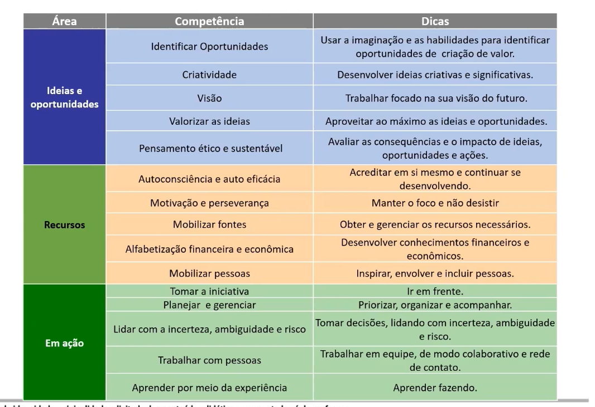
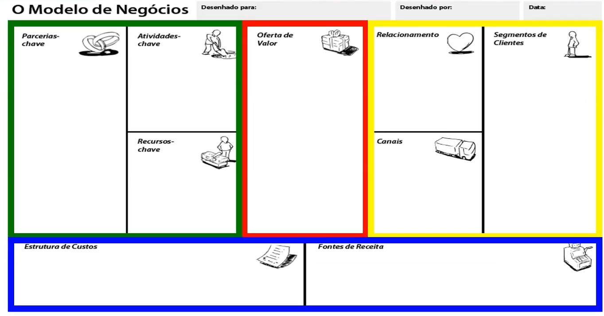

# Mindset Canvas e Plano de Negócio
- O empreendedor é aquele que **destrói a ordem econÔmica** existente através **da introdução de novos** produtos e serviços, pela criação de novas formas de organização, ou pela criação de novas formas de organização, ou pela exploração de novos recursos e materiais - Joseph Schumpeter (1949)

- Empreender pode ser definido como ato de **realizar sonhos, transformar ideias em oportunidades** e agir **para concretizar objetivos, gerando valor** para a sociedade - José Dornelas (2014)
  - Empreender é gerar valor para a sociedade

## Qual a motivação para empreender?
- [Global Entrepreneurship Monitor 2022/2023](https://www.gemconsortium.org/reports/latest-global-report)
  - Empreendedorismo de necessidade

## Competências Empreendedoras
- 3 áreas
- 15 competências
- 8 níveis de proficiÊncia
- 442 resultados de aprendizagem

### Modelo Entrecomp

- Conhecimento
- Habilidade
- Atitude

## Mindset Empreendedor
### Quebra-cabeça
- O objetivo final é claro e rapidamente definido
- Obter recursos
- Planejar
- Organizar
- Dividir as tarefas
- Definir a estratégia
- Executar o planejado
- Medir o progresso
- Atingir o objetivo

#### Planejamento "Previsão"
- Fins
- Planejamento
- Causal
- Certa previsibilidade

#### Análise gerencial
- Grande quantidade de informação analisada para filtrar as opções, avaliar e tomar decisões -> Previsão

### Lego
- Limitado apenas pela imaginação e habilidade
- Usa as peças disponíveis no momento
- Cada integrante traz suas peças e contribuições
- Os recursos dependem de quem você conhece
- O design evolui ao longo do tempo
- Cada ação amplia as possibilidades do resultado final
- Não é amarrado a um planejamento claro

#### Ação "Criação"
- Meios
- Ação
- Effectual
- Extrema incerteza

#### Ação empreendedora
- Cada entrada (ações, informação, recursos) expande as possibilidades de oportunidades e resultados -> Criação

### Effectuation
- [Como Surgiu o Effectuation - Saras Sarasvathy - Empreendedorismo](https://www.youtube.com/watch?v=rCnfsjKaLis)

#### Os princípios da Effectuation
- The bird-in-hand-principle
  - Comece com o que você tem em mãos
    - Quem eu sou
    - O que eu sei
    - Quem eu conheço
- The affordable-loss principle
  - Quanto eu estou disposto a perder vs Qual a opção com maior retorno esperado
- The crazy-quilt principle
  - Faça parcerias
- The lemonade principle
  - Aproveite as contingências
- The pilot-in-plane principle
  - Controle aquilo que é controlável

## Um pouco da história do empreendedorismo
- Planejamento:
  - Uma das teorias de gestão mais importantes a partir da década de 1980 é o Planejamento Estratégico
  - Com o surgimento das primeiras startups ele foi adaptado para as empresas nascentes e recebeu o nome de Plano de Negócios

### Plano de Negócios
- Na década de 1990 e 2000 o principal conselho para qualquer empreendedor era faça um Plano de Negócios
- Existiam centenas de concursos de Plano de Negócios
- Sem um Plano de Negócios você não conseguiria investimentos e nem entrar em uma incubadora
- Mas hoje estamos falando de várias tarefas que um empreendedor pode fazer antes de fazer um plano de negócios

1. Ideia
2. Oportunidade
3. Plano de negócios
4. Quantificar e obter recursos
5. Gerenciar o negócio

### Por que esse processo não é o mais indicado para Startups?
#### Incertezas
- Por que os planos falham?
  - Premissas não testadas que são consideradas verdadeiras
  - Planejamento linear
  - Grande investimento inicial
  - Pouca oportunidade para redirecionar quando novas informações são encontradas

#### Outras abordagens
- **Modelo de Negócios Canvas**
- **Lean Startup**
- **Modelo de Desenvolvimento de clientes**
- Pensamento científico
- Teoria de opões reais
- Aplicações da teoria do caos e complexidade

## Ferramentas de apoio do empreendedor
### Modelo de Negócios Canvas

- Descreve como a empresa cria, entrega e captura valor
  - Business Model Generation - Inovação em Modelos de Negócios

- **Framework: **
  - **Proposta de Valor**
    - O que você oferece?
    - O que você entrega?
    - Seus clientes percebem esse valor?
    - Que valores entregamos para os consumidores?
    - Qual problema dos nossos clientes estamos ajudando a resolver?
      - Novidades
      - Performance
      - Customização
      - Redução de custos
    
    - **Relevância:** como o produto resolve o problema do consumidor ou melhora sua situação
    - **Valor:** benefícios específicos que são entregues aos clientes
    - **Diferenciação:** porque o cliente ideal deve comprar de você e não do concorrente
    - **Job to be done**
  - **Relacionamento com clientes**
    - Pensa em:
      - Aquisição de consumidores
      - Retenção de consumidores
      - Produtos agregados (upselling)
  - **Segmentos de clientes**
    - Para quem a empresa está criando valor?
    - Quem serão os clientes mais importantes?
    - Quais são os cliente típicos?
    - Separe os clientes por segmentos

    - **Framework Personas:**
      - Representa o cliente ideal de uma empresa: ajuda a compreender quem é o cliente e o que precisa
  - **Fontes de Receitas**
    - O caixa que a empresa gera de cada um dos Segmentos de Clientes (o custo deve ser subtraído da receita para gerar o lucro)
    - Cada Segmento de Clientes pode gerar uma ou mais Fontes de Receitas
    - Cada Fonte de Receitas deve ter mecanismos de precificação diferenciados

    - **Dois tipos diferentes de Receitas:**
      - **Receitas de transação:** geradas de pagamentos de clientes feitos uma única vez
      - **Receita recorrente:** gerada de pagamentos recorrentes para entregar valor ao cliente ou oferecer suporte pós compra
    - **Tipos de fontes de receita:**
      - Venda de produto/serviço
      - Pagamento por utilização
      - Assinatura
      - Aluguel/Leasing
      - Licenciamento
      - Taxa de corretagem
      - Propaganda
  - **Canais**
    - Como a empresa se comunica com cada Segmento de clientes?
    - Como a empresa chega a cada Segmento de clientes?
    - Canais de comunicação, distribuição e vendas

    - **Despertar o interesse pelos produtos e serviços**
    - **Ajudar na avaliação da Proposta de Valor**
    - **Permitir que os consumidores comprem**
    - **Entregar a Proposta de Valor para o cliente**
    - **Oferecer suporte após a compra**
  - **Recursos Principais**
    - São os recursos que permitem à empresa criar e oferecer Proposta de Valor, atingir mercados, manter relacionamentos com os Segmentos de Clientes e gerar receitas
    - Recursos podem ser físicos, financeiros, intelectuais ou humanos
    - Podem ser adquiridos ou alugados pela empresa ou adquiridos por parceiros estratégicos
  - **Estrutura de Custo**
    - Descreve todos os custos para operar o modelo de negócios
    - Após definir as atividades, parceiros e recursos é possível calcular os custos envolvidos no modelo de negócios
    - Alguns modelo de negócios são mais baseados na estrutura de custos do que outros
    - **Tipos de custos:**
      - Custos fixos
      - Custos variáveis
      - Possibilidade de economias de escala
  - **Parcerias Principais**
    - A rede de fornecedores e parceiros que fazem o modelo de negócios funcionar
      - As alianças podem servir para otimizar o modelo de negócios, reduzir o risco, ou adquirir recursos
    - Quem são seus parceiros-chave?
    - Quem são seus fornecedores-chave?
    - Que recursos-chave você adquire de parceiros?
    - Que atividades-chave os parceiros desempenham?
  - **Atividades-chave**
    - As atividades/ações mais importantes que a empresa precisa fazer para o seu modelo de negócios funcionar
    
- Oferta
- Cliente
- Finanças
- Infraestrutura

#### Por que usar o Canvas?
- Auxilia o empreendedor a entender a sua proposta de valor
- Permite entender a empresa como um todo
- O Modelo de Negócios Canvas é uma ferramenta que pode auxiliar todos os empreendedores
- O seu Modelo de Negócios deve evoluir com o tempo

### Lean Startup
### O que é uma Startup?
- "uma organização que existe para criar novos produtos ou serviços sob condição de extrema incerteza" RIES, 2011
- Essa condição de extrema incerteza faz com que as ferramentas e metodologias tradicionais de gerenciamento não se apliquem
- A maneira tradicional de se medir o progresso de um projeto é garantindo que o mesmo caminhe conforme o planejado, na qualidade desejada e com os custos previstos
- O problema é que você pode executar com extremo sucesso o planejamento e, ainda assim, não chegar a qualquer resultado relevante
- O modelo de negócios da startup pode estar embasado em hipóteses
- Uma hipótese é a previsão de um resultado esperado
- Para validar cada uma das hipóteses (e, por consequência, o modelo de negócios), é preciso elaborar e executar testes empíricos
- Os resultados desses testes mostrarão se os esforços da startup estão sendo empregados no sentido de construir um negócio viável ou não

- O Ciclo do Lean Startup
  - Ideias -> **Construir** -> Produto -> **Medir** -> Dados -> **Aprender** -> Ideias...
    - O desafio da startup é **minimizar** o tempo necessário para atravessar esse loop
  

#### Construir
- A entrada no Ciclo acontece com a construção do Produto Mínimo Viável (MVP - minimum viable product)
- O MVP é a versão mais simples possível de um conceito/produto/serviço que permita à startup dar uma volta completa no Ciclo e assim adquirir aprendizado validado
- Minimum: Nobody wants to use it; Doesn't solve the problem
- Viable (maximum): product you want to build
- Minimum + Viable: Good enough product to attract the first users

#### Medir
- Medir os resultados usando dados quantitativos e qualitativos
  - Quantitativos validam a hipótese
  - Qualitativos dão base para novas ideias

#### Aprender
- Identificar se a hipótese testada deve ser aceita ou rejeitada
- Aceitar a hipótese significa manter a estratégica e testar a próxima
- Rejeitar a hipótese significa mudar a estratégia
- **Pivotar:** termo utilizado quando a negação da hipótese sugere uma mudança brusca nas estratégias

- **Principais hipóteses:**
  - Hipótese de Valor
  - Hipótese de Crescimento

### Project Model Canvas
- **Por quê?**
  - **Justificativas (passado):** o problema que a empresa pretende resolver. As organizações possuem dores e situação atual apresenta demandas não atendidas e oportunidades não exploradas
  - **OBJ SMART:** objetivos de realização. Se cumpridos, nos transportarão da situação atual para um futuro de geração de valor
  - **Benefícios (futuro):** Valores tangíveis e intangíveis serão obtidos pela organização no futuro após a implantação do projeto. Considerar o ESG
- **O quê?**
  - **Produto:** o que será entregue ao cliente
  - **Requisitos:** aquilo que é necessário ou desejável no produto que será gerado ao final do projeto
- **Quem?**
  - **Stakeholders Externos:** todas as pessoas ou organizações envolvidas ou afetadas pelo projeto. Cliente do projeto/Patrocinador do projeto - fornecedores, órgãos regulatórios
  - **Fatores Externos:** fatores externos que precisam ser monitorados - economia, clima, tecnologia, recursos, regulamentações, cultura, etc
  - **Equipe:** Todos que produzem algo, com os seus respectivos papéis. O que entregam e quais são as habilidades desejadas.
- **Como?**
  - **Premissas:** suposições sobre o futuro. Suposições dadas como certas
  - **Grupo de Entregas:** partes menores que integradas garantem que o projeto seja concluído. São tangíveis, palpáveis, mensuráveis e verificáveis.
  - **Restrições:** limitações de qualquer origem, impostas ao trabalho realizado pela equipe, que diminuem sua liberdade de opções
- **Quando e Quanto?**
  - **Riscos:** incertezas que podem afetar os objetivos do projeto. Precisam ser gerenciados. Podem representar ameaças ou oportunidades.
  - **Linha do tempo:** quanto tempo vai durar o projeto. Pode ter também um cronograma.
  - **Custos:** estimado de maneira resumida. Pode ser dividido por entregas e prever uma reserva de contingência (dependente do risco).

### Plano de Negócios
#### Objetivos de um Plano de Negócios
- Testar a viabilidade econômico/financeira de um negócio
- Auxiliar a busca de investimento
- Orientar as operações da empresa
- Orientar as escolhas estratégicas de empresa
- Alinhar a equipe de gestão
- Transmitir credibilidade

- O Plano de Negócios aumenta as suas chances de sucesso

#### Estrutura do Plano de Negócios
##### Estrutura sugerida
- Contar uma história
- Justificar as informações
- Definir informações financeiras

Empreendedorismo para visionários:
1. Sumário Executivo
2. Conceito do Negócio
3. Mercado e competidores
4. Equipe de gestão
5. Produtos e serviços
6. Estrutura e operações
7. Marketing e vendas
8. Estratégia de crescimento
9. Finanças

###### Conceito do negócio
- Histórico da empresa (caso ela já exista)
  - Faturamento, crescimento dos últimos anos, quantidade de clientes, número de funcionários, participação de mercado, entre outras.
- Modelo de negócio
  - O que será o negócio?
  - O que a empresa vende?
  - Para quem a empresa vende?
- Diferencial competitivo
- Localização e abrangência da empresa
- Missão, Visão e Valores

###### Mercado e competidores
- Análise do setor
  - Qual setor do mercado a empresa atua?
  - Qual o tamanho do mercado em reais, número de clientes e competidores? Isso irá se alterar nos próximos anos? (Histórico, atual e futuro)
  - Quais são as tendência nesse setor?
  - Quais fatores estão influenciando as projeções de mercado?
  - Como o mercado está estruturado e segmentado?
  - Quais são as oportunidades e riscos do mercado?
- Análise do nicho de mercado e do público-alvo
  - Qual o perfil do comprador?
  - O que ele compra atualmente (como resolve o seu problema)?
  - Por que ele compra?
  - Quais fatores influenciam a compra?
  - Quando, como e com que periodicidade é feita a compra?
  - Onde o cliente se encontra? Como chegar até ele?
  - Dividir os cliente em segmentos
  - **Foco nas características do público-alvo**
- Análise dos competidores
  - Quem são seus principais concorrentes?
  - De que maneira seu produto ou serviço pode ser comparado a eles?
  - Informações sobre os concorrentes
  - Quem são possíveis concorrentes no futuro?
  - Como você vence as atuais barreiras de entrada e como cria novas barreiras de entrada?
  - **Tabelas comparativas podem ser interessantes**
  - **Ferramentas - 5 forças de Porter e Matriz QFD**

###### Equipe de gestão
- Quem são os principais envolvidos no negócio?
- De onde eles vêm e qual a experiência prévia de cada um?
- A equipe é complementar?
- Quais as responsabilidade de cada área?
- Quem está faltando?
- **Currículos podem ficar no anexo**

- Foco na equipe estratégica, você poderá apresentar sua equipe operacional em outra seção
- A equipe não precisa estar completa, mas nesse caso é bom contar como pretende atrair outras pessoas
- A equipe de ser multidisciplinar e heterogênea
- Equipe é o mais importante para muitos investidores
- Pode colocar currículos no anexo
- Pode incluir um organograma

###### Produtos e serviços
- Apresentar os produtos e serviços da empresa
- Destacar seus benefícios e diferenciais
- Tecnologia, P&D e Patentes: Há inovações tecnológicas no produto? Você domina essa tecnologia? Há patentes já criadas para essa tecnologia? Como você pretende proteger sua propriedade intelectual?
- Plano para desenvolvimento de novos produtos

###### Estrutura e operações
- As operações no PN devem focar o estratégico e não o operacional
- Deve explicar suficientemente para que o leitor consiga saber os investimentos e gastos com Estrutura e operações
- Maiores detalhes sobre equipamentos e estrutura podem estar nos anexos
- Dependendo do negócio essa parte pode ser mais ou menos importante
- RH operacional pode ser descrito aqui
- Faça o RH a partir das atividades que precisam ser desenvolvidas
- CANVAS - Atividades-chave, Recursos0chave, Parcerias

- **Alianças estratégicas:** quais são os parceiros chave e o que eles oferecem? (caso sejam da área operacional)
- **Produção e Distribuição:** há uma estrutura de manufatura? Quem faz a distribuição dos produtos acabados?
- **Pós-venda:** há uma estrutura dedicada a isso?

**Opcional:**
- Organograma funcional
- Máquinas e equipamentos necessários
- Processos de negócios
- Processos de produção
- Políticas de RH (salários, benefícios, promoções, plano de carreira, entre outros)
- Previsão de RH
- Fornecedores (equipamentos, serviços, matéria-prima, etc)
- Infraestrutura e planta (layout)
- Infraestrutura tecnológica
- Projeção da capacidade produtiva

###### Marketing e Vendas
- **Posicionamento:** como você quer que seus produtos/serviços sejam vistos e percebidos pelos clientes? Como você vai se diferenciar da concorrência?
- **Preço:** qual a política de preços que sua empresa vai praticar?
  - Definir preços, prazos e formas de pagamentos para produtos ou grupos de produtos, para determinados segmentos de mercado
  - Explicar os motivos da precificação escolhida (baseada nos custos, pesquisa de concorrentes, etc)
- **Praça (Canais de distribuição):** Como seus produtos/serviços chegarão até os clientes? Qual a abrangência de atuação da empresa?
  - **CANVAS – Canais e Relacionamento**
- **Propaganda / comunicação:** Como seus clientes ficarão sabendo dos seus produtos/serviços? Como os produtos/serviços serão promovidos?
  - Definir meios que serão usados para divulgar o produto.
  - Definir investimentos e resultados esperados com a comunicação.
  - Evite simplesmente terceirizar o marketing.
  - **Capacidade comercial**
- **Projeção de vendas:** quanto e quando sua empresa vai vender?
  - É uma das partes mais importantes do Plano de Negócios.
  - E também uma das mais difíceis.
  - Precisa estar definida com base em premissas sólidas.
  - Pesquisa primária pode ajudar a definir premissas.
  - MVP pode ajudar a definir premissas.
  - Deve respeitar a capacidade do mercado em absorver o produto e a capacidade da empresa em divulgá-los.
  - Deve respeitar a capacidade produtiva e a capacidade comercial.

###### Estratégia de crescimento
- **Matriz SWOT**
- **Principais objetivos estratégicos para os próximos anos**
- **Principais tarefas e cronogramas**
- Requisitos de recursos $$ e seus estágios (quando precisará)
- **Períodos e marcos de controle** (número de clientes, receita, lançamento de novo produto, etc)
- **Análise dos riscos** (opcional)
  - Estratégia para mitigar os riscos
- **Análise de cenários** (opcional)
  - Cenários precisam ter embasamento
- **Planos de contingência** (opcional)

###### Finanças
- **Principais premissas (bases para projeções financeiras):**
  - Quais as premissas utilizadas para se chegar às projeções?
  - Explicar a planilha financeira para que o leitor entenda a lógica de cálculo.
- **Investimentos (usos e fontes):**
  - De que valor financeiro sua empresa precisa para iniciar as operações?
  - Além do momento inicial, haverá necessidade de recursos em quais outros momentos?
  - De onde virão os recursos?
  - Como serão utilizados os recursos?
- **Composição dos custos e despesas:**
  - Apresente em formato de planilha, os principais custos e despesas do negócio.
  - **CUSTOS:** ligados à operação ou à atividade fim.
  - **DESPESAS:** outros gastos para manutenção do negócio.
  - Se possível, compare suas margens com outras empresas semelhantes.
- **Evolução dos resultados financeiros e econômicos** (mensal nos anexos e anual no plano):
  - **Receitas:** Qual a quantidade prevista de vendas e as receitas obtidas?
  - **Demonstrativo de resultados:** Quais os resultados que serão obtidos com o negócio nos próximos anos? (regime de competência)
  - **Fluxo de caixa:** Qual o fluxo de caixa da empresa para os próximos anos? (regime de caixa)
  - **Balanço patrimonial (opcional):** Qual o balanço projetado para a empresa nos próximos anos?
  - **Indicadores financeiros:**
    - **Taxa interna de retorno:** Qual é o retorno financeiro proporcionado pelo negócio?
    - **Valor presente líquido:** Qual é o valor da empresa hoje, considerando as projeções futuras de seu fluxo de caixa?
    - **Breakeven e Payback:** Quando ocorrerá o ponto de equilíbrio financeiro (quando não há lucro e nem prejuízo)? Quando ocorrerá o retorno do investimento inicial?
- **Necessidade de aporte e contrapartida:**
  - Quanto de recursos será obtido/buscado junto a fontes externas de financiamento/investimento?
  - Quais as contrapartidas oferecidas aos investidores?
  - Existe alguma possibilidade de saída já planejada para o investidor?
- **Outras orientações:**
  - O planejamento financeiro deve refletir em números todo o planejamento estratégico.
  - Faça sua própria planilha e abuse de gráficos e tabelas.
  - O horizonte de planejamento normalmente é de 5 anos, mas pode variar.
  - O mais importante é justificar os números em premissas sólidas.
  - Peça ajuda a especialistas.
  - Confira se não esqueceu nenhuma informação.
  - A parte financeira é ótima para encontrar erros, descobrir pontos esquecidos e identificar inconsistências.
  - Tenha referências para comparar os seus números.

###### Sumário Executivo
- **Quem você é:** O que é o negócio e qual o modelo de negócio? Quem está envolvido no negócio? Por que você e sua equipe são especiais para esse negócio?
- **Qual é sua estratégia / visão:** Como você pretende desenvolver a empresa e aonde quer chegar?
- **Qual é o seu mercado:** Qual é a oportunidade de negócio? Qual o mercado-alvo e por que se mostra promissor?
- **De quanto investimento você precisa e o que fará com ele:** Qual o investimento, como será usado e quando será necessário?
- **Quais são suas vantagens competitivas:** Quais os diferenciais da sua empresa?

###### Qual o tamanho do Plano de Negócios (PN)?
- Em geral, de 15 a 25 páginas + anexos.
- Plano de Negócios operacional – sem limite de páginas.

###### Dicas finais
- Revise o plano.
- Peça que outros revisem o seu plano.
- Faça cenários.
- Tenha uma apresentação do seu PN sempre em mente.
- Seja objetivo.
- Use gráficos, tabelas e imagens.
- Excessos devem ser incluídos somente em anexos.
- Referencie todos os dados que não são seus.
- Preocupe-se com a aparência do plano.
- Faça versões diferentes para públicos diferentes.

