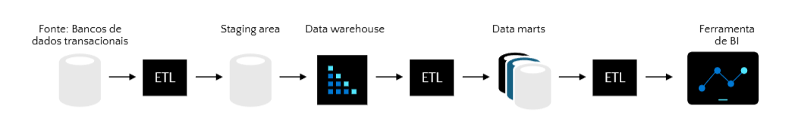
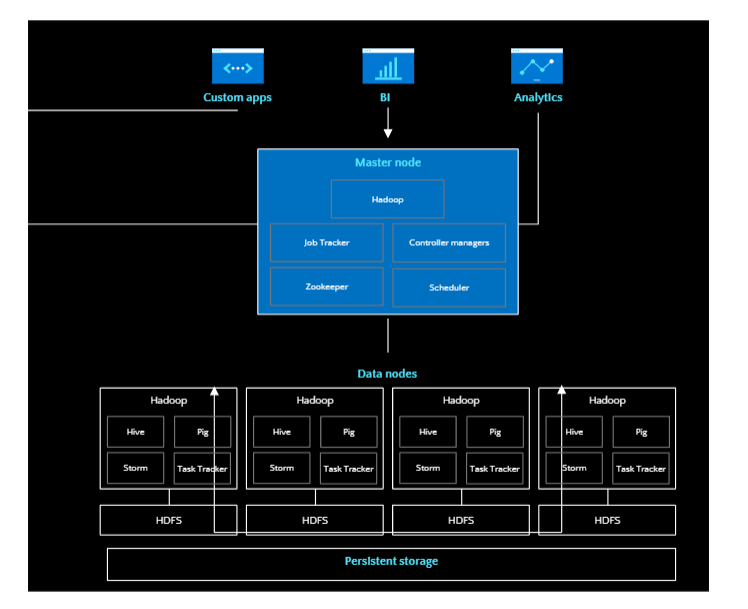
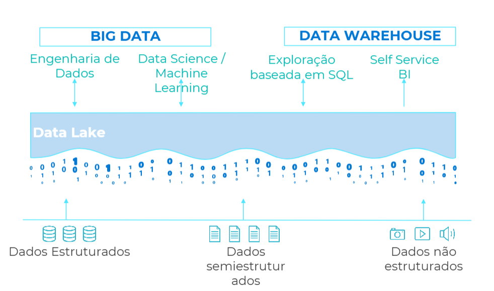
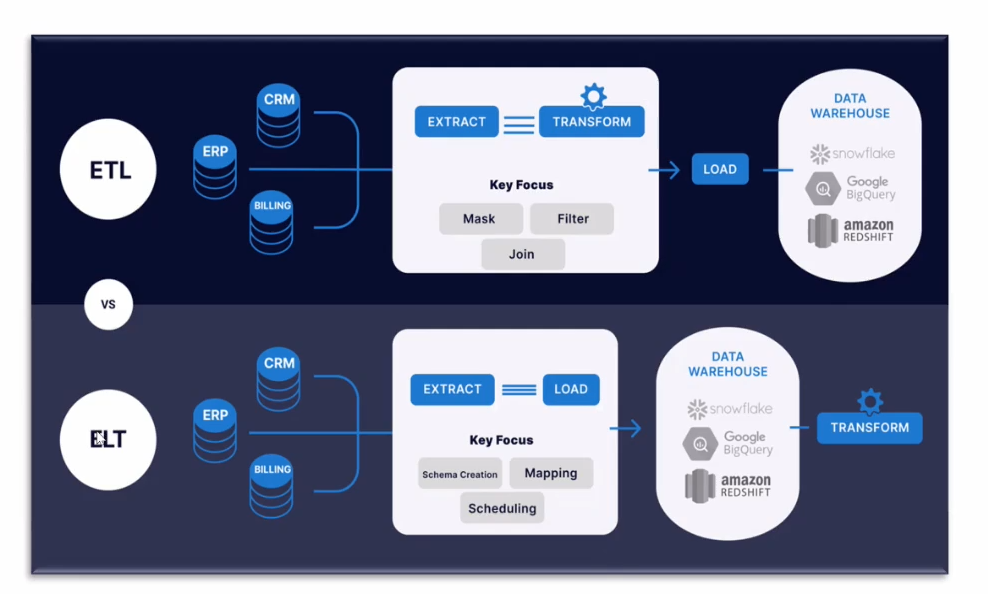
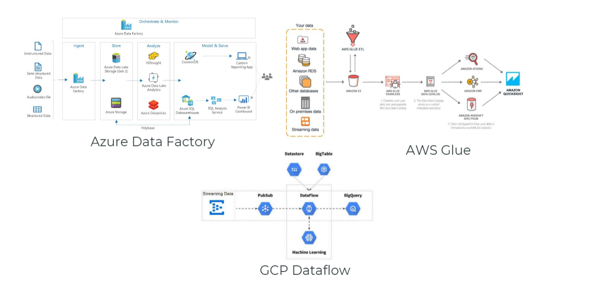
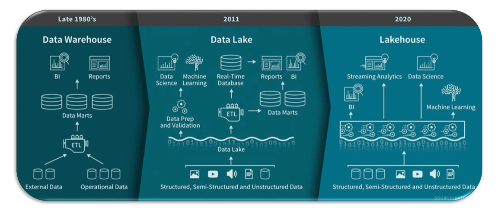
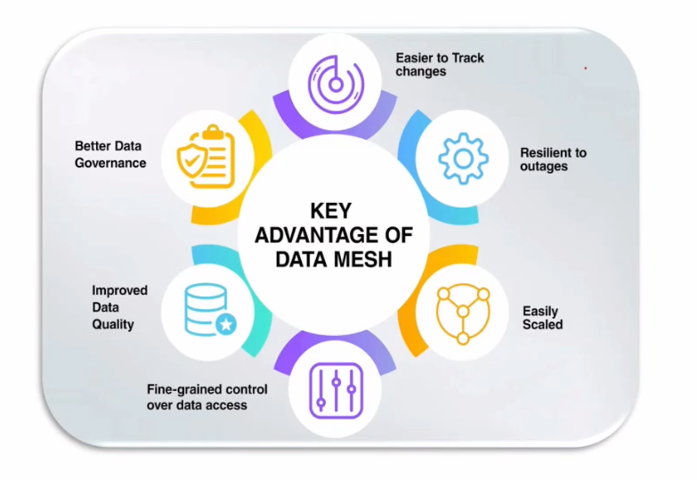

# NoSQL x SQL I
## O que é um banco de dados?
- **Definição de Banco de Dados:** um banco de dados é uma coleção estruturada de informações que facilita o acesso e a manipulação de dados
- **Acesso e Recuperação:** os bancos de dados permitem que os usuários acessem e recuperem dados de maneira rápida e eficiente, otimizando processos
- **Sistemas gerenciadores de bancos de dados (SGBDs):** são softwares que permite a criação, manipulação e administração de bancos de dados

## Tipos de bancos de dados
- Transacionais (OLTP) (Online Transaction Processing)
- Analíticos (OLAP) (Online Analytical Processing)

- Relacional SQL
- NoSQL (Not Only SQL)
- New SQL (Hybrid)

## ACID: Atomicidade, Consistência, Isolamento e Durabilidade
- **Atomicidade:** atomicidade assegura que todas as partes de uma transação sejam concluídas com sucesso ou nenhum delas é aplicada
- **Consistência:** consistência mantém a integridade dos dados durante e após as transações, garantindo que os dados estejam sempre corretos
- **Isolamento:** isolamento garante que as transações ocorram independentemente, evitando conflitos e interferências entre elas.
- **Durabilidade:** durabilidade assegura que os resultados de uma transação sejam permanentes, mesmo em caso de falhas no sistema

## Arquiteturas Modernas de Bancos de Dados
- **On Premises:** servidores locais
- **IaaS:** instalado manualmente ou por templates
- **PaaS - Capacidade gerenciada:** Múltiplas ofertas - Conceito de **Instância**
- **PaaS Serverless:** Múltiplas ofertas, até SaaS

## Arquitetura e Escalabilidade de Bancos de dados
### Transações e Controle de Concorrência
- **Transações** garantem a integridade dos dados em operações complexas
- **Commit** é o processo de conclusão de uma transação
- **Rollback** é o processo de cancelamento de uma transação
- **Locks** são utilizados para evitar acessos simultâneos a dados críticos
- **Deadlocks** ocorrem quando duas transações bloqueiam recursos mutuamente
- Otimização envolve técnicas para minimizar locks e deadlocks

### Escalabilidade de Bancos de Dados
- Escalabilidade **vertical** adiciona recursos a um único servidor para aumentar a capacidade
- Escalabilidade **horizontal** envolve adicionar mais servidores para distribuir carga, no que chamamos de **clusters**
- Estes **clusters** são baseados em múltiplos servidores (nós) conectados que podem servir para balanceamento de carga e/ou alta disponibilidade do banco de dados

### Clusters
- **Clusters** garantem alta disponibilidade e **failover** automático em banco de dados
- Clusters são compostos de **nós**, que são múltiplas máquinas (servidores) interconectados
- A **replicação de dados** é essencial para manter a integridade e a consistência entre os nós
- Ambientes **híbridos** (Cloud x On Premises ou MultiCloud) combinam soluções em nuvem e locais para flexibilidade
- Estratégias de **Load Balancing** melhoram o desempenho em clusters
- O monitoramento contínuo é crucial para a manutenção e operação eficaz dos clusters

## Fundamentos do Modelo Relacional e SQL
### Modelo Relacional
- **Esquema:** os bancos de dados SQL/Relacionais, precisam ter um **esquema pré-definido**, antes de serem utilizados
- **Estrutura de Tabelas:** o modelo relacional organiza dados em **tabelas**, facilitando a representação de **entidades** e seus **atributos**
- **Chaves Primárias e Estrangeiras:** as chaves primárias, ou Primary Key (PK) identificam **registros únicos**, enquanto as chaves estrangeiras criam relações entre tabelas, promovendo a integridade dos dados. Já uma chave estrangeira, ou Foreign Key (FK), é uma referência a uma chave primária ede outra tabela relacional.
- **Facilidade de Busca:** o modelo relacional permite **buscas eficientes** e conexões entre diferentes conjuntos de dados, melhorando a análise de informações

### Integridade Referencial e Normalização
- **Integridade referencial** garante a **consistência** dos dados entre tabelas
- **Chaves primárias** e **estrangeiras** são fundamentais para a integridade Referencial
- **Normalização** organiza dados para reduzir redundâncias e dependências indesejadas.

### O que é SQL?
- SQL (**Structured Query Language**) é uma linguagem de programação usada para gerenciar e manipular bancos de dados
- **Qual o papel da linguagem SQL na estruturação de dados?** - a linguagem SQL desempenha um papel essencial na estruturação de dados, pois fornece comandos específicos para organização, armazenamento, recuperação e manipulação de informações

## Introdução ao NoSQL
### O que é NoSQL?
- **Definição de NoSQL:** **NoSQL** refere-se a uma categoria de bancos de dados que não utilizam o modelo relacional, focando em flexibilidade e escalabilidade. Não possui **esquema** pré-definido
- **Alta Velocidade e Escalabilidade:** os bancos de dados NoSQL são projetados para gerenciar grandes volumes de dados com **alta velocidade** de leitura e gravação, permitindo operações em **tempo real**
- **Flexibilidade na Estrutura de Dados:** uma das principais vantagens dos bancos de dados NoSQL é a **flexibilidade** na estrutura de dados, permitindo armazenar informações não estruturadas e semiestruturadas

### CAP Theorem
- **Definição do Teorema CAP:** o Teorema CAP explica a relação entre consistências, disponibilidade e tolerância à partição em sistemas de banco de dados distribuídos
- **Consistência e Disponibilidade:** ao projetar um sistema NoSQL, você pode priorizar consistência e disponibilidade, mas isso pode comprometer a tolerância à partição
- **Impacto no Desempenho:** a escolha de quais propriedades priorizar impacta diretamente o desempenho e a integridade dos dados em um sistema distribuído

### Tipos de bancos NoSQL
- **Bancos de Dados Chave-Valor:** os bancos de dados chave-valor armazenam dados como pares de chave e valor, ideais para acesso rápido e escalável
- **Banco de Dados de Documentos:** bancos de dados de documentos armazenam dados em documentos flexíveis, geralmente em formato JSON, facilitando a gestão de dados semiestruturados
- **Banco de Dados Colunares:** os bancos de dados colunares armazenam dados em colunas em vez de linhas, otimizando consultas de grandes volumes de dados
- **Banco de Dados de Grafos:** bancos de dados de grafos são projetados para representar e consultar relacionamentos complexos entre dados de forma eficiente

### Escalabilidade em NoSQL
- **Escalabilidade Horizontal e Vertical:** os bancos de dados NoSQL permitem escalabilidade horizontal, facilitando a adição de novas máquinas ao cluster, bem como vertical aumentando a capacidade em um único servidor/instância
- **Desempenho em Aumento de Dados:** NoSQL é projetado para lidar com grandes volumes de dados sem comprometer o desempenho, mesmo com tráfego crescente

### Exemplos de Bancos de Dados Transacionais NoSQL - Não Relacionais
- **Modelo documento:** MongoDB, CouchDB
- **Modelo colunas:** Cassandra, Hbase, Bigtable
- **Modelo grafos:** Neo4j, Gremlin, ArangoDB
- **Modelo chave-valor:** Redis Cache, DynamoDB

### Exemplos Banco de Dados Analíticos NoSQL - Não Relacionais
- Azure Synapse Analytics
- Microsoft Fabric
- databricks
- Cloudera
- elastichsearch

# NoSQL x SQL II
## Comparação SQL x NoSQL, Arquiteturas Analíticas e Hand's On
### Vantagens e desvantagens: SQL
- **Vantagens do SQL:** SQL oferece forte consistência e integridade de dados, sendo ideal para aplicações que requerem rigidez e confiabilidade
1. Estrutura pré-definida
2. Consistência de Dados
3. Consultas Complexas
4. Transações ACID
5. Relatórios e Análises
6. Robustez e Suporte

- **Desvantagens do SQL:** menos flexível e especializado, mais difícil e muitas vezes com maior custo para escalar em cenários de grandes volumes de dados

### Vantagens e desvantagens: NoSQL
- **Vantagens do NoSQL:** NoSQL oferece escalabilidade e flexibilidade, permitindo lidar com grandes volumes de dados e estruturas variáveis
1. Flexibilidade de Esquema
2. Grandes Volumes de Dados Não Relacionais
3. Escalabilidade Horizontal
4. Desempenho
5. Modelo de Dados Específicos

- **Desvantagens do SQL:** NoSQL pode sacrificar a consistência em alguns casos, o que pode ser uma preocupação para aplicações que requerem dados sempre precisos

### O que é um Banco de Dados Analítico?
- Banco de dados analítico é projetado para **consultas e análises complexas**
- Ele armazena **grandes volumes de dados** históricos para análise de tendências
- Ideal para **relatórios de BI** e **tomada de decisões** estratégicas
- Usa técnicas de **processamento paralelo** para desempenho otimizado
- Diferente de bancos transacionais, foca na **leitura em vez de escrita**

### Data Warehouse vs Big Data
- Um **Data Warehouse** é um sistema para relatórios e análise de dados, geralmente baseado em banco de dados relacional analítico
- **Big Data** refere-se a grandes volumes de dados estruturados, semiestruturados e não estruturados
- Data Warehouse são otimizadas para **consultas complexas**, enquanto Big Data se concentra em análise de dados em larga escala
- Ambos são essenciais para a **tomada de decisões** informadas nas empresas

- **Big Data:** "Nascido em 1997, o termo Big Data quer dizer ativos de informação de alto volume, alta velocidade e/ou de alta variedade que exigem formas inovadoras e econômicas de processamento de informações que permitem insights aprimorados, tomada de decisões e automação de processos". Gartner, 2021

### Arquitetura de dados analíticos

### Tipos de Arquitetura de dados analíticos
1. **Lambda**
- 2 caminhos de ingestão dos dados, 1 Stream e 1 Batch. Dessa forma, é possível processar os dados mais pesados em uma camada preparada, enquanto os dados de real time passam por uma outra camada, que faz as interceptações necessárias para enriquecimento e agregações conforme necessidade

2. Kappa
- Essa arquitetura tem propósitos parecidos com a Arquitetura Lambda, mas com a diferença que os dados passam por um único ponto Stream. Essa simplificação resolve o problema de duplicidade e complexidade de gerenciamento, além de facilitar a rastreabilidade das informações em todas as suas etapas e transformações.

### Tipos ETL x ELT x Ingestão de Dados

### Soluções de Ingestão/Orquestração de dados

### Design Patterns de arquiteturas de dados modernos
- Lakehouse
- Data Mesh

#### Design Patterns: Lakehouse

### Design Patterns: Data Mesh

### Organização de um Data Lake: Medallion Architecture
- **Bronze (Ingestão raw e Histórica):** dados históricos completos e granulares, sem nenhuma transformação. Normalmente acessado apenas por Data Engineer
- **Silver (Filtrado, limpo, enriquecido):** dados limpos, selecionados e preparados para uso. Muito utilizado para Data Science e Data Engineer
- **Gold (Dados confiáveis, Agregações em nível de negócios):** Informação, dados confiáveis e já modelados para consumo conforme linguagem dos negócios. Mais utilizado por Data Analysts e Data Stewards

