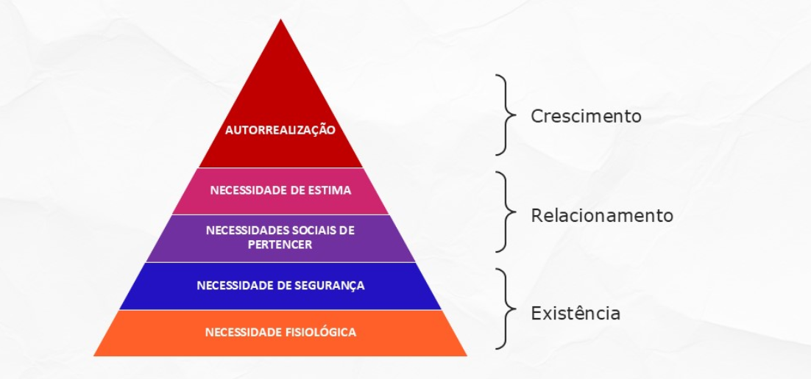

# Liderança em Projetos de Tecnologia I
- "Quando chegamos a determinado ponto da nossa vida profissional a nossa missão é muito menos conectada com o que sabemos/queremos fazer no trabalho e mais conectada com a nossa capacidade de **conseguir fazer com que o outro saiba e queira fazer o trabalho**."

- **A natureza mutável do trabalho e das organizações**
  - Globalização;
  - Intensificação da Competição;
  - Nova tecnologia da informação e comunicações;
  - Conectividade e Colaboração;
  - Sustentabilidade/Resiliência às Crises.

## Motivação e engajamento: o que te motiva?
### Motivação
#### O que te motiva?
- **Motivação:** conjunto de processos que dão ao comportamento uma intensidade, uma direção determinada e uma forma de desenvolvimento próprias da atividade individual
- **Motivado:** diz-se do indivíduo que se comporta com determinação ou intensidade em busca de algum objetivo

- Para Hitt el al "os **fatores motivacionais** são responsáveis pela disponibilidade das pessoas de aplicarem seu capital intelectual em benefício do sucesso da empresa"

- "Forças oriundas do interior de uma pessoa, que são responsáveis pelo direcionamento, pela intensidade e pela persistência intencionais dos esforços, orientados para **alcançar objetivos específicos** que não dependam de capacidades ou de demandas ambientais."

#### Aumentos na Produtividade
- **Des=f(C, M, A)**
  - **Capacidade:**
    - Recrutamento
    - Seleção
    - Treinamento
    - Desenvolvimento
  - **Motivação:**
    - Enriquecimento de cargo
    - Promoções
    - Coaching
    - Feedback
    - Recompensas
  - **Ambiente:**
    - Empowerment
    - Equipes
    - Liderança
    - Cultura

#### Motivação Extrínseca
- Está relacionada a **recompensas materiais**, tais como:
  - Salários
  - Benefícios adicionais
  - Seguro de vida
  - Promoções
  - Ambiente e condições de trabalho

#### Motivação Intríseca
  Está relacionada a **recompensas psicológicas**, tais como:
  -  O reconhecimento da habilidade de alguém
  -  Sentido de desafio e realização
  -  Reconhecimento positivo ou apreciação
  -  Ser tratado de maneira considerável

#### Teoria das necessidades de Maslow
- Parte da ideia de que as pessoas buscam satisfazer necessidades específicas, formadas a partir de uma **escala de importância** que pode ser representada por uma pirâmide
  - Autorregulação
  - Necessidade de estima
  - Necessidades sociais de pertencer
  - Necessidade de segurança
  - Necessidade fisiológica

#### Teoria ERG
- Essa teoria é uam releitura contemporânea da Teoria das Necessidades de Maslow, em que se postula a existência de três grupos de necessidades essenciais 

#### Teoria de Mc Clelland
- O psicólogo americano Mc Clelland, em sua teoria, também classifica a questão da motivação individual e coletiva **com base nas necessidades humanas**
  - **Realização:** pessoas que desejam fazer as coisas melhor e de maneira mais eficaz do que outras pessoas já possam ser feito
  - **Afiliação:** pessoas que t~em o forte desejo de se sentir queridas e de permanecer em bons termos com a maioria das pessoas
  - **Poder:** pessoas que têm vontade de influenciar outras pessoas e eventos

#### Teoria dos dois fatores
- Desenvolvida pelo estudioso americano Frederick Herzberg, que considerava haver pelo menos dois **conjuntos de elementos fundamentais** à motivação nas empresas
  - **Fatores Higiênicos (ambientais):**
    - Salários
    - Benefícios sociais
    - Políticas da empresa e regulamentos internos
  - **Fatores emocionais:**
    - Conteúdo do cargo
    - Tarefas e deveres relacionados à função exercida

#### Princípios de Enriquecimento do Trabalho
- Aumentar a responsabilidade dos indivíduos para o seu trabalho através da remoção de alguns controles
- Dar às pessoas a responsabilidade por um processo completo ou unidade de trabalho
- Disponibilizar informações diretamente aos empregados, em vez de enviá-los através de seus gestores
- Capacitar as pessoas a assumir novas tarefas mais difíceis, que nunca tenham utilizado antes
- Atribuir indivíduos tarefas específicas que permitem que eles se tornem especialistas

##### Maior Ênfase em Aspectos Culturais e Menos em Compensação Financeira
- Quão importante são os seguintes elementos de trabalho para você?
  - **Pacote de Remuneração:**
    - 8. Salário fixo atrativo
  - **Ambiente de Trabalho:**
    - 2. Bom relacionamento com colegas de trabalho
    - 3. Bom equilíbrio trabalho / vida pessoal
    - 4. Bom relacionamento com superiores
    - 7. Estabilidade do trabalho
  - **Conteúdo do Trabalho e Oportunidade:**
    - 1. Apreço pelo trabalho
    - 6. Desenvolvimento de carreira e aprendizado
    - 9. Conteúdo do trabalho interessante
  - **Imagem e Reputação da Empresa:**
    - 5. Estabilidade financeira da empresa
    - 10. Valores da empresa

