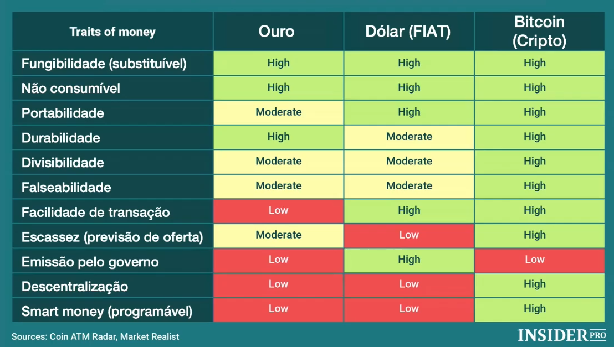

# Blockchain e Criptomoedas I
- Uma experiência:
  - Tecnológica
  - Econômica
  - Política
  - Social
  - Financeira
- Uma nova economia está surgindo

- **WEB 2.0 (1970-2000):**
  - Páginas WWW
  - HTML
  - e-Commerce
  - Emails, Chats
  - Java
  - **Do analógico, manual -> Para o digital baseado em sistemas**
- **WEB 2.0 (2000-Presente):** 
  - Media Social
  - Conteúdo gerado pelo usuário
  - Acesso mobile
  - Apps (centralizados)
  - Empresas monetizando dados
  - Câmeras e vídeo de HQ
  - **Do digital baseado em sistemas -> Para o mobile, baseado em apps, streaming e redes sociais**
- **WEB 3.0 (Iminente):**
  - dApps (descentralizados)
  - Tokens, NFTs, Stablecoins
  - Dados monetizados pelo usuário
  - VR e AR (metaversos)
  - Blockchains, DeFi, ReFi, SoFi
  - AI generativa
  - Visão Computacional
  - Realidade estendida
  - **Dos modelos tradicionais que conhecemos -> Para transações "on chain" baseadas em blockchain e com uso massivo de IA generativa**

Modelos de negócio definidos por capacidade de processamento **limitada** e **centralizada** x Modelos de negócio definidos por capacidade de processamento **ilimitada** e **universal**

- **Transição:**
  - Tecnológica profunda
  - Política e geopolítica
  - Aspectos regulatórios
  - Modelos de negócio e monetização
  - Suportes jurídicos
  - Acesso e operação de dados

- Ativos que **representam** valor mobiliário
  - Equity de empresas
  - Recebíveis
  - FDICs
  - Títulos executáveis
  - Mercado imobiliário
  - Crowdfunding
  - Royalties musicais
  - Dividendos
  - Debêntures
  - Produção agrícola
  - Empréstimos
  - Florestas
  - Costas de Fundos
  - Crédito de carbono
  - Construção civil
  - Safra de soja
  - Recebíveis advocatícios
  - Ativos verdes
  - Apólices
- Ativos que **não representam** valor mobiliário
  - Colecionáveis
  - Tickets
  - NFTs
  - Reputação
  - Social presence
  - Fidelidade
  - Fotografia
  - Loyalty
  - Consórcios
  - Experiências
  - Gamification
  - Social finance
  - Obras de arte
  - Engajamento
  - Momentos
  - Trechos de filmes

- **Criptomoedas:** é uma moeda digital descentralizada, emitida, distribuída e negociada de forma livre no mercado, não emitida/controlada por um determinado governo. Valor oscila de acordo com o mercado
  - Bitcoin
  - Ethereum
  - Litecoin
  - Monero
  - Solana
  - Cardano
  - Matic
- **Stablecoins:** é a representação equivalente ao Dólar, Real, Euro, etc. Emitida e controlada por uma empresa privada. Valor "travado" na sua moeda de referência
  - USDC
  - USDT
  - DAI
  - BRZ
- **CBDCs:** é a própria moeda emitida e controlada por um determinado país, tal qual Brasil e China, utilizando blockchain. Valor é o próprio valor do dinheiro.
  - DREX
  - e-CNY
  - (Yuan Digital)
- **Tokens (securities):** representam um determinado ativo classificado como valor mobiliário, na forma de um **token**, emitido, registrado, distribuído e negociado em uma determinada blockchain. Valor depende do ativo.
  - Equity
  - Debêntures
  - Recebíveis
  - Royalties
  - Fundos
  - Imóveis
  - Dividendos
- **NFTs (Non-Fungible Tokens):** representam um determinado ativo, benefícios, acesso, na forma de um **NFT**, emitido, registrado, distribuído e negociado em uma determinada blockchain. Valor depende da utilidade.
  - NuCoin
  - Starbucks
  - Mercado Pago
  - Colecionáveis
  - Artes
  - Tickets
  - Benefícios

## Bitcoin
1. Uma nova classe de ativos (digital e global)
2. Uma nova expressão monetária ("um novo dinheiro")
3. Uma nova infraestrutura tecnológica (Blockchain)

- 18/ago/2008: bitcoin.org foi registrado
- 31/out/2008: Artigo seminal publicado por Satoshi Nakamoto
- **03/jan/2009:** Primeiro bloco da Blockchain
- **05/out/2009:** 1 US$ = 1.309,03 BTC
- **22/mai/2010:** Famosa compra das 2 pizzas por 10.000 BTC
- 06/nov/2010: Market cap US$ 1 milhão
- **09/fev/2011:** 1 BTC = US$ 1
- 02/jun/2011: 1 BTC = US$ 10
- 15/set/2012: London BTC Conference
- **22/fev/2013:** 1 BTC = US$ 30
- 21/mar/2013: 1 BTC = US$ 74,90
- 28/mar/2013: Market cap US$ 1 bilhão
- **10/abr/2013:** 1 BTC = US$ 266
- 02/out/2013: FBI fecha Silk Road
- **19/nov/2013:** 1 BTC = US$ 1.242

- Plataformas como:
  - E-gold - 1996
  - WebMoney - 1998
  - Liberty Reserve - 2006
  - Perfect Money - 2007
- falharam por:
  - Centralização
  - Gasto duplo
  - Regulamentação
  - Uso para fins ilícitos

1. O problema do gasto duplo
  - Solução tradicional: utilizar um intermediário garantidor
  - Bitcoin elimina o gasto duplo sem a necessidade de um intermediário
2. A desintermediação
  - Transações entre duas partes (P2P) sem o intermediário garantidor
3. Base de dados distribuída (ledger distribuído)
  - Tradicional: Banco
  - Bitcoin: Blockchain

### Econômica
- Uma nova forma de dinheiro: digital, global e distribuído
- Pode se manifestar de duas formas:
  - **Moeda**, como o Real, Dólar ou Euro
  - **Ativo financeiro (investimento)**, como o Ouro, Ações ou Commodities

- Global
- Livre Mercado
- Puramente Digital
- Divisível por 100 milhões
- Não governamental
- Limitado a 21 milhões de unidades

### Tecnológica
- Uma nova camada tecnológica no mundo
  - Blockchain
  - Internet
  - Energia elétrica

- **Blockchain** é uma base de dados distribuída (DLT) que torna possível criar um registro digital de transações que podem ser compartilhadas, monitoradas e mantidas por uma rede distribuída de computadores. Uma **cadeia de blocos** conectados sequencialmente, cada bloco com um conjunto de transações.
  - Segurança 
  - Imutável
  - Desintermediação
  - Não falsificável
  - Ledger distribuído
  - Resolve o gasto duplo

## Chave Pública e Chave Privada
- A chave pública serve como o endereço para o qual os Bitcoins são enviados. A segurança das suas chaves é essencial para proteger seus ativos.
- No Bitcoin, uma carteira é utilizada para gerenciar a **chave privada**, que é necessária para assinar transações. 
- O seu bitcoin **nunca** está na carteira. Ele é representado como um saldo lá na blockchain, no endereço da sua chave pública.

## A Primeira Compra de Bitcoin
### Como Fazer minha Primeira Compra de Bitcoin
Existem duas maneiras principais de comprar Bitcoin:
1. Através de uma corretora (exchange).
2. Diretamente com outra pessoa que possua Bitcoin.

## Ouro vs Dólar vs Bitcoin

## Premissas econômicas de uma moeda
- Ser um **meio de troca**
- Ser uma **unidade de conta**
- Permitir a **reserva de valor**

## Alticoins (Alternative Coins)
- Todas as outras moedas, exceto o Bitcoin

## Blockchain 
### EM AÇÃO!
- O que acontece quando uma transação é submetida?
1. Fábio quer enviar 0,004 BTC para ??
2. A transação é submetida para a rede Blockchain
3. Os mineradores trabalham para validar as transações
   1. Os mineradores dão preferência para as transações que pagam taxar maiores
4. O primeiro a resolver o "hash", cria um novo bloco incluindo, entre outras, a transação do Beto para a Ana
   1. E é recompensado com novos Bitcoins e com um fee sobre as transações
5. E o novo bloco é adicionado na blockchain
   1. Um novo bloco é criado a cada 10 minutos, e os mineradores passam a trabalhar buscando o próximo bloco
6. A rede reconhece o novo bloco com as transações validadas (consenso)
7. A transação é concluída e o BTC agora pertence à ?

### DESCOMPLICADO
- Rede distribuída de computadores responsáveis por algumas funções:
  - Validar as transações
  - Minerar (criar) novos Bitcoins
  - Consenso e confiança distribuída
  - (**Metcalfe's law:** o efeito da rede é proporcional ao número de nós no quadrado)

- Halving é mudado a cada 4 anos (210 mil blocos)

### Transações realizadas em Blockchain são teoricamente imutáveis
- Porque é improvável uma fraude na **blockchain**
1. Imagine que a rede esteja trabalhando no **bloco 91**
2. E alguém deseja alterar (fraudar) uma transação no **bloco 74**
3. Seria necessário alterar o **bloco 74** e reprocessar todos os blocos entre 74 e 90, e ainda completar o **bloco 91**, o que exigiria um poder computacional extraordinário
4. Para tornar tudo ainda mais complicado, todo esse esforço deveria ser concluído antes de todos que estão na blockchain do Bitcoin terminando o trabalho que está sendo feito em apenas **um bloco (número 91)**, o que demora apenas 10 minutos para ser realizado.

## Pessoas já não são mais necessária para operar o dinheiro
- O dinheiro digital, programável, não reconhece fronteiras, não reconhece pessoas
- Não importa se você é uma pessoa, uma geladeira, um carro autoguiado, um celular ou um device qualquer
- Pessoas, máquinas, sistemas... todos agora são iguais e podem operar esse dinheiro digital

## A criação de um Sistema Integrado
- **Hoje**
  - Sistemas para pagamentos (Visa, Master, Paypal)
  - Sistemas para transações entre bancos
  - Sistemas para transações entre países
  - Sistemas para transações entre empresas
  - Sistemas para transações com governo
- **Amanhã**
  - Bitcoin é um sistema que pode unificar TODAS estas transações entre diferente partes
  - Além de criar o primeiro sistema para transações P2P em escala global

## Bitcoin não está tentando substituir a moeda nacional de um país
- Bitcoin não compete com os bancos... porque ele não foi criado para esse habitat
- Bitcoin não compete com o dinheiro em papel, porque ele foi criado para outro propósito
- Bitcoin não é o dinheiro para o mundo do dinheiro físico (plástico, papel), é para outra realidade
- Bitcoin não é para ser um dinheiro de alguma nação, isso é pouco para ele

## Streaming, Bitcoin e a noção de tempo em relação ao dinheiro
- Dinheiro como fluxo, como **experiência**
- Acabou a lógica do dinheiro como container: salário, ciclos, pacotes 
- Isso era necessário porque os sistemas eram caros e ineficientes

## Restrições do sistema atual e as crianças entrando nesse mercado
- As crianças de hoje jamais terão um conta bancária...
- ...ou uma carteira de motorista
- ...ou transações em papel
- (Você ainda tem fax, vídeo cassete ou walkman em casa?)

## O primeiro artefato digital com histórico eterno, imutável
- Quando mais antiga a transação, mais imutável ela será
- Bitcoin é a primeira manifestação real de **imutabilidade digital**
- Não existe outro sistema que provê esse grau de imutabilidade
Escrever na blockchain do Bitcoin é melhor do que escrever na pedra

## Bitcoin foi criado para um mundo com internet, os outros sistemas não
- Cheque
- Cartão de Crédito

## Neutralidade e inovação
- Você não precisa pedir permissão para inovar em Blockchain

## Inversão de infraestrutura já ocorreu várias vezes na sociedade moderna
- Dos cavalos para os carros
- Do gás para a eletricidade

- As tecnologias da época foram utilizadas pelas novas tecnologias, até que ocorreu a inversão (tipping point) para as novas tecnologias dominantes

- Bitcoin supera a American Express em quantidade de transações na rede

## Bitcoin/Blockchain é uma grande plataforma, um conjunto de conceitos harmonizados
- Blockchain
- Proof-of-Work
- P2P Network
- Cryptography

## Observações e Complementos
- Vídeos: 
- [Bitcoin – O Fim do Dinheiro Como Conhecemos](https://www.youtube.com/watch?v=5Aqq9l73IEU)

- Artigos
  - [Muito Além do NFT: Metaversos, Web3 e o Futuro Digital](https://mittechreview.com.br/muito-alem-do-nft-metaversos-web3-e-o-futuro-digital/)
  - Satoshi Nakamoto - Bitcoin: Um Sistema de Dinheiro Eletrônico Peer-to-Peer

- Livros:
  - Fernando Ulrich - Bitcoin: A moeda na era digital

- Outros:
  - O problema dos dois generais
  - [BitBonkers](https://bitbonkers.netlify.app/)
  - [BitInfoCharts](https://bitinfocharts.com/bitcoin)
  - [Bit Address](https://www.bitaddress.org/bitaddress.org-v3.3.0-SHA256-dec17c07685e1870960903d8f58090475b25af946fe95a734f88408cef4aa194.html)
