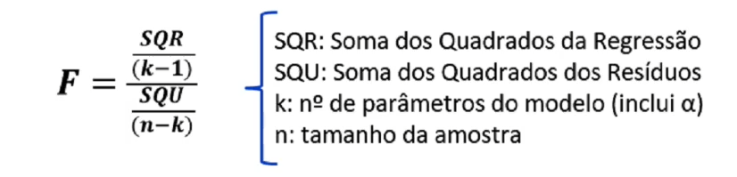

# Técnicas de Machine Learning I
## Machine Learning
- Definição
  - Podem ser encontradas muitas definições para o conceito machine learning
  - Porém, em termos de seus objetivos, pode-se entender como a utilização dos dados e de algoritmos para a produção de informações que serão relevantes para a tomada de decisão
    - Informações úteis para uma melhor tomada de decisão (data-driven decision making)
    - Por exemplo: criando modelos preditivos e/ou analisando a interdependência entre os dados

## Banco de Dados
- Definição e composição
  - O banco de dados é o objeto onde estão armazenadas as informações de interesse para a análise ou estudo em questão
  - Em muitos casos, o banco de dados contém uma amostra, ou seja, é um subconjunto extraído da população
  - O banco de dados é composto por variáveis e por observações
    - **Observações:** as unidades que têm suas características e atributos medidos
    - **Variáveis:** características/atributos observados, medidos ou categorizados

- **Exemplos**
  - Bancos de dados sobre:
    - Pessoas
    - Países
    - Empresas
    - Tarefas
    - Ações da bolsa
    - ...

- Estrutura para uso
  - Normalmente, o banco de dados é estruturado com as variáveis em colunas e as observações em linhas em uma estrutura tabular

## Tipos de Variáveis
- As variáveis podem ser divididas em
  - **Métricas:** são as variáveis quantitativas, isto é, apresentam características que podem ser mensuradas ou contadas
  - **Não métricas:** são as variáveis qualitativas, sendo que indicam características que não podem ser medidas. Tais variáveis contêm categorias, por isto, muitas vezes, são chamadas de variáveis categóricas
- A identificação do tipo de variável é fundamental para a escolha da técnica que será utilizada na análise dos dados

- **Exemplos:**
  - **Métricas (quantitativas)**
    - Idade em anos
    - Renda mensal em Reais
    - Número de habitantes no município
    - Distância em metros entre duas cidades
    - Rentabilidade percentual diária de uma ação na bolsa
  - **Não métricas (qualitativas)**
    - Nacionalidade
    - Cor do veículo
    - Profissão
    - Grau de escolaridade
    - Respostas sim ou não a um questionário
    - Escalas likert: concordo parcialmente, concordo totalmente, etc

### Variáveis Qualitativas
- Características principais
  - As variáveis qualitativas têm sua representação feita por meio de tabelas de distribuição de frequências ou gráficos
    - Não é possível calcular medidas de resumo como média ou desvio padrão para variáveis qualitativas
  - As tabelas de frequências apresentam as contagens observadas por categoria da variável

### Variáveis Quantitativas
- Características principais
  - As variáveis quantitativas podem ser representadas por diversas ferramentas, como gráficos, medidas de posição e dispersão
  - A seguir, alguns exemplos de estatísticas descritivas
    - **Medidas de posição:** média, mediana, quartis
    - **Medidas de dispersão:** variância e desvio padrão

#### Detalhando as Variáveis
- Outras características relevantes
  - Variáveis qualitativas: dicotômica ou policotômica; nominal ou ordinal
    - **Dicotômica:** duas categorias (binária); Policotômica: mais de duas categorias
    - **Nominal:** não estabelece relação de grandeza/ordem
    - **Ordinal:** estabelece ordem
  - Variáveis quantitativas: discretas ou contínuas
    - **Discretas:** possuem conjunto finito e numerável de valores, em geral, são obtidas a partir de dados de contagem (0, 1, 2, 3, 4, 5...)
    - **Contínuas:** assumem valores pertencentes ao intervalo de números reais

## Introdução ao Spyder IDE
- Python: é a linguagem de programação que vamos utilizar
- Neste curso, vamos implementá-lo por meio do Spyder (IDE)
- Software que torna o uso do Python mais simples para o usuário

### Ajuste: View > Window layouts > Rstudio
- Ficam os scripts: 
  - linguagem Python 
  - Console: executa o Python
  - Ambiente com 
  - objetos e gráficos
  - Arquivos do 
  - project e help 

### Acessando um Project
- Sempre que acessar um projeto em execução, acesse o project:
  1. Retire a pasta do arquivo compactado (caso esteja);
  2. No Spyder acesse: Projects > Open Project > Selecione a pasta
  3. Os arquivos contidos no project aparecerão no ambiente

### Pacotes
- Alguns pacotes que utilizaremos:
  - **Pandas:** manipulação e análise de dados
  - **Numpy:** funções matemáticas e dados
  - **Matplotlib:** visualização de dados em gráficos
  - **Seaborn:** também é um pacote gráfico
  - **Plotly:** gráficos interativos

## Documentação
- Leituras e documentação para consulta
  - https://pandas.pydata.org/docs/index.html
  - https://numpy.org/doc/stable/
  - https://matplotlib.org/
  - https://seaborn.pydata.org/
  - https://plotly.com/python/

## Modelos Lineares de Regressão Simples e Múltipla
- Modelos supervisionados de machine learning
- Conhecidos como modelos confirmatórios ou técnicas de dependência
- O objetivo é estimar modelos, equações, com o intuito de elaborar previsões
- Portanto, há inferência dos resultados para outras observações fora da amostra
- Define-se uma relação Y = f(X)
  - **Y:** chamada de variável dependente, é a variável a ser explicada (target)
  - **X:** chamadas de variáveis explicativas, são as preditoras (features)

### Quando Aplicar o Modelo
- A regressão linear é aplicada quando a **variável dependente é quantitativa**
  - O objetivo é explicar o comportamento de Y em função de um conjunto de X
  - Estabelece-se uma relação linear entre as variáveis
- Regressão linear simples e múltipla
  - A regressão linear simples contém **apenas uma** variável explicativa
  - A regressão linear múltipla contém **mais de uma** variável explicativa

### Modelo Geral de Regressão Linear
Y~i~ = a + b~1~.X~1i~ + b~2~.X~2i~ + ... + b~k~.X~ki~ + u~i~

- Y é a variável dependente quantitativa
- a representa a constante (intercepto)
- b~k~ representam os coeficientes para cada variável explicativa
- X~k~ representam as variáveis explicativas do modelo
- u~i~ representa o termo de erro do modelo (resíduo)
  - k é o número de variáveis explicativas e i refere-se às observações em análise
- As variáveis explicativas (X) podem ser métricas ou categóricas

### Análise do coeficiente de correlação de Pearson
- 1: inclinação positiva
- -1: inclinação negativa
- 0: não há correlação 

### Mínimos Quadrados Ordinários (MQO)
- O algoritmo estimará os parâmetros **α** e **β** do modelo
  - Ŷ~i~ = α + β.X~i~
- Pode-se definir o resíduo do modelo para dada observação i
  - u~i~ = Y~i~ - Ŷ~i~
- Condições para a estimação dos parâmetros do modelo (MQO)
  1. A somatória dos resíduos deve ser igual a zero
  2. A somatória dos resíduos ao quadrado é a mínima possível

### Elementos de um Modelo
- Interpretaremos
  - Coeficientes estimados
  - Significância geral do modelo (teste F – ANOVA)
  - Significância dos parâmetros (testes t)
  - Intervalos de confiança
  - Poder explicativo do modelo (R²)

### Parâmetros do Modelo
- Interpretação dos parâmetros α e β
  - α é o coeficiente linear, ou seja, o valor de Y caso todas as X=0
    - Muitas vezes, o α pode ser interpretado como a projeção da reta no eixo Y, uma vez que não encontram-se observações da amostra com todas as variáveis X=0
  - β são os coeficientes angulares, ou seja, a inclinação da reta
    - Na regressão múltipla, os β são interpretados na condição ceteris paribus, ou seja, o efeito daquela X sobre Y mantidas todas as demais variáveis constantes
    - Destaca-se que a interpretação dos parâmetros do modelo deve ocorrer sem a extrapolação dos dados, isto é, vale dentro do limite de variação das variáveis

### Teste F (ANOVA)
- No exemplo: 
  - F-statistic: 36.30
  - Prob (F-statistic): 0.000314

- Avalia a significância geral do modelo de regressão, ou seja, se pelo menos um dos β estimados é estatisticamente diferente de zero
  - 

  - H0: β1 = β2 = ... = βk = 0
  - H1: existe pelo menos um βj ≠ 0
- Normalmente, adota-se o nível de significância de 5% para o teste
  - Se o p-valor do teste F < 0.05, rejeita-se H0

### Teste t
- Avalia a significância individual dos parâmetros estimados
  - 

### Coeficiente de explicação (R^2^)
- **R-squared: 0.819**
- O R^2^ apresenta o poder explicativo do modelo, ou seja, o percentual da variabilidade de Y que é explicado pela variação das variáveis X
  -  
- **Na regressão simples, o R² pode ser obtido pelo coef_correl²**

### Intervalos de confiança
- Para o nível de confiança escolhido, é o intervalo de valores que contém o verdadeiro parâmetro populacional
  -  

# Técnicas de Machine Learning II
## Modelos Lineares de Regressão Simples e Múltipla
### Múltipla
- tempo = 8,15 + 0,79 * distancia + 8,29 * semaforos
- tempo = α + β~1~ + β~2~

# Técnicas de Machine Learning III

