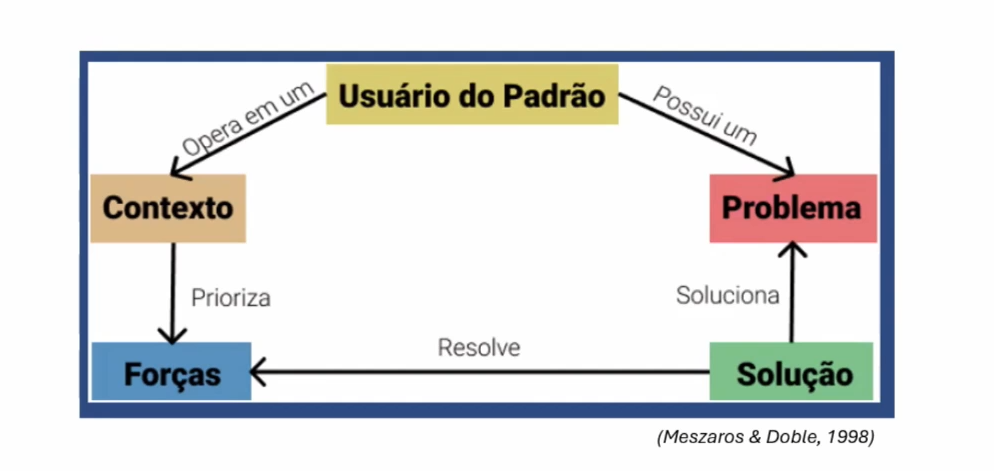

# Padrões de Projetos (Design Patterns) I
## Origem
- **Reúso de Software:** replicação de qualquer tipo de conhecimento sobre um sistema em outros sistemas similares, com objetivo de reduzir o esforço de desenvolvimento e a manutenção nesses novos sistemas (Biggerstaff e Perlis, 1989)
  - **Anos 70:** módulos e sub-rotinas
  - **Anos 80:** classes e geradores de aplicação
  - **Anos 90:** análise de domínio, componentes, **padrões** (patterns) e frameworks
  - **Anos 2000:** serviços, aspectos
- Benefícios da reutilização:
  - Melhores índices de produtividade
  - Produtos de melhor qualidade, mais confiáveis, consistentes e padronizados
  - Redução dos custos e tempo envolvidos no desenvolvimento de software
  - Maior flexibilidade na estrutura do software produzido, facilitando sua manutenção e evolução

## Importante: Patterns x Standards
- **Patters:**
  - Proxy, Composite, Factory-method, etc (**de projeto**)
  - Camadas, MVC, etc (arquiteturas)
  - Transaction, Item-transaction, Type-object (de análise)
  - Site map, shopping cart, ... (de interação com o usuário)
  - etc...
- **Standards:**
  - USB, HDMI, Bluetooth, ...
  - HTML, XML, ...
  - ISO 9000, ISO/IEC 15504, ...S
  - IEEE
  - etc...

## Padrões de Software (origem)
- **Origem dos padrões:**
  - Christopher Alexander (1977, 1979) - Arquiteto
    - "Cada padrão descreve um problema que ocorre repetidas vezes em nosso ambiente, e então descreve o núcleo da solução para esse problema, de forma que você possa utilizar essa solução milhões de vezes sem usá-la do mesmo modo duas vezes"
    - Proposta de padrões extraídos a partir de estruturas de edifícios e cidades de diversas culturas, com o intuito de ajudar as pessoas a construir suas comunidades coma melhor qualidade de vida possível
    - Exemplo de um padrão: Window place ("Um lugar à janela")

### Por que Padrões?
- Desenvolvedores acumulam soluções para os problemas que resolvem com frequência
- Essas soluções são difíceis de serem elaboradas e podem aumentar a produtividade, qualidade e uniformidade do software
- **Padrões de Software: descrevem soluções para problemas que ocorrem com frequência no desenvolvimento de software (Gamma 95)**
- **Um bom padrão:**
  - resolve um problema
  - é um conceito aprovado (não apenas teoria)
  - a solução não é óbvia
  - descreve um relacionamento (estruturas e mecanismos)
  - tem um componente humano significativo

### Vantagens de Padrões
- **Aumento de produtividade:** aplicação de soluções prontas leva a menos tempo em pensar na solução, projetá-la para depois aplicá-la
- **Uniformidade na estrutura do software:** entender um software fica mais fácil quando padrões foram utilizados, pois consegue-se enxergar os padrões utilizados ao longo do software (seja no projeto ou na implementação)
- **Aplicação imediata por outros desenvolvedores:** conhecendo o padrão (seu propósito, sua estrutura, o contexto em que deve ser aplicado, suas consequências, etc.), pode-se aplicá-lo imediatamente mesmo sem ter sido o proponente do padrão
- **Redução da complexidade:** padrões passam a ser vistos como blocos construtivos, em que a complexidade inerente a cada padrão é abstraída e vê-se o todo com menos complexidade (princípio dividir para conquistar)

### Categorias de Padrões
- Organizacionais
- Arquiteturais
- De Análise
- De Projeto
  - **Gamma et al**
  - Outros: p. ex J2EE
- De programação (estilos)
- De usabilidade
- Educacionais
- Etc

### Elementos de um padrão

### Formato para escrita de padrões de software
- Ao escrever um padrão, pode-se combinar alguns elementos essenciais e outros elementos opcionais
- A princípio, não deve se prender a nenhum formato de escrita e não há obrigatoriedade de uso de todos os elementos em todos os padrões
- Na medida em que o padrão vai sendo reusado, pode-se mudar seu formato para facilitar seu entendimento e reuso
- Existem algumas sugestões de gabaritos já testados e aprovados: **Gamma et al. (1995), Coplien (1996) e Buschmann et al. (1996)**

## Padrões de Projeto:
- Descrevem soluções para problemas que ocorrem com frequência no projeto de software orientado a objetos

### Tipos de Padrões de Projeto GoF*
- Catálogo de Padrões de Projeto publicado em 1995 por Gamma, Helm, Johnson e Vlissides
- Dois critérios de classificação:
  - **Propósito - reflete o que o padrão faz**
    - **De Criação:** trata da criação de objetos
    - **Estrutural:** cuida da composição de classes a objetos
    - **Comportamental:** caracteriza o modo como as classes e objetos interagem e distribuem responsabilidades
  - **Escopo em que o padrão atua:**
    - **Classe:** trata do relacionamento entre classes e subclasses (herança - relacionamento estático)
    - **Objetos:** lida com a manipulação de objetos (podem ser modificados em tempo de execução)

